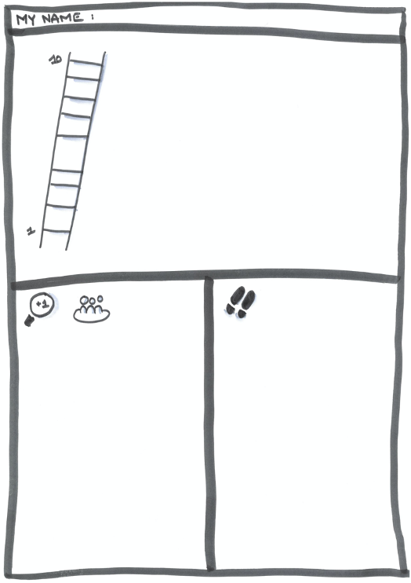

# Echelle

* On a scale from 1 to 10, how do you ... ?
  * 10 : I embody fully ...&#x20;
  * 1 : means the complete opposite
* Enumerate at least 10 facts that demonstrate you are already there
  * What else (10 more)
* _**1 point higher**_
  * Imagine you are 1 point higher on this scale :
    * Who else will see differences?
    * Which ones?
* _**Small steps**_&#x20;
  * What could you do in the next 10 days that could put you on the way to this +1 ?

