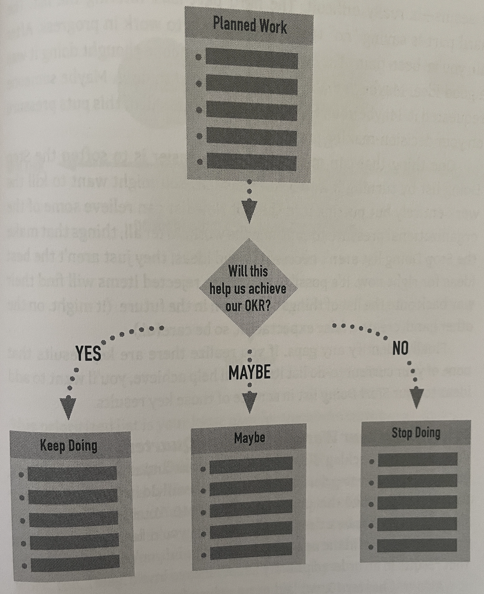

# DDD re-distilled

## Conway's law 

> Any organization that designs a system will produce a design whose structure is a copy of the organization's communication structure. - Melvin Conway

Style of code reflects the way the people and teams in your company communicate or produce software architectures matching their current structure.

It can lead to OUTDATED AND LOWER QUALITY PRODUCTS.

### How to reverse the conway's law ?

Build teams that look like the architecture you want : 


Cross functional teams organized around business capabilities


* Structure your system into independent, self-contained services so that teams can work independently.
* Microservices architectures aim to increase velocity, so they apply Conway’s law in reverse to structure the system to achieve this noble goal.
* Reverse Logic follows to create fewer dependencies and can grow faster as compared to Conway Law.
* Teams only focus on what they are building and how they communicate with other pieces of code or micro-services.

## DDD What ?

Domain Driven Design a.k.a DDD is an approach to software development.

* DDD is definitely NOT about technology.
* DDD is all about the domain.

There are 2 kinds of patterns in DDD :

Often people focuses only on the tactical ones \(closer to the code\) but it is really mandatory before starting anything to start with a strategy.

## Strategic patterns

### Domain Model

* A domain is the reality : your real business
* A domain model is an abstraction of this reality

### Bounded Contexts

A Bounded Context is a semantic contextual boundary.

Within the boundary **each component** of the software model has **a specific meaning and does specific things**.

**Software model = language that is developed by the team**

* Spoken by every member of the team
* Implemented in the software model

This language = **Ubiquitous Language**

There should be :

* One team assigned to work on one Bounded Context
* A separate source code repository for each Bounded Context


**One team could work on multiple Bounded Contexts BUT multiple teams should not work on a single Bounded Context**


### Subdomains : 3 types

* **Generic Subdomain** : Solution may be available for purchase or be outsourced or even developed in house by a team that doesn’t have the kind of elite developers that you assign to your Core Domain or even a lesser Supporting Subdomain. NO WAY TO DIFFERENTIATE
* **Core domain** : Where you are making a strategic investment in a single, well-defined domain model.

  This is very high on your organization’s list of projects because it will distinguish it from all competitors. _**The heart of an organization’s business.**_

* **Supporting domain** : This is a modeling situation that calls for custom development, because an off-the-shelf solution doesn’t exist. This is still an important software model, because _**your Core Domain cannot be successful without it**_.

One of the Bounded Contexts will be the **Core Domain :** Various Subdomains in other Bounded Contexts.


A Bounded Context should align one-to-one \(1:1\) with a single Subdomain


### Context distillation

Once you have identified your Subdomains you can use the matrix behind to understand which Subdomain is what.

Find more explanation on it here :

* [https://medium.com/nick-tune-tech-strategy-blog/core-domain-patterns-941f89446af5
  ](https://medium.com/nick-tune-tech-strategy-blog/core-domain-patterns-941f89446af5
  )
* [https://github.com/ddd-crew/core-domain-charts
  ](https://github.com/ddd-crew/core-domain-charts
  )
* [https://youtu.be/8TDiuQ3vdh0
  ](https://youtu.be/8TDiuQ3vdh0
  )
* [https://speakerdeck.com/mploed/visualizing-sociotechnical-architectures-with-context-maps
  ](https://speakerdeck.com/mploed/visualizing-sociotechnical-architectures-with-context-maps
  )


Make sure that your core \(sub\)domains and / or your most valuable contexts in genesis and custom built phases are perfectly staffed


### Context Mapping

_`Integration between Core Domain and other Bounded Contexts is known in DDD as Context Mapping`_

Considering that in two different Bounded Contexts there are two Ubiquitous Languages , this **line represents the translation that exists between the two languages**.

#### What relationships and integrations can be represented by the Context Mapping line?

#### Partnership

A _**Partnership relationship exists between two teams**_. Each team is responsible for one Bounded Context.

They create a Partnership to align the two teams with a dependent set of goals. It is said that the two teams will succeed or fail together.

Teams will meet frequently to :

* Synchronize schedules and dependent work
* Use continuous integration to keep their integrations in harmony.

The synchronization is represented by the thick mapping line between the two teams. The thick line indicates the level of commitment required, which is quite high.

#### Customer-supplier

Describes a relationship between two Bounded Contexts and respective teams : the _**Supplier is upstream \(the U in the diagram\) and the Customer is downstream \(the D in the diagram\)**_.

The Supplier holds sway in this relationship because it must provide what the Customer needs.

* Downstream requirements factor into upstream planning.
* Downstream team gains some influence over the priorities and tasks of the upstream team.

#### Shared kernel

A Shared Kernel , is a subset of a domain model that two teams share :

* Physically shared artifact between two teams \(Shared JARs, DB, …\)
* High degree of coupling requires a high amount of coordination between the involved teams

_Use it with caution._

#### Conformist

The conformist slavishly _**adheres to the upstream model**_ :

* No model-to-model transformation
* Motivation : simplicity, contracts
* he team implementing a Conformist is always downstream

_**Example**_ : Consider the need to conform to the Amazon.com model when integrating as one of Amazon’s affiliate sellers.

#### Anticorruption layer

The Anticorruption Layer _**translates one model to another one : \(Looser coupling\)**_ Transforms an external model from another team / bounded context / system to another internal one Reduces the amount of coupling to a single layer The team implementing the ACL is always downstream.

#### Open-host service

Defines a protocol or interface that gives access to your Bounded Context as a set of services.

_**The Open-host Service is a public API**_ :

* One API for several consumers
* Has a common/general purpose model and functionality
* The team providing the Service is an upstream team

#### Published language

A well documented language shared between bounded contexts :

* Every bounded context can translate in and out from that language
* Often combined with Open-host Service

_**Such a Published Language can be defined with XML Schema, JSON Schema, …**_

**Examples**: iCalendar, vCard

#### Separate ways

A bounded context has no connections to others :

* Sometimes integration is too expensive or takes very long
* The teams choose separate ways in order to focus on specialized solutions

_**Perhaps the functionality that you seek is not fully provided by any one Ubiquitous Language.**_

In this case produce your own specialized solution in your Bounded Context and forget integrating for this special case.

#### Big ball of mud

Here’s what happens over time when you are responsible for creating a Big Ball of Mud :

1. A growing number of Aggregates cross-contaminate because of unwarranted connections and dependencies.
2. Maintaining one part of the Big Ball of Mud causes ripples across the model, which leads to “whack-a-mole” issues.
3. Only tribal knowledge and heroics—speaking all languages at once—save the system from complete collapse.

#### Team relationships

Source : [https://speakerdeck.com/mploed/visualizing-sociotechnical-architectures-with-context-maps
](https://speakerdeck.com/mploed/visualizing-sociotechnical-architectures-with-context-maps
)

## Bounded contexts and micro-services

There is one question that divides the DDD community : which mapping can I make between bounded context and micro-services ?

Well it depends...

Some consider a micro-service to be much smaller than a DDD Bounded Context. Using that definition, a micro-service models only one concept and manages one narrow type of data.

An example of such a micro-service is a Product and another is a BacklogItem

If this is the granularity that you consider a worthy micro-service, understand that both the Product ms and the BacklogItem ms will still be in the same larger, logical Bounded Context.

The two small ms components have only different deployment units, which may also have an impact on how they interact.

## How to discover complex domains ?

### Event storming  : Explore with Domain Events

**EventStorming** is a flexible workshop format for collaborative exploration of complex business domains.

It comes in different flavors, that can be used in different scenarios:

* to assess health of an existing line of business and to discover the most effective areas for improvements;
* to explore the viability of a new startup business model;
* to envision new services, that maximise positive outcomes to every party involved;
* to design clean and maintainable Event-Driven software, to support rapidly evolving businesses.

Rules for organizing good sessions :

* Invite the right people 
  * Business
  * IT
  * UX
  * Technical stakeholders, ...
* Provide unlimited modeling space \(surface, markers, stickies\)
* Model a whole business line with domain events

It is not something from IT for IT but from business to the organization.

Find more about it here : [https://www.eventstorming.com/](https://www.eventstorming.com/)

### How to capture the outcomes ?


After an Event Storming session participants have a shared understanding of the Domain. One of the major criticism about Event Storming is really the lack of structure of the production that has been done. That's why it's really mandatory to capture the outcomes of each session.


Find more about the outcomes in this great article from Philippe Bourgau : [https://philippe.bourgau.net/5-views-to-capture-the-outputs-of-an-event-storming-workshop/
  
](https://philippe.bourgau.net/5-views-to-capture-the-outputs-of-an-event-storming-workshop/
)

### Document your bounded contexts

You can use the Bounded Context Canvas to do so : 

Find more about it here : [https://medium.com/nick-tune-tech-strategy-blog/modelling-bounded-contexts-with-the-bounded-context-design-canvas-a-workshop-recipe-1f123e592ab
](https://medium.com/nick-tune-tech-strategy-blog/modelling-bounded-contexts-with-the-bounded-context-design-canvas-a-workshop-recipe-1f123e592ab
)

Real life example :

## Tactical patterns / Tactical design with Aggregates

### Entity

An Entity models an **individual thing**. Each Entity has a unique identity in that you can distinguish its individuality from among all other Entities of the same or a different type. 

Most times, an Entity will be **mutable**; its state will change over time.

### Value Object / Value

Models an **immutable** conceptual whole. Unlike an Entity , it does not have a unique identity, and equivalence is determined by comparing the attributes encapsulated by the Value type.

### Aggregate

Each Aggregate is composed of one or more Entities / Value Objects One Entity is called the Aggregate Root.

### Each Aggregate forms a transactional consistency boundary : all composed parts must be consistent, according to business rules, when the controlling transaction is committed to the database.

#### Aggregate : rule of thumbs

#### 1\) Protect business invariants inside Aggregate boundaries.

> "When all Task instances have hoursRemaining of zero, the BacklogItem status must be set to DONE .”

At the end of a transaction this very specific business invariant must be met. The business requires it.

#### 2\) Design small aggregates

Memory footprint and transactional scope of each Aggregate should be relatively small.

#### 3\) Reference other Aggregates by identity only

Keep the Aggregate design :

* Small and efficient
* Making for lower memory requirements
* Quicker loading from a persistence store.

Helps enforce the rule not to modify other Aggregate instances within the same transaction.

Store them as you want Relational Database or not.

#### 4\) Update Other Aggregates Using Eventual Consistency

A BacklogItem is committed to a Sprint :

* BacklogItem + Sprint must react to this

As part of the BacklogItem Aggregate ’s transaction, it publishes a Domain Event.

At one point our system will be consistent.

### From Event Storming to Aggregates : Aggregate Canvas

Here is the different steps you can use to go from Event Storming to your Aggregates Design :

Find more about it here : [https://www.youtube.com/watch?v=AF880t1RUU4
](https://www.youtube.com/watch?v=AF880t1RUU4
)

## How to start ?

The DDD community is doing a really great job and they provide this modeling process that gives you a step-by-step guide for learning and practically applying each aspect of Domain-Driven Design \(DDD\) - from orienting around an organisation's business model to coding a domain model.

Find more about it here : [https://github.com/ddd-crew/ddd-starter-modelling-process/blob/master/README.md
](https://github.com/ddd-crew/ddd-starter-modelling-process/blob/master/README.md
)

## Key take aways

DDD is a :

* Strategic tool that can help you
  * Invest through Context Distillation
  * Organize teams through Context Mapping
  * Align everyone on a business / technical vision
* Design tool through Bounded Contexts
* Implementation tool through Tactical patterns

### To go further

Here are great books on DDD :

* [Legacy Architecture Modernisation With Strategic Domain-Driven Design](https://medium.com/nick-tune-tech-strategy-blog/legacy-architecture-modernisation-with-strategic-domain-driven-design-3e7c05bb383f)



* [Domain Events vs Change Data Capture](https://medium.com/swlh/domain-events-versus-change-data-capture-e426772f76e5)

