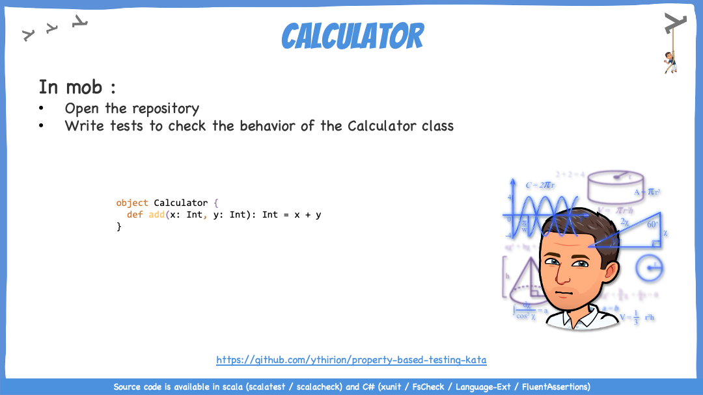
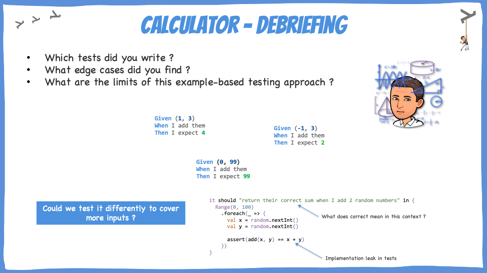
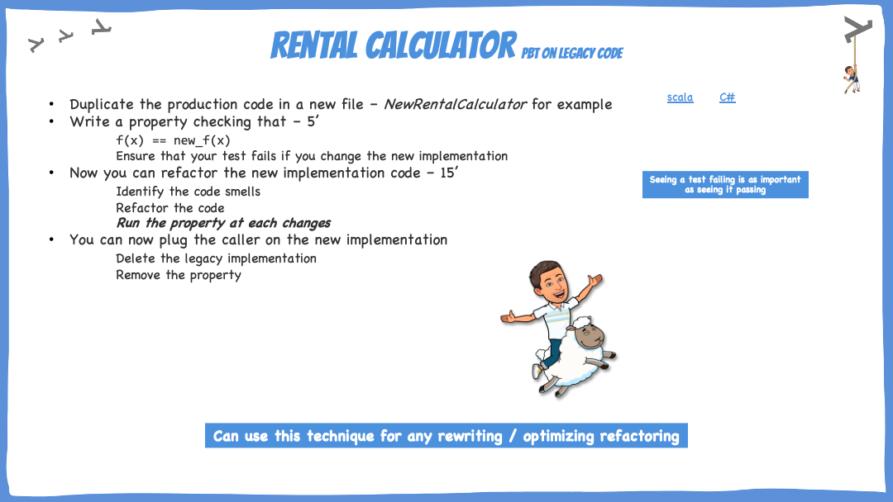

# A journey to Property-Based Testing

The purpose of this workshop is to understand by the practice an approach to testing that allows us to identify and check our business invariants. We will discover :

* How it differs from traditional sampling approach (example-based testing)
* Its advantages and limits

### Source code

Source code is available [here](https://github.com/ythirion/property-based-testing-kata) in :

* Scala : Scalatest / Scalacheck
* C# 10  : XUnit / FsCheck / Language-Ext / FluentAssertions&#x20;

### Connection - Calculator

Connect participants to the topic by making them write Unit Tests on the Calculator class :

Debriefing :

### Concepts - PBT

* Go through slides 4 to 15 to explain the different concepts :&#x20;
  * Example-Based Testing vs PBT
  * What is PBT ?
  * Addition properties example
  * PBT by hands
  * Scalacheck / FsCheck / QuickCheck
  * Associated concepts
* Demonstrate how to write properties on the Calculator, you can use the [step-by-step guide](https://github.com/ythirion/property-based-testing-kata/blob/main/C%23/PBTKata.Tests/Math/Solution/step-by-step.md) to prepare yourself

.png>)

### Concrete Practice

#### Postal Parcel

Open \`PostalParcel\` :&#x20;

* Identify properties – 5’
* What are the invariants ?
* Write them in \`PostalParcelPropertiesFlatSpec\` with ScalaCheck / FsCheck - 15’
* Collective debriefing – 5’
  * [Scala](https://github.com/ythirion/property-based-testing-kata/blob/main/scala/src/test/scala/post/solution/step-by-step.md)
  * [C#](https://github.com/ythirion/property-based-testing-kata/blob/main/C%23/PBTKata.Tests/Post/Solution/step-by-step.md)

#### Bank withdrawal

* Open \`AccountService\` :•Identify properties – 5’&#x20;
* What should we do to check those properties ?

.png>)

* Demonstrate how you could write properties on those knowing that Command and Account are tightly coupled as inputs :&#x20;
  * Using properties + input filtering (when)
  * Using properties and Builder
  * How we would write tests on Bank withdrawal in real life (with Parameterized tests

#### Rental Calculator - PBT as a refactoring tool

* Open \`RentalCalculator\`
* Imagine this code is running in production and business is happy with it
* &#x20; Imagine you need to adapt it, but you need to be sure that you don’t introduce any regression
* How PBT can help us ?

* Let them code - 15'
* Collective debriefing - 5'
  * [Scala](https://github.com/ythirion/property-based-testing-kata/blob/main/scala/src/test/scala/rental/solution/step-by-step.md)
  * [C#](https://github.com/ythirion/property-based-testing-kata/blob/main/C%23/PBTKata.Tests/Rentals/Solution/step-by-step.md)

### Conclusion

* When to apply PBT in real life
* Associated anti-patterns
* Reflect : Think about your last development, how this approach could have helped you ?

### Resources

* [ScalaCheck documentation](https://github.com/typelevel/scalacheck/blob/main/doc/UserGuide.md)
* Scala exercises on PBT : [https://www.scala-exercises.org/scalacheck/generators](https://www.scala-exercises.org/scalacheck/generators)
* ["Functions for nothing, and your tests for free" Property-based testing and F# - George Pollard](https://youtu.be/8oALNLdyOyM)
* Property based testing - step by step : [https://www.leadingagile.com/2018/04/step-by-step-toward-property-based-testing/](https://romainberthon.blog/2019/01/08/a-la-decouverte-du-property-based-testing/)


Slide deck to support workshop


