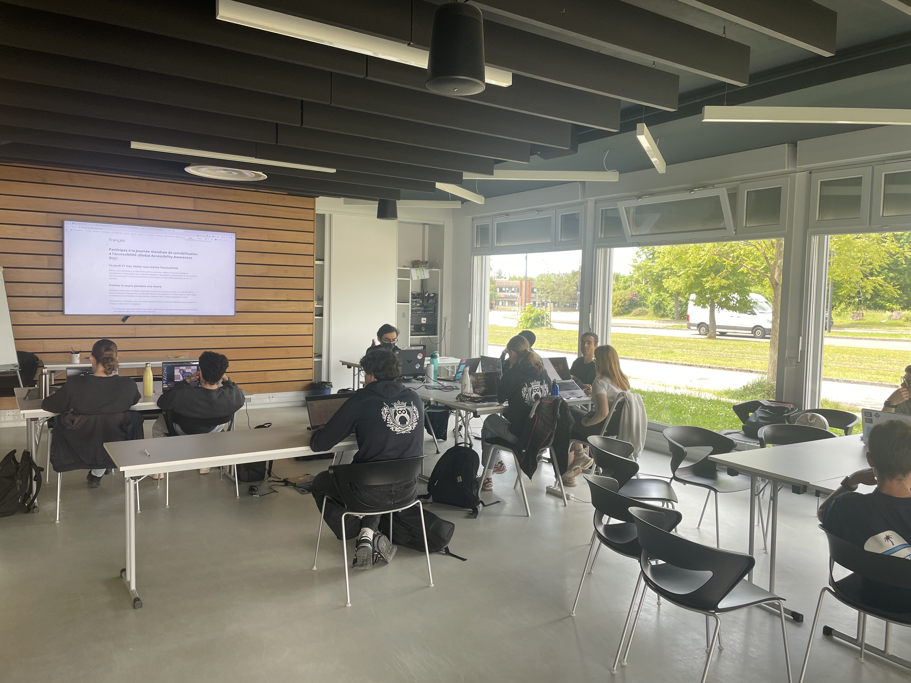

# Le Coding Dojo à l'école

## C'est quoi un Coding Dojo ?

Le terme vient des arts martiaux. Un _dojo_ est un lieu d'entraînement, un espace où l'on vient pratiquer, se tromper, recommencer sans la pression du combat réel.

<figure><figcaption></figcaption></figure>

Appliqué au développement logiciel, le **Coding Dojo** est exactement ça : un espace d'entraînement collectif où des devs se réunissent pour pratiquer leur craft, sans la pression du projet de production.

L'idée émerge au début des années 2000, popularisée notamment par Laurent Bossavit et la communauté Craft.

> Le principe est simple : on code ensemble, on apprend ensemble, on progresse ensemble.

***

## Les Code Katas : l'unité de base de l'entraînement

Dans un dojo de karaté, un _**kata**_ est une séquence de mouvements codifiée que l'on répète jusqu'à ce que le geste devienne naturel.&#x20;

En développement, un _**Code Kata**_ est un exercice de code, délibérément simple dans son énoncé, que l'on résout et re-résout pour travailler sa technique plutôt que de trouver _**LA**_ solution.

Il existe plusieurs grandes familles de katas, et surtout plusieurs **formats de pratique** qui changent radicalement l'expérience :

### Les formats de pratique

#### **Le Randori**&#x20;

Deux participant·e·s s'installent devant le clavier : un·e pilote, un·e copilote, pendant quelques minutes, sous les yeux du reste du groupe.&#x20;

Puis on tourne : un·e nouveau·elle participant·e prend la place du·de la pilote, l'ancien·ne copilote devient pilote. Le code évolue en direct, sous le regard collectif, et le groupe peut intervenir entre les rotations pour suggérer, questionner, réorienter.

Ce _**format est inconfortable au début**_ : coder devant tout le monde, verbaliser sa pensée en temps réel, reprendre un code qu'on n'a pas écrit. C'est précisément là que réside sa puissance.&#x20;

> Il force une qualité d'expression et d'écoute qu'on ne développe pas en codant seul·e dans son coin.

#### **Le Pair Programming**

Deux développeur·euse·s, un clavier. L'un·e code, l'autre challenge, relit, questionne, suggère. Les rôles s'inversent régulièrement. Ce n'est pas "deux personnes pour faire le travail d'une" c'est un outil de qualité et de transfert de connaissances / compétences que le dojo permet de pratiquer dans un cadre sans enjeu.

<figure><figcaption></figcaption></figure>

#### **Le Mob Programming**&#x20;

Toute l'équipe travaille sur le même problème, au même moment, sur le même écran. Un·e pilote tape, tou·te·s les autres naviguent collectivement. On tourne régulièrement. La verbalisation des intentions, la confrontation des approches en temps réel, la décision collective, tout cela accélère la progression de manière spectaculaire.

<figure><figcaption></figcaption></figure>

### Les types de katas

**Les katas classiques / algorithmiques -** Des problèmes bien définis avec une ou plusieurs solutions connues : FizzBuzz, Bowling, Roman Numerals, String Calculator… L'objectif n'est pas de "finir" le kata, mais de le traverser différemment à chaque fois en changeant d'approche, de langage, de contrainte.

**Les katas de conception (design katas) -** L'accent est mis sur la structure du code, les principes SOLID, les design patterns. Le problème est un prétexte pour réfléchir à l'architecture, à la lisibilité, à la maintenabilité.

**Les katas de refactoring -** On part d'un code existant, souvent intentionnellement mauvais ou "legacy", et l'objectif est de l'améliorer sans en changer le comportement. Gilded Rose, Tennis Refactoring, Trip Service… Ces katas sont particulièrement puissants pour développer le sens critique et comprendre ce que "clean code" veut vraiment dire.

**Les katas contraints (Object Calisthenics, Evil Coder…) -** On ajoute des règles artificielles pour forcer de nouveaux comportements : pas de boucles `for`, pas de `else`, méthodes de 5 lignes maximum… Ces contraintes semblent arbitraires au premier abord, mais elles révèlent des schémas de pensée et poussent à explorer des solutions qu'on n'aurait jamais envisagées autrement.

***

### En entreprise : puissant sur le papier, difficile dans les faits

Le Coding Dojo et les pratiques qu'il véhicule (TDD, Pair Programming, Mob Programming, boucles de feedback courtes) sont reconnues depuis des années comme des vecteurs puissants de montée en compétences. Des équipes qui les pratiquent régulièrement produisent un code de meilleure qualité, détectent les problèmes plus tôt, et transfèrent les compétences bien plus efficacement.

Pourtant, dans la réalité des entreprises, ces pratiques peinent souvent à s'installer durablement. Les freins sont nombreux, et ils reviennent avec une régularité déconcertante.

Au fil de mes interventions dans des contextes très variés (industrie, luxe, banque, assurance, startups…), j'ai constitué une petite collection. En voici quelques extraits :

**"On n'a pas le temps." -** C'est l'objection reine. Le backlog déborde, la deadline approche, les tickets s'accumulent. Dégager une heure par semaine pour s'entraîner semble un luxe inaccessible, même quand tout le monde s'accorde à dire que ça serait utile.

> L'urgence perpétuelle écrase l'important.

**"À quoi ça sert concrètement ?" -** Les bénéfices du dojo sont réels mais diffus. On ne peut pas les mettre dans un dashboard. Le retour sur investissement ne se mesure pas en features livrées. Pour des managers ou des équipes habituées à des métriques de productivité court-terme, justifier du temps "à coder pour s'entraîner" est un exercice périlleux.

**"On a toujours fait comme ça." -** C'est peut-être le frein le plus profond.&#x20;

Coder seul·e, dans son coin, sur "sa partie", c'est le mode par défaut. Le pair programming dérange, le mob programming intrigue (et inquiète), le TDD renverse l'ordre naturel des choses. Changer ces habitudes demande un effort culturel que beaucoup d'équipes ne sont pas prêtes à fournir, même avec la meilleure volonté du monde.

**Le contexte organisationnel -** Même quand l'équipe est partante, l'organisation peut bloquer : pas de salle disponible, des plannings impossibles à synchroniser, un management qui voit d'un mauvais œil ses développeur·euse·s "ne pas produire" pendant une heure.&#x20;

> Le dojo résiste mal aux environnements où tout s'optimise à court terme.

Ces freins, je les ai entendus sous mille formes différentes. Reformulés, habillés d'un vocabulaire nouveau, parfois sincères, souvent confortables. À force de les rencontrer, j'ai fini par les reconnaître avant même qu'ils soient prononcés.

Après des années à accumuler les mêmes conversations, les mêmes objections, les mêmes bonnes intentions sans lendemain, j'ai ressenti une fatigue que je ne pouvais plus ignorer. Pas la fatigue du sujet, j'y crois toujours autant et avec la même passion, mais celle de l'environnement.

Alors j'ai cherché un terrain différent. Un endroit où ces pratiques pourraient s'installer avant que les biais ne se forment, avant que les excuses ne deviennent des réflexes.

***

### À l'école : un terreau nettement plus fertile ?

C'est là que quelque chose d'intéressant se produit quand on déplace cette pratique en contexte scolaire.

Les étudiant·e·s arrivent sans les biais accumulés par des années de pratique solitaire. Ils et elles n'ont pas encore intégré que "coder, c'est forcément seul·e".&#x20;

Pas de territoire à défendre, pas de mauvaises habitudes cristallisées, pas de peur du regard des collègues parce que tout le monde est en train d'apprendre, visiblement, ensemble.

Le contexte scolaire offre aussi ce que l'entreprise peine à dégager : **du temps sanctuarisé, un cadre explicitement dédié à l'apprentissage, et une tolérance naturelle à l'erreur**.&#x20;

Se tromper devant ses camarades dans un dojo scolaire, c'est normal. C'est même attendu. C'est l'inverse de ce que beaucoup de développeur·euse·s ressentent en entreprise.

Il y a aussi une forme de liberté dans le fait de ne pas avoir de code de production à livrer demain matin. On peut essayer TDD sans se demander si ça va ralentir le sprint. On peut refactorer (refactoriser en français ? je ne sais jamais) sans la peur de "casser quelque chose en prod". On peut explorer, tâtonner, recommencer, sans que ça ne coûte rien d'autre que de l'attention et de la curiosité.

Et dans un contexte où les étudiant·e·s ont grandi avec les outils d'IA à portée de main, le dojo joue un rôle encore plus fondamental : il leur permet de **construire des repères solides avant de déléguer quoi que ce soit à une machine**. Savoir évaluer ce que l'IA produit, c'est d'abord savoir ce qu'est du bon code.

En résumé : l'école est peut-être l'endroit idéal pour installer ces réflexes avant que les biais professionnels et les raccourcis de l'IA ne s'accumulent.

> C'est cette conviction qui m'a conduit, début 2025, à franchir le pas. Après des années de consulting et de coaching en entreprise, j'ai rejoint [Coda](https://coda.school), une école d'informatique à Dijon, en tant que responsable de la pédagogie.&#x20;
>
> Non pas pour fuir le monde professionnel, mais pour agir en amont, auprès d'étudiant·e·s qui n'ont pas encore eu le temps d'accumuler les mauvaises habitudes que j'ai passé des années à essayer de défaire.
>
> L'une des premières choses que j'ai voulu tester : est-ce que le Coding Dojo peut fonctionner ici ?

***

### Le Coding Dojo à Coda : expérimenter dans le monde de l'école

Je pratique et facilite des Coding Dojos depuis des années en entreprise. J'avais à cœur de tester si le format pouvait fonctionner dans un contexte scolaire, avec des étudiant·e·s en cours d'apprentissage, pas encore des "professionnel·le·s".

> La réponse est oui. Et les résultats m'ont parfois surpris.

Depuis fin 2025, j'ai pu animer **une vingtaine de sessions** avec nos étudiant·e·s volontaires.&#x20;

Ce que j'ai observé au fil des semaines :

**Une vraie progression dans leur manière de penser -** Pas seulement dans leur code, dans leur raisonnement. La décomposition d'un problème, la capacité à identifier une prochaine étape minuscule mais précise, le réflexe de questionner une hypothèse avant de coder.

**Une meilleure maîtrise de leur environnement de développement ^-** IDE, raccourcis, terminal, Git, à force de coder en groupe avec un écran partagé, les bons gestes se transmettent naturellement.

**Du pair programming qui fonctionne -** Ce qui semblait gênant au début, coder sous le regard de quelqu'un d'autre, verbaliser sa pensée, est devenu une force. Les étudiant·e·s qui pratiquent régulièrement communiquent mieux, expliquent mieux, débug mieux.

**Du papier au code, efficacement -** Avant de toucher le clavier, on pense. On schématise. On se met d'accord. Ce réflexe, souvent négligé, s'ancre progressivement dans la pratique des participant·e·s.

**La découverte du refactoring -** Pas comme concept théorique, mais comme geste naturel. "Ça marche, maintenant comment on peut le rendre plus lisible / maintenable ?" Cette question commence à émerger spontanément. C'est un indicateur fort de maturité.

**Les boucles de feedback via les tests automatisés -** Voir ses tests passer au vert après une implémentation, puis les voir rester au verts après un refactoring, c'est une expérience qui marque. Les étudiant·e·s comprennent viscéralement pourquoi on teste, bien mieux qu'avec n'importe quel cours magistral.

<figure><figcaption></figcaption></figure>

#### La parole aux étudiant·e·s

> _"J’ai adoré participer aux séances de code kata ! Le format en petit groupe avec Yoan crée une atmosphère idéale pour progresser sans pression. Le fait d'avoir des tests qui valident notre code en temps réel est un vrai plus : cela permet d'expérimenter en toute sécurité. J'ai vraiment senti une évolution dans ma façon d'aborder les problèmes et de structurer ma réflexion. Il y a une réelle satisfaction personnelle à résoudre chaque exercice, même les plus basiques. Je vous conseille vraiment de tester : c’est l'outil parfait pour apprivoiser des notions parfois intimidantes, comme la récursivité !"_ - **Clémence Dassé**

> _"\[...] personnellement j'ai beaucoup appris de ces séances qui ont renforcé mon sens de l'analyse sur des problèmes qui peuvent sembler complexes au premier abord. J'ai compris progressivement l'importance des tests qui dans notre cas ont littéralement été nos examinateurs immédiats. En plus c'est satisfaisant de tous les voir passer au vert ( le rouge un peu moins ^^). \[...] je perçois beaucoup de différence entre mon ancienne façon d'aborder une problématique et l'actuelle; maintenant je m'efforce de tout mettre par écris, je décompose et des idées me viennent rapidement en tête car je reconnais des patterns qu'on a déjà vu pendant les séances (c'est comme un giga puzzle dont j'ai déjà la moitié des pièces bien placées ). Je pense aussi que le fait de réaliser nos sessions en petit comité a rendu l'expérience meilleure, les échanges sont beaucoup plus fluides et bien orientés... Peu importe votre niveau, ces séances vous feront forcément découvrir de nouvelles choses, vous grandirez non pas en taille ( bon j'arrête ^^ ) mais surtout en connaissance..."_ - **Darill Adjiwanou**

***

Je vais récupérer les READMEs manquants.Parfait, j'ai tout ce qu'il me faut. Voici la section retravaillée :

***

### **Quelques katas réalisés cette première année**

Tous les supports sont disponibles en open source sur le [repo GitHub de Coda](https://github.com/Coda-Dijon/coda-katas).

<figure><figcaption></figcaption></figure>

[**CodaBuzz**](https://github.com/Coda-Dijon/coda-katas/blob/main/01.coda-buzz/README.md) **:** Le point de départ. Une variante maison du classique FizzBuzz, en apparence triviale, qui sert surtout de premier terrain d'exploration du pair programming : alterner les rôles de driver et de navigator, verbaliser son raisonnement, identifier ses angles morts.&#x20;

[**Prime Numbers**](https://github.com/Coda-Dijon/coda-katas/blob/main/02.prime/README.md) : Un kata d'algorithmique pure. Implémenter `isPrime`, puis l'optimiser pour dépasser la solution naïve en O(n). Simple à énoncer, révélateur dans l'exécution : les étudiant·e·s doivent gérer les cas limites (0, 1, 2…), structurer leurs tests, et confronter leurs intuitions sur la complexité algorithmique.

[**Pricing**](https://github.com/Coda-Dijon/coda-katas/blob/main/03.pricing/README.md) **:** Un kata qui introduit l'Example Mapping sans forcément le nommer. À partir d'un calcul de prix avec taxes et remises progressives, les étudiant·e·s apprennent à identifier les exemples qui font les règles, à les formuler avant de coder, et à structurer leurs tests autour de cas concrets.

[**Algorithmique Wars**](https://github.com/Coda-Dijon/coda-katas/blob/main/09.algos-star-wars/README.md) : Onze épisodes inspirés de l'univers Star Wars, chacun centré sur une notion algorithmique : les midichloriens pour introduire les bases, la puissance de Skywalker pour les exposants, ... Le contexte narratif n'est pas un gadget : il donne envie de résoudre le problème suivant, ce qui est déjà la moitié du travail.

<figure><figcaption></figcaption></figure>

[**Calendrier de l'Avent 2025**](https://coda-dijon.github.io/advent-2025/) : Une initiative à part : 25 jours de défis couvrant développement, data, éco-conception, ... ouverts à tous. Un Discord pour s'entraider, partager les solutions, débattre des approches. Moins dojo au sens strict, plus communauté d'apprentissage mais le même esprit : progresser ensemble, visiblement, sans se prendre trop au sérieux.

<figure><figcaption></figcaption></figure>

***

### **Pourquoi se concentrer sur les fondamentaux alors que des IA écrivent du code pour nous ?**

Bonne question. Vraiment.

Mettons de côté tout ce qui touche à l'éthique : les biais algorithmiques, la consommation énergétique, la propriété intellectuelle du code généré, la dépendance aux grandes plateformes. Ce sont des sujets légitimes et importants, mais ce n'est pas le débat d'aujourd'hui.&#x20;

Concentrons-nous uniquement sur la promesse technique : l'IA génère du code, donc apprendre à coder devient optionnel. _**Sauf que.**_

Un outil comme Claude Code peut produire du code syntaxiquement correct, fonctionnellement plausible, **et structurellement catastrophique**. Il ne sait pas ce que ton système doit faire dans six mois. Il ne connaît pas les contraintes implicites de ton architecture. Il ne ressent pas la dette technique qui s'accumule. Il génère. C'est tout. Et il génère avec une confiance absolue, que ce soit du bon code ou du désastre bien formaté.

Le vrai risque, c'est **l'illusion de compétence**. Un·e développeur·euse sans bases solides qui utilise l'IA peut produire rapidement du code qui "marche", jusqu'au premier bug non trivial, jusqu'à la première revue sérieuse, jusqu'au premier besoin de maintenir ce qu'il·elle a livré. L'IA peut masquer les lacunes. Elle ne les comble pas.

Et là, le dojo reprend tout son sens. Pas comme une nostalgie du code écrit à la main. Mais parce que **lire, évaluer, critiquer et refactorer du code**, qu'il soit écrit par un humain ou généré par une machine, reste une compétence profondément humaine. C'est précisément ce que le dojo entraîne, session après session.

Dans un monde où une partie du code est générée, **les pratiques collaboratives prennent encore plus de valeur** : le TDD, le pair programming, les revues de code sont des mécanismes de vérification collective que l'IA ne peut pas remplacer. Ils garantissent que ce qui est produit est compris, validé, et maintenable, pas juste compilable.

> Maîtriser les fondamentaux à l'ère de l'IA, ce n'est pas résister au changement. C'est se donner les moyens de l'utiliser intelligemment **et de rester aux commandes**.

### Et maintenant ?

On repart pour une deuxième saison. Avec ce qu'on a appris, les katas qui ont fonctionné, les formats à affiner, et l'envie d'ouvrir ça au-delà des murs de l'école.

> Le Coding Dojo n'a pas besoin de beaucoup : une heure, un problème, des gens curieux. Si tu es sur Dijon et que ça te parle, fais-moi signe. On peut organiser des sessions ouvertes 😉.
