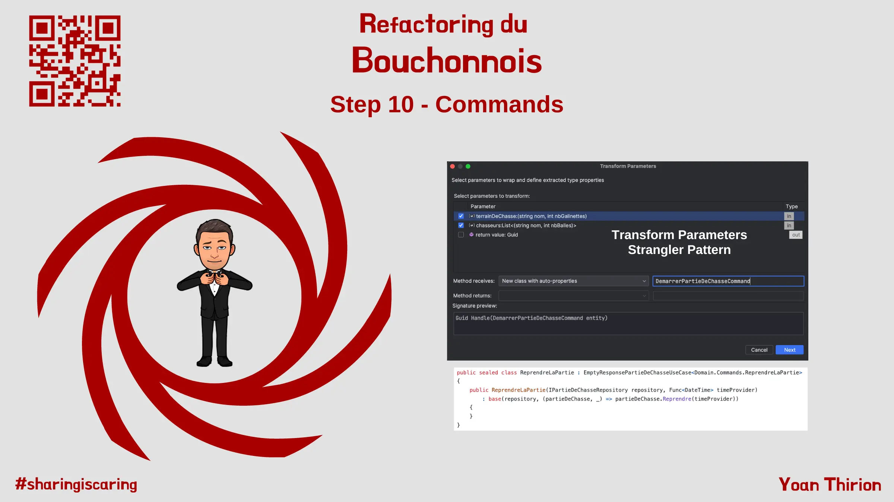
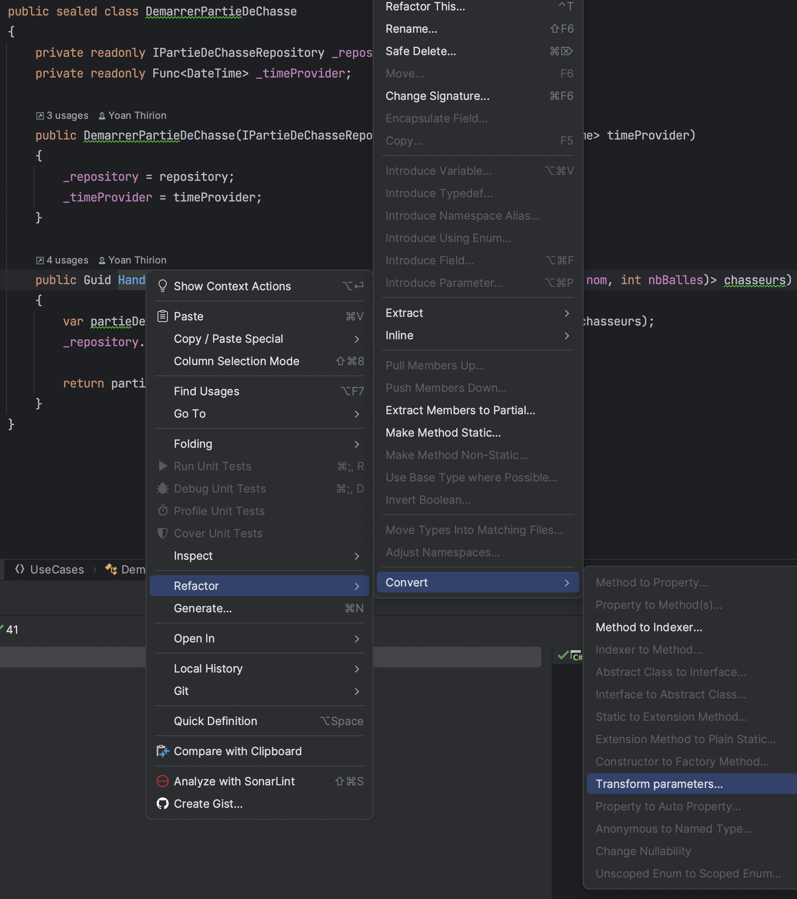
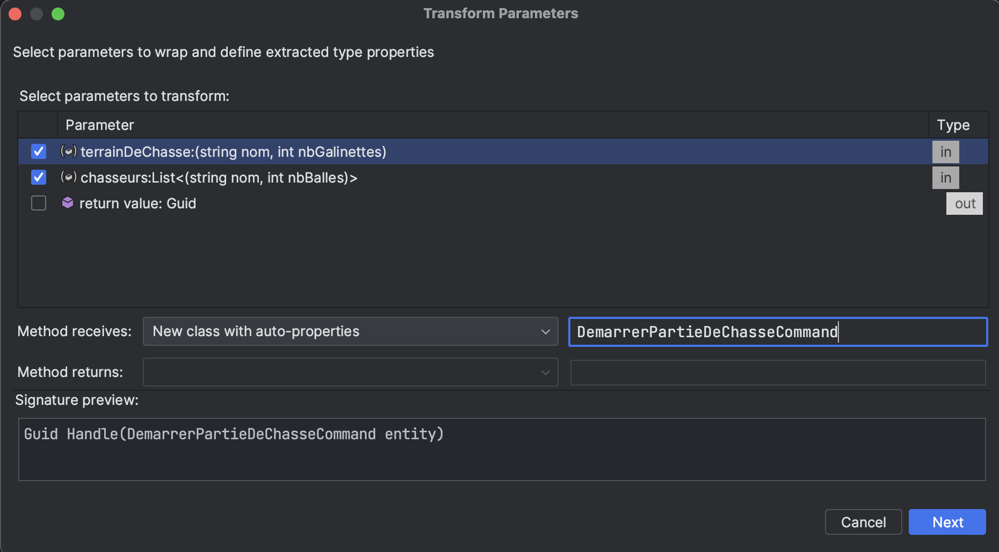
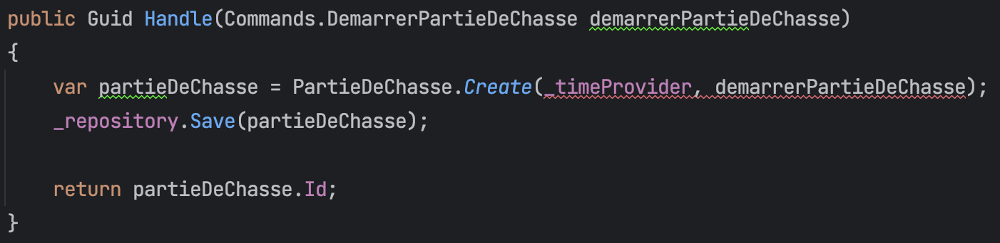
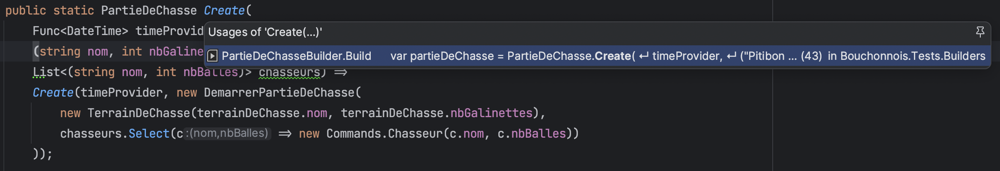

# 10) "Avoid Primitives" - Commands

Nous avons encore du travail quant aux entrants de notre système.\
Celui-ci ne prend en paramètre que des types primitifs avec des signatures de méthodes :

* difficiles à faire évoluer
  * listes de Tuples...
* pouvant être cryptiques et donc avec un `fort impact cognitif`

```csharp
public Guid Handle((string nom, int nbGalinettes) terrainDeChasse, List<(string nom, int nbBalles)> chasseurs)
public void Handle(Guid id, string chasseur)
```

<figure><figcaption><p>Step 10 : "Avoid Primitives" - Commands</p></figcaption></figure>

Il existe un moyen d'éviter ce phénomène : les "objets".\
En l'occurence nous allons encapsuler ce qui est handlé par nos Use Cases dans des objets de type `Command` :

* Prendre du temps pour comprendre ce qu'est le principe [`Avoid Primitive Types`](https://xtrem-tdd.netlify.app/Flavours/no-primitive-types)
* Commencer par refactorer le code du Use Case `DemarrerPartieDeChasse`

> _Si nous avions une couche d'exposition au-dessus, nous devrions mapper les DTOs en entrée vers nos commandes afin de préserver l'encapsulation et pouvoir faire évoluer notre Domain sans impacter les couches supérieures._

## DemarrerPartieDeChasse

* On peut commencer par transformer les paramètres entrants en `class`

<figure><figcaption><p>Transform parameters</p></figcaption></figure>

* Puis on configure l'extraction

<figure><figcaption><p>Configure Transform Parameters</p></figcaption></figure>

* Voici l'impact de ce refactoring automatisé sur notre code :&#x20;
  * Notre IDE est capable de faire ces changements lui-même

```csharp
var id = _demarrerPartieDeChasse.Handle(new DemarrerPartieDeChasseCommand(command.Terrain, command.Chasseurs));
```

* On peut maintenant renommer et bouger cette classe dans notre `Domain`
  * Dans le namespace `Commands`
  * Pour en savoir plus sur le choix de placer les `Commands` dans le `Domain`, je vous invite à lire [ce super article](https://enterprisecraftsmanship.com/posts/cqrs-commands-part-domain-model/) de [Vladimir Khorikov](https://www.linkedin.com/in/vladimir-khorikov-bb482653/)

```csharp
using Commands = Bouchonnois.Domain.Commands;

namespace Bouchonnois.UseCases
{
    public sealed class DemarrerPartieDeChasse
    {
        private readonly IPartieDeChasseRepository _repository;
        private readonly Func<DateTime> _timeProvider;

        public DemarrerPartieDeChasse(IPartieDeChasseRepository repository, Func<DateTime> timeProvider)
        {
            _repository = repository;
            _timeProvider = timeProvider;
        }

        public Guid Handle(Commands.DemarrerPartieDeChasse demarrerPartieDeChasse)
        {
            var partieDeChasse = PartieDeChasse.Create(_timeProvider, demarrerPartieDeChasse.TerrainDeChasse, demarrerPartieDeChasse.Chasseurs);
            _repository.Save(partieDeChasse);

            return partieDeChasse.Id;
        }
    }
}

public record DemarrerPartieDeChasse((string nom, int nbGalinettes) TerrainDeChasse, List<(string nom, int nbBalles)> Chasseurs);
```

* Nous pouvons continuer à travailler sur le `record` afin de lui donner plus de sens métier
  * Malheureusement, à l'heure où j'écris ces lignes mon IDE n'est pas en capacité de faire ce refactoring automatiquement

```csharp
namespace Bouchonnois.Domain.Commands
{
    public record DemarrerPartieDeChasse(TerrainDeChasse TerrainDeChasse, IEnumerable<Chasseur> Chasseurs);
    public record TerrainDeChasse(string Nom, int NbGalinettes);
    public record Chasseur(string Nom, int NbBalles);
}
```

* Nous allons donc adapter par nous-mêmes les appelants en nous laissant guider par les erreurs de compilation
  * On commence par "fixer" les tests

```csharp
[Fact]
public Task DéroulerUnePartie()
{
    var command = DémarrerUnePartieDeChasse()
        .Avec((Data.Dédé, 20), (Data.Bernard, 8), (Data.Robert, 12))
        .SurUnTerrainRicheEnGalinettes(4);

    // C'est ce que l'on veut avec l'utilisation de notre CommandBuilder
    var id = _demarrerPartieDeChasse.Handle(command.Build());
    ...
```

* On adapte notre `Builder`

```csharp
public class CommandBuilder
{
    private (string, int)[] _chasseurs = Array.Empty<(string, int)>();
    private int _nbGalinettes;

    public static CommandBuilder DémarrerUnePartieDeChasse() => new();

    public CommandBuilder Avec(params (string, int)[] chasseurs)
    {
        _chasseurs = chasseurs;
        return this;
    }

    public CommandBuilder SurUnTerrainRicheEnGalinettes(int nbGalinettes = 3)
    {
        _nbGalinettes = nbGalinettes;
        return this;
    }

    // On choisit de ne pas changer le contrat mais uniquement ajouter la méthode Build
    public DemarrerPartieDeChasse Build() 
        => new(
                new TerrainDeChasse("Pitibon sur Sauldre", _nbGalinettes),
                _chasseurs.Select(c => new Chasseur(c.Item1, c.Item2))
            );
}
```

### Refactoring du code de production

* On se focalise maintenant sur le code de production

<figure><figcaption><p>Failure</p></figcaption></figure>

* On utiliser le [Strangler Pattern](https://xtrem-tdd.netlify.app/Flavours/strangler-pattern) pour refactorer notre code
  * On génère un nouvel `overload`
  * :red\_circle: 5 tests sont maintenant rouges : ils vont nous servir de `driver`

```csharp
public static PartieDeChasse Create(Func<DateTime> timeProvider, DemarrerPartieDeChasse demarrerPartieDeChasse)
{
    throw new NotImplementedException();
}
```

* :green\_circle: On commence par utiliser l'ancienne méthode dans à partir de la nouvelle pour faire passer les tests

```csharp
 public static PartieDeChasse Create(Func<DateTime> timeProvider, DemarrerPartieDeChasse demarrerPartieDeChasse) =>
    Create(timeProvider,
        (demarrerPartieDeChasse.TerrainDeChasse.Nom, demarrerPartieDeChasse.TerrainDeChasse.NbGalinettes),
        demarrerPartieDeChasse.Chasseurs.Select(c => (c.Nom, c.NbBalles)).ToList()
    );

public static PartieDeChasse Create(
    Func<DateTime> timeProvider,
    (string nom, int nbGalinettes) terrainDeChasse,
    List<(string nom, int nbBalles)> chasseurs)
{
    CheckTerrainValide(terrainDeChasse);
    CheckChasseursValides(chasseurs);

    return new PartieDeChasse(
        Guid.NewGuid(),
        timeProvider,
        new Terrain(terrainDeChasse.nom, terrainDeChasse.nbGalinettes),
        chasseurs
    );
}
```

* :blue\_circle: On peut maintenant "copier / coller" le code de l'ancienne méthode dans la nouvelle

```csharp
public static PartieDeChasse Create(Func<DateTime> timeProvider, DemarrerPartieDeChasse demarrerPartieDeChasse)
{
    CheckTerrainValide(demarrerPartieDeChasse.TerrainDeChasse);
    CheckChasseursValides(demarrerPartieDeChasse.Chasseurs.ToArray());

    return new PartieDeChasse(
        Guid.NewGuid(),
        timeProvider,
        new Terrain(demarrerPartieDeChasse.TerrainDeChasse.Nom, demarrerPartieDeChasse.TerrainDeChasse.NbGalinettes),
        demarrerPartieDeChasse.Chasseurs.Select(c => new Chasseur(c.Nom, c.NbBalles)).ToArray()
    );
}

public static PartieDeChasse Create(
    Func<DateTime> timeProvider,
    (string nom, int nbGalinettes) terrainDeChasse,
    List<(string nom, int nbBalles)> chasseurs) =>
    Create(timeProvider, new DemarrerPartieDeChasse(
        new TerrainDeChasse(terrainDeChasse.nom, terrainDeChasse.nbGalinettes),
        chasseurs.Select(c => new Commands.Chasseur(c.nom, c.nbBalles))
    ));
```

* On regarde qui appelait l'ancienne méthode de création

<figure><figcaption><p>Usages</p></figcaption></figure>

* On "plug" les appelants sur la nouvelle méthode

```csharp
var partieDeChasse = PartieDeChasse.Create(
    timeProvider,
    new DemarrerPartieDeChasse(
            new TerrainDeChasse("Pitibon sur Sauldre", _nbGalinettes),
            builtChasseurs
                .Select(c => new Domain.Commands.Chasseur(c.Nom, c.BallesRestantes > 0 ? c.BallesRestantes : 1))
                .ToList()
            )
);
```

* :blue\_circle: On peut supprimer de manière totalement `safe` la méthode "_étranglée_"&#x20;

## Reproduire ces étapes pour les autres Commands

Après avoir extrait des `Command` pour chaque `Use Case` nous pouvons remarquer les patterns suivants :

* 1 `Use Case` a pour définition : `Command` -> `Result`
* Chaque `Use Case` implémente la même logique
  * Charge la `PartieDeChasse` à partir du repository
  * Vérifie que celle-ci existe
  * Exécute l'action sur le `Domain`
  * `Save` le nouvel état

> 1 seule exception à celà : DemarrerPartieDeChasse

Nous allons faire en sorte de factoriser cette logique grâce à notre nouveau typage d'entrée.

## Factoriser le code des Use Cases

On commence par traduire le texte ci-dessus sous forme de "contrat".

* On crée une nouvelle interface pour nos `Use Cases`
  * On crée également une interface pour contraindre qu'en entrée d'un `Use Case` seule 1 `Command` puisse être passée

```csharp
public interface IUseCase<in TRequest, out TResponse> where TRequest : ICommand
{
    public TResponse Handle(TRequest command);
}

public interface ICommand
{
}
```

* On l'utilise pour `ConsulterStatus`
  * Le gain n'est pas flagrant...
  * On utilise uniquement les interfaces pour contraindre la méthode `Handle`

```csharp
public sealed class ConsulterStatus : IUseCase<Domain.Commands.ConsulterStatus, string>
{
    private readonly IPartieDeChasseRepository _repository;

    public ConsulterStatus(IPartieDeChasseRepository repository)
        => _repository = repository;

    public string Handle(Domain.Commands.ConsulterStatus consulterStatus)
    {
        // On voudrait factoriser ce code...
        var partieDeChasse = _repository.GetById(consulterStatus.PartieDeChasseId);

        if (partieDeChasse == null)
        {
            throw new LaPartieDeChasseNexistePas();
        }

        return partieDeChasse.Consulter();
    }
}
```

* On continue avec un autre `Use Case` : `PrendreLapéro`
  * On tombe sur un problème
  * Le type de retour ici est `void`

```csharp
public sealed class PrendreLapéro : IUseCase<Domain.Commands.PrendreLapéro, void>
```

* On crée un type de retour pour ce besoin

```csharp
public class VoidResponse
{
    public static readonly VoidResponse Empty = new();
}

public sealed class PrendreLapéro : IUseCase<Domain.Commands.PrendreLapéro, VoidResponse>
{
    private readonly IPartieDeChasseRepository _repository;
    private readonly Func<DateTime> _timeProvider;

    public PrendreLapéro(IPartieDeChasseRepository repository, Func<DateTime> timeProvider)
    {
        _repository = repository;
        _timeProvider = timeProvider;
    }

    public VoidResponse Handle(Domain.Commands.PrendreLapéro prendreLapéro)
    {
        var partieDeChasse = _repository.GetById(prendreLapéro.PartieDeChasseId);

        if (partieDeChasse == null)
        {
            throw new LaPartieDeChasseNexistePas();
        }

        partieDeChasse.PrendreLapéro(_timeProvider);
        _repository.Save(partieDeChasse);

        return Empty;
    }
}
```

* On profite d'avoir 2 usages pour essayer de mutualiser du code
  * On extrait 1 squelette de classe
  * On extrait également 1 `record` contenant le `Guid` de la partie

```csharp
public record PartieDeChasseCommand(Guid PartieDeChasseId) : ICommand;

public class PartieDeChasseUseCase<TRequest, TResponse> : IUseCase<TRequest, TResponse>
    where TRequest : PartieDeChasseCommand
{
    public TResponse Handle(TRequest command)
    {
        throw new NotImplementedException();
    }
}
```

* On utilise cette classe dans 1 premier `Use Case`

```csharp
public sealed class ConsulterStatus : PartieDeChasseUseCase<Domain.Commands.ConsulterStatus, string>
{
    private readonly IPartieDeChasseRepository _repository;

    public ConsulterStatus(IPartieDeChasseRepository repository)
        => _repository = repository;
}
```

* On implémente la méthode `Handle`

```csharp
public abstract class PartieDeChasseUseCase<TRequest, TResponse> : IUseCase<TRequest, TResponse>
        where TRequest : PartieDeChasseCommand
{
    private readonly IPartieDeChasseRepository _repository;

    public PartieDeChasseUseCase(IPartieDeChasseRepository repository) => _repository = repository;

    public TResponse Handle(TRequest command)
    {
        var partieDeChasse = _repository.GetById(command.PartieDeChasseId);

        if (partieDeChasse == null)
        {
            throw new LaPartieDeChasseNexistePas();
        }

        var response = Handle(partieDeChasse, command);
        _repository.Save(partieDeChasse);

        return response;
    }
    
    // Chaque Use Case devra implémenter cette méthode abstract
    protected abstract TResponse Handle(PartieDeChasse partieDeChasse, TRequest command);
}
```

* On "fixe" la classe `ConsulterStatus`

```csharp
public sealed class ConsulterStatus : PartieDeChasseUseCase<Domain.Commands.ConsulterStatus, string>
{
    public ConsulterStatus(IPartieDeChasseRepository repository) : base(repository)
    {
    }

    protected override string Handle(PartieDeChasse partieDeChasse, Domain.Commands.ConsulterStatus command)
        => partieDeChasse.Consulter();
}
```

> Alternativement, nous pourrions utiliser 1 Higher Order Function plutôt qu'une méthode Abstract ici

```csharp
public abstract class PartieDeChasseUseCase<TRequest, TResponse> : IUseCase<TRequest, TResponse>
        where TRequest : PartieDeChasseCommand
{
    private readonly IPartieDeChasseRepository _repository;
    private readonly Func<PartieDeChasse, TRequest, TResponse> _domainHandler;

    protected PartieDeChasseUseCase(IPartieDeChasseRepository repository,
        Func<PartieDeChasse, TRequest, TResponse> domainHandler)
    {
        _repository = repository;
        _domainHandler = domainHandler;
    }
    ...
}

public sealed class ConsulterStatus : PartieDeChasseUseCase<Domain.Commands.ConsulterStatus, string>
{
    public ConsulterStatus(IPartieDeChasseRepository repository) :
        base(repository, (partieDeChasse, _) => partieDeChasse.Consulter())
    {
    }
}
```

* On refactor les autres `Use Cases`
  * Et apporte quelques améliorations
  * Finalement, voici le code de nos `Use Cases` (sans avoir introduit aucune régression)

```csharp
public sealed class ConsulterStatus : PartieDeChasseUseCase<Domain.Commands.ConsulterStatus, string>
{
    public ConsulterStatus(IPartieDeChasseRepository repository) :
        base(repository, (partieDeChasse, _) => partieDeChasse.Consulter())
    {
    }
}

public sealed class PrendreLapéro : EmptyResponsePartieDeChasseUseCase<Domain.Commands.PrendreLapéro>
{
    public PrendreLapéro(IPartieDeChasseRepository repository, Func<DateTime> timeProvider)
        : base(repository, (partieDeChasse, _) => partieDeChasse.PrendreLapéro(timeProvider))
    {
    }
}

public sealed class ReprendreLaPartie : EmptyResponsePartieDeChasseUseCase<Domain.Commands.ReprendreLaPartie>
{
    public ReprendreLaPartie(IPartieDeChasseRepository repository, Func<DateTime> timeProvider)
        : base(repository, (partieDeChasse, _) => partieDeChasse.Reprendre(timeProvider))
    {
    }
}

public sealed class TerminerLaPartie : PartieDeChasseUseCase<Domain.Commands.TerminerLaPartie, string>
{
    public TerminerLaPartie(IPartieDeChasseRepository repository, Func<DateTime> timeProvider)
        : base(repository, (partieDeChasse, _) => partieDeChasse.Terminer(timeProvider))
    {
    }
}

public sealed class Tirer : EmptyResponsePartieDeChasseUseCase<Domain.Commands.Tirer>
{
    public Tirer(IPartieDeChasseRepository repository, Func<DateTime> timeProvider)
        : base(repository,
            (partieDeChasse, command) => partieDeChasse.Tirer(command.Chasseur, timeProvider, repository))
    {
    }
}

public sealed class TirerSurUneGalinette : EmptyResponsePartieDeChasseUseCase<Domain.Commands.TirerSurUneGalinette>
{
    public TirerSurUneGalinette(IPartieDeChasseRepository repository, Func<DateTime> timeProvider)
        : base(repository,
            (partieDeChasse, command) =>
                partieDeChasse.TirerSurUneGalinette(command.Chasseur, timeProvider, repository))
    {
    }
}

// Use Case de création -> cas particulier
public sealed class DemarrerPartieDeChasse : IUseCase<Domain.Commands.DemarrerPartieDeChasse, Guid>
{
    private readonly IPartieDeChasseRepository _repository;
    private readonly Func<DateTime> _timeProvider;

    public DemarrerPartieDeChasse(IPartieDeChasseRepository repository, Func<DateTime> timeProvider)
    {
        _repository = repository;
        _timeProvider = timeProvider;
    }

    public Guid Handle(Domain.Commands.DemarrerPartieDeChasse demarrerPartieDeChasse)
    {
        var partieDeChasse = PartieDeChasse.Create(_timeProvider, demarrerPartieDeChasse);
        _repository.Save(partieDeChasse);

        return partieDeChasse.Id;
    }
}
```

## Confinement des Commands

Nous pouvons ajouter 1 nouvelle règle d'architecture :

```
Toutes les Commandes doivent être déclarées au sein du Domain (Domain.Commands)
```

Voici le code que l'on peut écrire à l'aide d'ArchUnit :

```csharp
[Fact]
public void CommandsShouldBePartOfDomain() =>
    Classes().That()
        .ImplementInterface(typeof(ICommand))
        .Or()
        .HaveNameEndingWith("Command").Should()
        .ResideInNamespace("Domain.Commands", true)
        .Check();
```

Nouveau rapport `SonarCloud` disponible [ici](https://sonarcloud.io/summary/overall?id=ythirion\_refactoring-du-bouchonnois\&branch=steps%2F10-commands).

## Reflect

* Où avez-vous placé les classes de type `Command` dans votre solution ?
* Quel impact ce refactoring a eu ?

<figure><figcaption></figcaption></figure>
