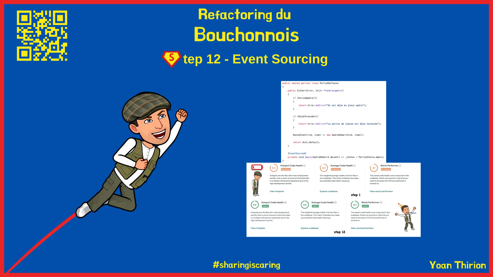
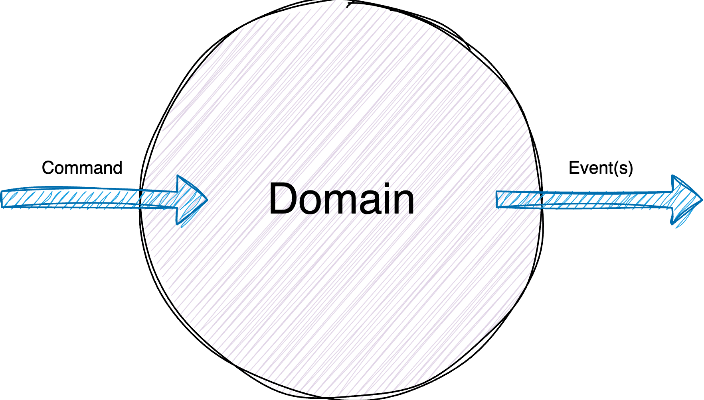
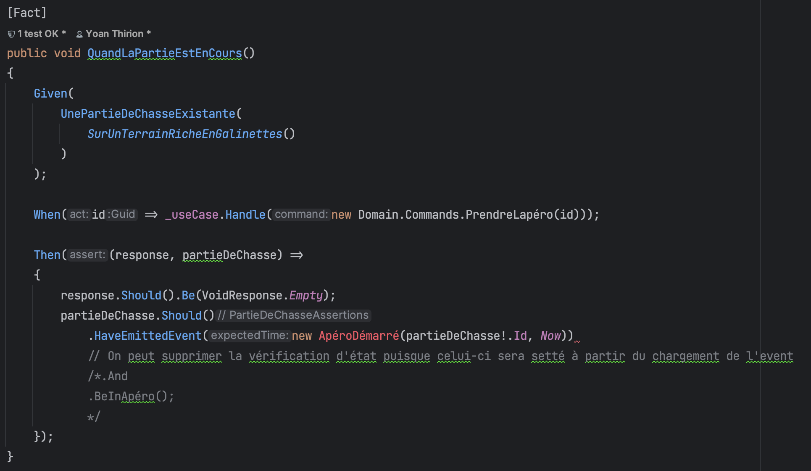
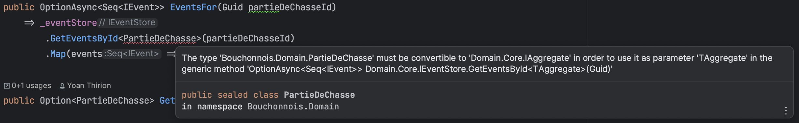
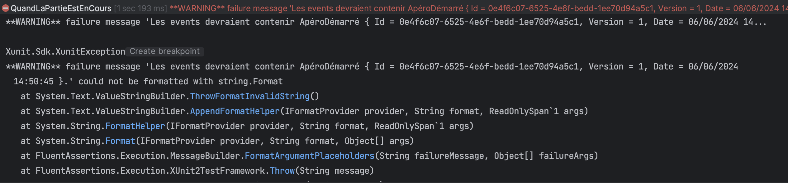
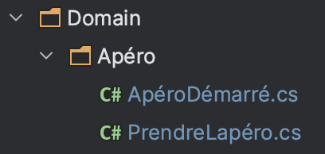
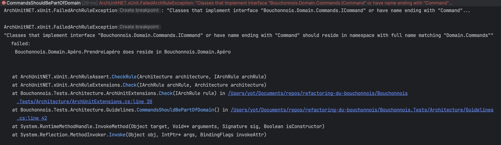
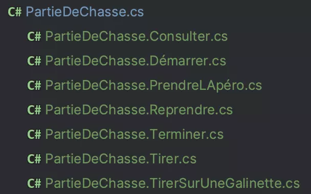
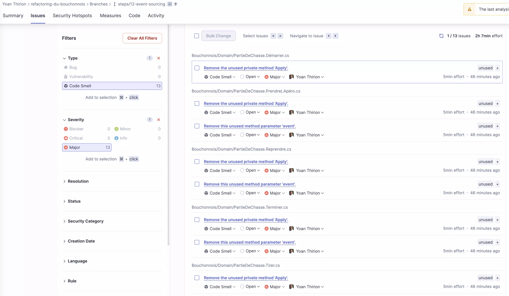
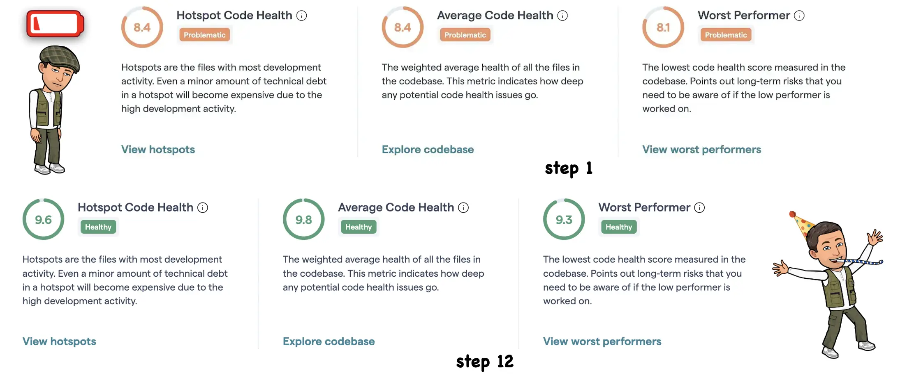

# 12) "Event Sourcing"

<figure><figcaption><p>Step 12 : "Event Sourcing"</p></figcaption></figure>

Nous avons des `ersatzs` d'événements au sein de notre `PartieDeChasse`.

Ceux-ci sont extrêmement limités :

* ils ne portent aucune sémantique métier
* pas structurés : ce sont de simples `string`

```csharp
private readonly List<Event> _events;
public sealed record Event(DateTime Date, string Message)
{
    public override string ToString() => string.Format("{0:HH:mm} - {1}", Date, Message);
}

if (TousBrocouilles(classement))
{
    result = "Brocouille";
    EmitEvent("La partie de chasse est terminée, vainqueur : Brocouille", timeProvider);
}
else
{
    result = Join(", ", classement[0].Select(c => c.Nom));
    EmitEvent(
        $"La partie de chasse est terminée, vainqueur : {Join(", ", classement[0].Select(c => $"{c.Nom} - {c.NbGalinettes} galinettes"))}",
        timeProvider);
}
```

On va revoir cette gestion des événements et allons en profiter pour `Event-sourcer` notre `Aggregate`. Celà signifie que nous n'allons plus stocker l'état de notre `Aggregate` mais tous ses événements.

Pour celà, on va :

* Prendre du temps pour découvrir ce qu'est l'[`Event Sourcing`](https://martinfowler.com/eaaDev/EventSourcing.html)
* Quelques classes ont déjà été implémenté afin de faciliter l'utilisation d'1 `Event Store` in memory
  * Faire 1 `checkout` du commit `6efde7c3e470e7c84c50da2715c255bd9acd3d6c`

```shell
git checkout 5b3129f2bc384ccc707b3f6bb730ff2ef9999167
```

* Cette version est très minimaliste et ne résolve pas des problématiques telles que la concurrence
* Prendre du temps pour comprendre le code du `Domain.Core`
  * Ce code est fortement inspiré du travail fait sur [`NEventStore`](https://github.com/NEventStore/NEventStore)
  * Pour comprendre comment utiliser ce code, on peut se focaliser sur les tests qui nous en donnent une bonne idée

```csharp
[Fact]
public class AggregateShould
{
    private readonly Guid _id;
    private readonly Movie _movie;

    public AggregateShould()
    {
        _id = Guid.NewGuid();
        _movie = Oppenheimer.Movie(_id);
    }

    [Fact]
    public void have_raised_creation_event()
    {
        _movie.HasRaisedEvent(new MovieCreated(_id, Data.Now, Oppenheimer.Title, Oppenheimer.ReleaseDate))
            .Should()
            .BeTrue();
        _movie.Version.Should().Be(1);
        _movie.Id.Should().Be(_id);
    }

    [Fact]
    public void have_raised_casting_changed_event()
    {
        var newCasting = new List<string> {"Cillian Murphy", "Florence Pugh"}.ToSeq();

        _movie.ChangeCast(newCasting);

        _movie.HasRaisedEvent(new CastingHasChanged(_id, Data.Now, newCasting))
            .Should()
            .BeTrue();

        _movie.Version.Should().Be(2);
    }

    [Fact]
    public void throw_handler_not_found_when_apply_method_not_defined()
    {
        var act = () => _movie.NotWellImplementedBehavior();
        act.Should()
            .Throw<HandlerForDomainEventNotFoundException>()
            .WithMessage(
                "Aggregate of type 'Movie' raised an event of type 'NotWellImplementedDomainBehaviorRaised' but no handler could be found to handle the event.");
    }
    ...
}

public class Movie : Aggregate
{
    // public only for testing purpose
    public string? _title;
    public DateTime? _releaseDate;
    public Seq<string> _casting = Seq<string>.Empty;
    private Movie(Guid id, Func<DateTime> timeProvider) : base(timeProvider, true) => Id = id;

    public Movie(Guid id, Func<DateTime> timeProvider, string title, DateTime releaseDate) : this(id, timeProvider)
        => RaiseEvent(new MovieCreated(id, Time(), title, releaseDate));

    private void Apply(MovieCreated @event)
    {
        _title = @event.Title;
        _releaseDate = @event.ReleaseDate;
    }

    public void ChangeCast(Seq<string> casting) => RaiseEvent(new CastingHasChanged(Id, Time(), casting));

    private void Apply(CastingHasChanged @event) => _casting = @event.Casting;

    public void NotWellImplementedBehavior() => RaiseEvent(new NotWellImplementedDomainBehaviorRaised(Id, Time()));
}

public record MovieCreated(Guid Id, DateTime Date, string Title, DateTime ReleaseDate) : Event(Id, 1, Date);

public record CastingHasChanged(Guid Id, DateTime Date, Seq<string> Casting) : Event(Id, 1, Date);

public record NotWellImplementedDomainBehaviorRaised(Guid Id, DateTime Date) : Event(Id, 1, Date);
```

* Identifier quels sont les éléments fondamentaux à mettre en place pour avoir 1 `Aggregate` "Event-Sourcé"

## Changer l'implémentation de `Prendre LApéro`

Faire en sorte que le flux ressemble à cela :&#x20;

<figure><figcaption><p>Command / Event(s)</p></figcaption></figure>

* Pour le moment au sein de notre `Domain` son implémentation ressemble à ça :

```csharp
public Either<Error, PartieDeChasse> PrendreLapéro(Func<DateTime> timeProvider)
{
    if (DuringApéro())
    {
        return AnError("On est déjà en plein apéro");
    }

    if (DéjàTerminée())
    {
        return AnError("La partie de chasse est déjà terminée");
    }

    Status = Apéro;
    EmitEvent("Petit apéro", timeProvider);

    return this;
}
```

* Soyons plus explicite en retournant `Either<Error, Unit>`
  * On ne stockera plus l'état mais que les `Events` donc plus besoin de retourner le nouvel état de l'objet
* :red\_circle: On commence par adapter 1 test existant afin de spécifier nos attentes vis-à-vis du système
  * On change le test
  * On utilise 1 verbe au passé pour décrire notre événement -> quelque chose d'immuable

<figure><figcaption><p>First red test</p></figcaption></figure>

* On génère l'Event "structuré" depuis le test
  * On choisi d'utiliser 1 `record` parce qu'ils sont immuables par design
  * On ajoute la référence sur le projet `Domain.Core`

```csharp
public record ApéroDémarré(Guid Id, DateTime Date) : Event(Id, 1, Date);
```

* On doit maintenant ajouter 1 `overload` sur notre class `PartieDeChasseAssertions` afin de pouvoir faire des assertions sur des Domain Events :

```csharp
public AndConstraint<PartieDeChasseAssertions> HaveEmittedEvent<TEvent>(TEvent expectedEvent) where TEvent : class, IEvent 
    => // Comment écrire cette Assertion ???
```

* On doit vérifier que l'événemt a bien été émis par notre aggrégat et commité dans notre `EventStore`
  * On va donc vérifier que dans le `stream` d'events associé à l'instance de notre aggrégat notre `event` est bien présent
  * On ajoute alors dans l'assertion 1 dépendance sur le repository

```csharp
public void HaveEmittedEvent<TEvent>(PartieDeChasseRepositoryForTests repository,
    TEvent expectedEvent) where TEvent : class, IEvent
    => Call(() =>
        Assertion.Given(() => Subject!.Id)
            .ForCondition(_ => repository.LastEvent().Equals(expectedEvent))
            .FailWith($"Les events devraient contenir {expectedEvent}.")
    );
```

* Pour continuer on doit itérer sur notre `interface` de repository
  * On commence à inclure de l'asynchronisme en utilisant 1 `OptionAsync` (toujours de `LanguageExt`)
  * On adapte aussi l'assertion (on va utiliser l'`AsyncHelper` pour se faciliter la tâche)

```csharp
public interface IPartieDeChasseRepository
{
    void Save(PartieDeChasse partieDeChasse);
    Option<PartieDeChasse> GetById(Guid partieDeChasseId);
    // On va utiliser des mécanismes Async pour refléter l'asynchronisme de notre Event Store
    OptionAsync<Seq<IEvent>> EventsFor(Guid partieDeChasseId);
}

public AndConstraint<PartieDeChasseAssertions> HaveEmittedEvent<TEvent>(
    IPartieDeChasseRepository repository,
    TEvent expectedEvent) where TEvent : class, IEvent =>
    Call(() => Assertion
            .Given(() => repository.EventsFor(Subject!.Id))
            .ForCondition(events => AsyncHelper.RunSync(() => events.Exists(stream => stream.Exists(@event => @event.Equals(expectedEvent)))))
            .FailWith($"Les events devraient contenir {expectedEvent}.")
    );
```

* On ajoute 1 instance d'`EventStore` au sein du `PartieDeChasseRepositoryForTests`
  * Sachant que pour les besoins de testing nous utiliserons l'instance `InMemory`
  * Ce repository permettra de manière transiente de pouvoir faire du state-based et de l'event sourcing

```csharp
public class PartieDeChasseRepositoryForTests : IPartieDeChasseRepository
{
    private readonly IEventStore _eventStore;
    private Map<Guid, PartieDeChasse> _partiesDeChasse = Map<Guid, PartieDeChasse>.Empty;
    private PartieDeChasse? _savedPartieDeChasse;

    public PartieDeChasseRepositoryForTests(IEventStore eventStore)
        => _eventStore = eventStore;

    public void Save(PartieDeChasse partieDeChasse)
    {
        ((IAggregate) partieDeChasse).GetUncommittedEvents().ToSeq();
        // On sauvegarde l'aggrégat via l'EventStore
        AsyncHelper.RunSync(() => _eventStore.Save(partieDeChasse));

        _savedPartieDeChasse = partieDeChasse;
        Add(partieDeChasse);
    }
    
    ...
    
    public OptionAsync<Seq<IEvent>> EventsFor(Guid partieDeChasseId)
        => _eventStore
            .GetEventsById<PartieDeChasse>(partieDeChasseId)
            .Map(events => events.OrderByDescending(e => e.Date).ToSeq());
            
    ...
}
```

* On adapte ses instantiations

```csharp
protected UseCaseTest(Func<IPartieDeChasseRepository, Func<DateTime>, TUseCase> useCaseFactory)
{
    Repository = new PartieDeChasseRepositoryForTests(new InMemoryEventStore(TimeProvider));
    _useCase = useCaseFactory(Repository, TimeProvider);
}
```

* On doit maintenant travailler sur l'Aggregate

<figure><figcaption><p>PartieDeChasse n'est pas 1 Aggregate</p></figcaption></figure>

* On lui fait hériter de `Aggregate` et on fixe les warnings

```csharp
public sealed class PartieDeChasse : Aggregate
{
    private readonly Arr<Chasseur> _chasseurs = Arr<Chasseur>.Empty;
    // TODO : à supprimer à terme
    private readonly List<Event> _events = new();
    public IReadOnlyList<Chasseur> Chasseurs => _chasseurs.ToImmutableArray();
    public Terrain? Terrain { get; }
    public PartieStatus Status { get; private set; }
    public IReadOnlyList<Event> Events => _events.ToImmutableArray();

    // Nouveau ctor    
    private PartieDeChasse(Guid id, Func<DateTime> timeProvider) : base(timeProvider) => Id = id;

    private PartieDeChasse(Guid id,
        Func<DateTime> timeProvider,
        Terrain terrain,
        Chasseur[] chasseurs)
        : this(id, timeProvider)
    {
        Id = id;
        _chasseurs = chasseurs.ToArr();
        Terrain = terrain;
        Status = EnCours;
        _events = new List<Event>();

        EmitPartieDémarrée(timeProvider);
    }
```

* :red\_circle: On fail maintenant plus pour des erreurs de compilation mais bien parce qu'aucun événement n'est présent dans l'`Event Store`

<figure><figcaption><p>Fail ca aucun événement trouvé</p></figcaption></figure>

* :green\_circle: On `raise` l'event

```csharp
public Either<Error, PartieDeChasse> PrendreLapéro(Func<DateTime> timeProvider)
{
    if (DuringApéro())
    {
        return AnError("On est déjà en plein apéro");
    }

    if (DéjàTerminée())
    {
        return AnError("La partie de chasse est déjà terminée");
    }

    Status = Apéro;
    RaiseEvent(new ApéroDémarré(Id, timeProvider()));
    EmitEvent("Petit apéro", timeProvider);

    return this;
}
```

* :blue\_circle: On va désormais adapté notre code pour faire en sorte que cet événement puisse être rejoué sur l'aggrégat
  * La transition (mutation / changement d'état doit se faire au chargement de l'event) ici `Status = Apéro`

```csharp
public Either<Error, PartieDeChasse> PrendreLapéro(Func<DateTime> timeProvider)
{
    if (DuringApéro())
    {
        return AnError("On est déjà en plein apéro");
    }

    if (DéjàTerminée())
    {
        return AnError("La partie de chasse est déjà terminée");
    }

    RaiseEvent(new ApéroDémarré(Id, timeProvider()));
    // On supprimera la méthode EmitEvent une fois qu'on aura finit de changer chaque behavior de l'aggrégat
    EmitEvent("Petit apéro", timeProvider);

    return this;
}

// Attention : cette méthode sera appelé par Reflection -> votre IDE voudra la supprimée...
// Vos tests diront le contraire 😉
private void Apply(ApéroDémarré @event) => Status = Apéro;
```

* :blue\_circle: On va changer le retour de la méthode à partir de l'appelant

```csharp
protected static Either<Error, VoidResponse> ToEmpty(Either<Error, Unit> either)
    => either.Map(_ => VoidResponse.Empty);
    

public Either<Error, Unit> PrendreLapéro(Func<DateTime> timeProvider)
{
    if (DuringApéro())
    {
        return AnError("On est déjà en plein apéro");
    }

    if (DéjàTerminée())
    {
        return AnError("La partie de chasse est déjà terminée");
    }

    RaiseEvent(new ApéroDémarré(Id, timeProvider()));
    EmitEvent("Petit apéro", timeProvider);

    return Default;
}
```

* :blue\_circle: Quoi d'autre ?
  * On peut changer l'organisation du `Domain` afin de grouper ensemble les couples `Command | Event`

<figure><figcaption><p>Event avec Command</p></figcaption></figure>

* En faisant cela, on brise une règle d'architecture définie précédemment :&#x20;

<figure><figcaption><p>Broken Architecture Rule</p></figcaption></figure>

* On va alors créer 1 `ADR` (Architecture Decision Record) pour expliquer pourquoi on a voulu dévier de cette règle
  * Plus d'informations sur les ADR [ici](https://xtrem-tdd.netlify.app/Flavours/adr)
  * Bien sûr, ce genre de décisions doivent être discutées et prises en équipe

```markdown
# Grouper les Commands et Events
- Date : 23/08/2023
- Who were involved in the decision : `Yoan Thirion`

## Context
Describe the decision context :

Nous avions pris la décision de localiser les commandes dans le Domain dans 1 répertoire `Commands`.  
Maintenant que nous utilisons des `Event` pour réponse aux `Command`, nous devrions peut-être faire évoluer notre desgin.

## Decision
On préfère grouper ces couples `Command | Event` avec une sémantique métier.  
Celà permet de créer une `Screaming Architecture`.

Exemple pour `Prendre l'apéro` :  


## Status
`Accepted`
```

* On change la règle `ArchUnit`

```csharp
private readonly GivenClassesConjunction _commands = Classes().That()
    .ImplementInterface(typeof(ICommand)).Or()
    .HaveNameEndingWith("Command");

private readonly GivenClassesConjunction _events = Classes().That().ImplementInterface(typeof(IEvent));

[Fact]
public void CommandsAndEventsShouldBePartOfDomain() 
    => create(_commands, _events)
        .ForEach(ShouldBePartOfDomain);

private static void ShouldBePartOfDomain(GivenClassesConjunction classes)
    => classes.Should()
        .ResideInNamespace("Domain", true)
        .Check();
```

## Après avoir tout refactoré...

* Pour la consultation du status
  * On a choisi de conserver cette méthode au niveau du `Domain`
    * En construisant le `status` basé sur le `stream` de l'aggrégat
  * On aurait pu, depuis le `Use Case` passé par une projection

```csharp
public Either<Error, string> Consulter(IPartieDeChasseRepository repository)
    // RunSync : on a fait le choix de garder notre Domain synchrone
    => RunSync(() => repository.EventsFor(Id)
        .Map(FormatEvents)
        .ValueUnsafe()
    );

private static string FormatEvents(Seq<IEvent> events)
    => Join(Environment.NewLine,
        events.Map(@event => $"{@event.Date:HH:mm} - {@event}")
    );
```

* On va pouvoir "cleaner" notre `PartieDeChasse`
  * Plus besoin de gérer les `mytho` events au sein de l'aggrégat avec la méthode `EmitEvent`
  * La gestion du temps est complètement faites via le `TimeProvider` fournit en entrée
    * On a plus besoin de passer de référence dans nos méthodes

```csharp
public sealed class PartieDeChasse : Aggregate
{
    private Arr<Chasseur> _chasseurs = Arr<Chasseur>.Empty;
    public IReadOnlyList<Chasseur> Chasseurs => _chasseurs.ToImmutableArray();
    public Terrain? Terrain { get; private set; }
    public PartieStatus Status { get; private set; }
    private PartieDeChasse(Guid id, Func<DateTime> timeProvider) : base(timeProvider) => Id = id;

    #region Create

    private PartieDeChasse(Guid id,
        Func<DateTime> timeProvider,
        Terrain terrain,
        Chasseur[] chasseurs) : this(id, timeProvider)
    {
        RaiseEvent((_, time) =>
            new PartieDeChasseDémarrée(id,
                time,
                new TerrainCréé(terrain.Nom, terrain.NbGalinettes),
                chasseurs.Map(c => new ChasseurCréé(c.Nom, c.BallesRestantes)).ToArray()
            )
        );
    }

    public static Either<Error, PartieDeChasse> Create(
        Func<DateTime> timeProvider,
        DemarrerPartieDeChasse demarrerPartieDeChasse)
    {
        if (!IsTerrainValide(demarrerPartieDeChasse.TerrainDeChasse))
        {
            return AnError("Impossible de démarrer une partie de chasse sur un terrain sans galinettes");
        }

        if (!ContainsChasseurs(demarrerPartieDeChasse.Chasseurs.ToArray()))
        {
            return AnError("Impossible de démarrer une partie de chasse sans chasseurs...");
        }

        if (AuMoinsUnChasseurNaPasDeBalles(demarrerPartieDeChasse.Chasseurs.ToArray()))
        {
            return AnError("Impossible de démarrer une partie de chasse avec un chasseur sans balle(s)...");
        }

        return new PartieDeChasse(
            Guid.NewGuid(),
            timeProvider,
            new Terrain(
                demarrerPartieDeChasse.TerrainDeChasse.Nom,
                demarrerPartieDeChasse.TerrainDeChasse.NbGalinettes
            ),
            demarrerPartieDeChasse.Chasseurs.Select(c => new Chasseur(c.Nom, c.NbBalles)).ToArray()
        );
    }

    private void Apply(PartieDeChasseDémarrée @event)
    {
        Id = @event.Id;
        _chasseurs = @event.Chasseurs.Map(c => new Chasseur(c.Nom, c.BallesRestantes)).ToArray();
        Terrain = new Terrain(@event.Terrain.Nom, @event.Terrain.NbGalinettes);
        Status = EnCours;
    }

    private static bool IsTerrainValide(TerrainDeChasse terrainDeChasse) => terrainDeChasse.NbGalinettes > 0;
    private static bool ContainsChasseurs(Démarrer.Chasseur[] chasseurs) => chasseurs.Any();

    private static bool AuMoinsUnChasseurNaPasDeBalles(Démarrer.Chasseur[] chasseurs)
        => chasseurs.Exists(c => c.NbBalles == 0);

    #endregion

    #region Apéro

    public Either<Error, Unit> PrendreLapéro()
    {
        if (DuringApéro())
        {
            return AnError("On est déjà en plein apéro");
        }

        if (DéjàTerminée())
        {
            return AnError("La partie de chasse est déjà terminée");
        }

        RaiseEvent((id, time) => new ApéroDémarré(id, time));

        return Default;
    }

    private void Apply(ApéroDémarré @event) => Status = PartieStatus.Apéro;

    #endregion

    #region Reprendre

    public Either<Error, Unit> Reprendre()
    {
        if (DéjàEnCours())
        {
            return AnError("La partie de chasse est déjà en cours");
        }

        if (DéjàTerminée())
        {
            return AnError("La partie de chasse est déjà terminée");
        }

        RaiseEvent((id, time) => new PartieReprise(id, time));

        return Default;
    }

    private void Apply(PartieReprise @event) => Status = EnCours;

    #endregion

    #region Consulter

    public Either<Error, string> Consulter(IPartieDeChasseRepository repository)
        => RunSync(() => repository.EventsFor(Id)
            .Map(FormatEvents)
            .ValueUnsafe()
        );

    private static string FormatEvents(Seq<IEvent> events)
        => Join(Environment.NewLine,
            events.Map(@event => $"{@event.Date:HH:mm} - {@event}")
        );

    #endregion

    #region Terminer

    public Either<Error, string> Terminer()
    {
        if (DéjàTerminée())
        {
            return AnError("Quand c'est fini, c'est fini");
        }

        var classement = Classement();
        var (winners, nbGalinettes) = TousBrocouilles(classement)
            ? (new List<string> {"Brocouille"}, 0)
            : (classement[0].Map(c => c.Nom), classement[0].First().NbGalinettes);

        RaiseEvent((id, time) => new PartieTerminée(id, time, winners.ToSeq(), nbGalinettes));

        return Join(", ", winners);
    }

    private List<IGrouping<int, Chasseur>> Classement()
        => _chasseurs
            .GroupBy(c => c.NbGalinettes)
            .OrderByDescending(g => g.Key)
            .ToList();

    private static bool TousBrocouilles(IEnumerable<IGrouping<int, Chasseur>> classement) =>
        classement.All(group => group.Key == 0);

    private void Apply(PartieTerminée @event) => Status = Terminée;

    #endregion

    #region Tirer

    public Either<Error, Unit> Tirer(
        string chasseur)
        => Tirer(chasseur,
            intention: "tire",
            _ => RaiseEvent((id, time) => new ChasseurATiré(id, time, chasseur)));

    private Either<Error, Unit> Tirer(
        string chasseur,
        string intention,
        Action<Chasseur>? continueWith = null)
    {
        if (DuringApéro())
        {
            return RaiseEventAndReturnAnError((id, time) =>
                new ChasseurAVouluTiréPendantLApéro(id, time, chasseur));
        }

        if (DéjàTerminée())
        {
            return RaiseEventAndReturnAnError((id, time) =>
                new ChasseurAVouluTiréQuandPartieTerminée(id, time, chasseur));
        }

        if (!ChasseurExiste(chasseur))
        {
            return RaiseEventAndReturnAnError((id, time) => new ChasseurInconnuAVouluTiré(id, time, chasseur));
        }

        var chasseurQuiTire = RetrieveChasseur(chasseur);

        if (!chasseurQuiTire.AEncoreDesBalles())
        {
            return RaiseEventAndReturnAnError((id, time) =>
                new ChasseurSansBallesAVouluTiré(id, time, chasseur, intention));
        }

        continueWith?.Invoke(chasseurQuiTire);

        return Default;
    }

    private void Apply(ChasseurATiré @event) => RetrieveChasseur(@event.Chasseur).ATiré();

    #endregion

    #region Tirer sur une Galinette

    public Either<Error, Unit> TirerSurUneGalinette(string chasseur)
        => Terrain is {NbGalinettes: 0}
            ? RaiseEventAndReturnAnError((id, time) => new ChasseurACruTiréSurGalinette(id, time, chasseur))
            : Tirer(chasseur,
                intention: "veut tirer sur une galinette",
                c => RaiseEvent((id, time) => new ChasseurATiréSurUneGalinette(id, time, chasseur)));

    private void Apply(ChasseurATiréSurUneGalinette @event)
    {
        var chasseur = RetrieveChasseur(@event.Chasseur);
        chasseur.ATiré();
        chasseur.ATué();
        Terrain!.UneGalinetteEnMoins();
    }

    #endregion

    private bool DuringApéro() => Status == PartieStatus.Apéro;
    private bool DéjàTerminée() => Status == Terminée;
    private bool DéjàEnCours() => Status == EnCours;
    private bool ChasseurExiste(string chasseur) => _chasseurs.Exists(c => c.Nom == chasseur);
    private Chasseur RetrieveChasseur(string chasseur) => _chasseurs.ToList().Find(c => c.Nom == chasseur)!;

    private IEvent RaiseEvent(Func<Guid, DateTime, IEvent> eventFactory)
    {
        var @event = eventFactory(Id, Time());
        RaiseEvent(@event);

        return @event;
    }

    private Error RaiseEventAndReturnAnError(Func<Guid, DateTime, IEvent> eventFactory) =>
        AnError(RaiseEvent(eventFactory).ToString()!);
}
```

* Concernant le test utilisant le mécanisme d'`Approval` sur le démarrage d'une partie
  * On effectue l'approbation, non plus sur l'aggrégat, mais sur le dernier event émis

```csharp
[Fact]
public Task AvecPlusieursChasseurs()
{
    var command = DémarrerUnePartieDeChasse()
        .Avec((Data.Dédé, 20), (Data.Bernard, 8), (Data.Robert, 12))
        .SurUnTerrainRicheEnGalinettes()
        .Build();

    UseCase.Handle(command);

    return Verify(Repository.LastEvent())
        .DontScrubDateTimes();
}
```

## Revue de l'encapsulation

* Au niveau de la partie de chasse on expose quelques propriétés mais uniquement pour des besoins de testing

<figure><figcaption><p>public methods sur PartieDeChasse</p></figcaption></figure>

* On doit se poser la question : `Sommes nous assez confiant en testant uniquement que les events sont bien raised par notre PartieDeChasse` ?

```csharp
private Arr<Chasseur> _chasseurs = Arr<Chasseur>.Empty;
// Exposé uniquement pour des besoins de testing
public IReadOnlyList<Chasseur> Chasseurs => _chasseurs.ToImmutableArray();
public Terrain? Terrain { get; private set; }
public PartieStatus Status { get; private set; }
private PartieDeChasse(Guid id, Func<DateTime> timeProvider) : base(timeProvider) => Id = id;

// Exemple de test
Then((_, savedPartieDeChasse) =>
    savedPartieDeChasse
        .Should()
        .HaveEmittedEvent(Repository, new PartieReprise(savedPartieDeChasse!.Id, Now))
        .And
        .BeEnCours()); 
```

* Pour moi, on peut se dire que oui :
  * On a couvert les transitions qui, intrinsèquement, vont valider l'application des events
  * On encapsule les fields et corrigent les tests

```csharp
private PartieStatus _status;
private Arr<Chasseur> _chasseurs = Arr<Chasseur>.Empty;
private Terrain? _terrain;
```

* On peut `splitter` la classe `PartieDeChasse` par comportement en utilisant des `partial` classes
  * N'a absolument aucun impact sur les consommateurs mais peut être plus facile à comprendre / maintenir

<figure><figcaption><p>Partial classes</p></figcaption></figure>

* Exemple de `partial` class :

```csharp
public sealed partial class PartieDeChasse
{
    public Either<Error, string> Terminer()
    {
        if (DéjàTerminée())
        {
            return Error.AnError("Quand c'est fini, c'est fini");
        }

        var classement = Classement();
        var (winners, nbGalinettes) = TousBrocouilles(classement)
            ? (new List<string> {"Brocouille"}, 0)
            : (classement[0].Map(c => c.Nom), classement[0].First().NbGalinettes);

        RaiseEvent((id, time) => new PartieTerminée(id, time, winners.ToSeq(), nbGalinettes));

        return String.Join(", ", winners);
    }

    private List<IGrouping<int, Chasseur>> Classement()
        => _chasseurs
            .GroupBy(c => c.NbGalinettes)
            .OrderByDescending(g => g.Key)
            .ToList();

    private static bool TousBrocouilles(IEnumerable<IGrouping<int, Chasseur>> classement) =>
        classement.All(group => group.Key == 0);

    private void Apply(PartieTerminée @event) => _status = PartieStatus.Terminée;
}
```

## Nouveau rapport `Sonar Cloud`

Le rapport est disponible [ici](https://sonarcloud.io/summary/overall?id=ythirion\_refactoring-du-bouchonnois\&branch=steps%2F12-event-sourcing).

* L'outil identifie un problème avec les méthodes `Apply`
  * Elles sont appelées uniquement via réflexion

<figure><figcaption><p>Major issues SonarCloud</p></figcaption></figure>

* Si on veut `by-passer` cette règle on peut utiliser une des stratégies définies avec la règle
  * Plus d'informations [ici](https://rules.sonarsource.com/csharp/RSPEC-1144/)
  * On choisit de flagger avec 1 attribut les méthodes `Apply`

```csharp
[EventSourced]
private void Apply(ChasseurATiréSurUneGalinette @event)
    => RetrieveChasseur(@event.Chasseur)
        .Let(chasseur =>
        {
            chasseur.ATiré();
            chasseur.ATué();
            _terrain!.UneGalinetteEnMoins();
        });

[AttributeUsage(AttributeTargets.Method)]
public class EventSourcedAttribute : Attribute
{
}
```

* On en profite pour changer la manière de récupérer les méthodes `Apply` dans le `ConventionEventRouter`

```csharp
private static Arr<(MethodInfo infos, Type eventType)> ApplyMethodsFor(IAggregate aggregate)
=> aggregate
    .GetType()
    .GetMethods(BindingFlags.Default
                | BindingFlags.Instance
                | BindingFlags.NonPublic
                | BindingFlags.Public)
    .Where(m => m.GetCustomAttribute<EventSourcedAttribute>() != null
                && m.GetParameters().Length == 1
                && m.ReturnParameter.ParameterType == typeof(void))
    .Map(m => (m, m.GetParameters().Single().ParameterType))
    .ToArr();
```

### CodeScene

Après tous ces refactorings on observe la santé du code via `codescene` :&#x20;

<figure><figcaption><p>Codescene debriefe</p></figcaption></figure>

Félicitations sa santé est en nette amélioration 🎉🎉🎉

### Reflect

* Qu'est-ce que cela a simplifié ?
  * Au contraire complexifié ?
* Qu'est ce que tu en penses ?
* Qu'est-ce que tu changerais ?

<figure><figcaption></figcaption></figure>
