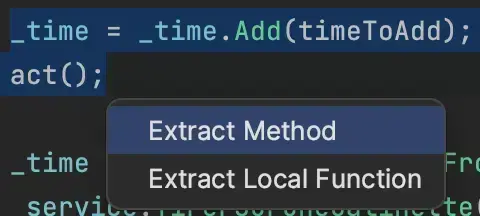
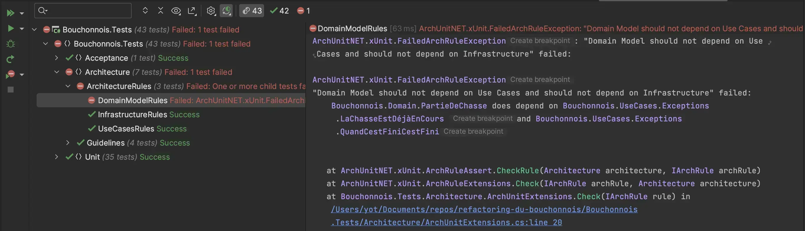
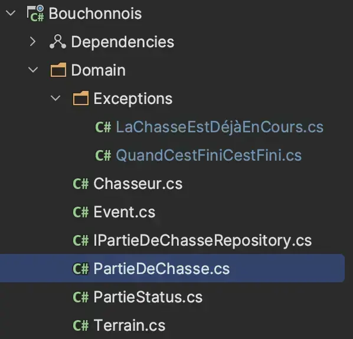
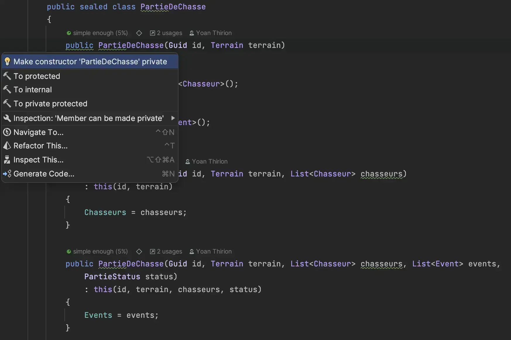
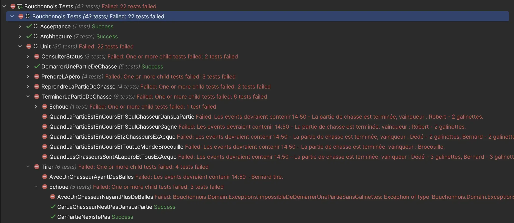
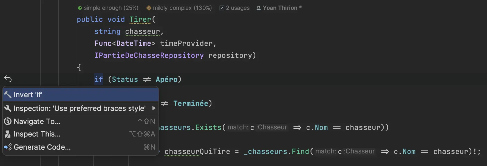
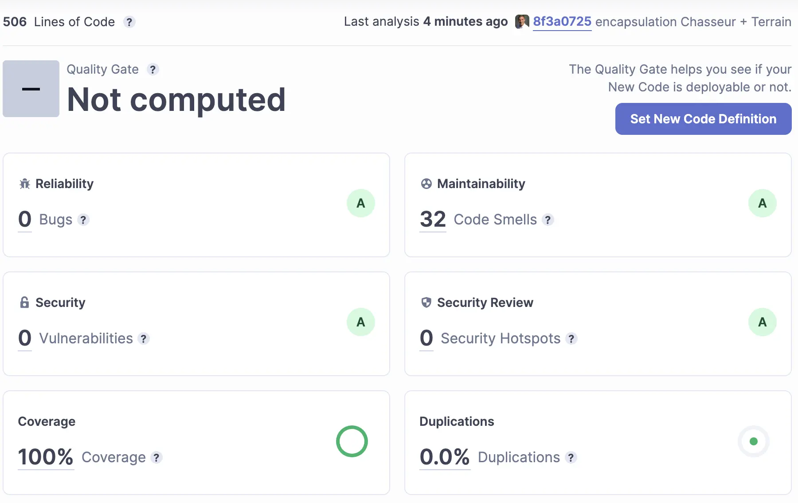

# 9) Tell Don't Ask

<figure><figcaption><p>Step 9 : Tell Don't Ask</p></figcaption></figure>

Le code des `Use Cases` ressemble pour le moment furieusement à du code procédural en :

* interrogeant des objets
* prenant des décisions basées sur l'état de ces objets

<figure><figcaption><p>Tell Don't Ask</p></figcaption></figure>

Voici un exemple avec un `Use Case` existant :

```csharp
public sealed class ReprendreLaPartie
{
    private readonly IPartieDeChasseRepository _repository;
    private readonly Func<DateTime> _timeProvider;

    public ReprendreLaPartie(IPartieDeChasseRepository repository, Func<DateTime> timeProvider)
    {
        _repository = repository;
        _timeProvider = timeProvider;
    }

    public void Handle(Guid id)
    {
        var partieDeChasse = _repository.GetById(id);

        // Prise de décision
        if (partieDeChasse == null)
        {
            throw new LaPartieDeChasseNexistePas();
        }

        // Prise de décision
        if (partieDeChasse.Status == PartieStatus.EnCours)
        {
            throw new LaChasseEstDéjàEnCours();
        }

        // Prise de décision
        if (partieDeChasse.Status == PartieStatus.Terminée)
        {
            throw new QuandCestFiniCestFini();
        }

        // Changement d'état pas encapsulé
        partieDeChasse.Status = PartieStatus.EnCours;
        partieDeChasse.Events.Add(new Event(_timeProvider(), "Reprise de la chasse"));
        
        _repository.Save(partieDeChasse);
    }
}
```

Nous allons encapsuler la prise de décision au niveau du `Domain` et faire en sorte que les `Use Cases` respectent le principe `Tell Don't Ask` :

* Prendre du temps pour comprendre ce qu'est le principe [`Tell Don't Ask`](https://xtrem-tdd.netlify.app/Flavours/tell-dont-ask)
* Encapsuler le code `Business` des `Use Cases` dans le `Domain`
* Revoir l'encapsulation des objets afin de préserver l'état du `Domain`
  * Rendre impossible de représenter un état invalide
  * Avoir des objets métiers porteurs de sens

## Refactorer le Use Case : `ReprendreLaPartie`

* On commence par extraire le contenu business du `Use Case`
  * `Refactor` -> `Extract` -> `Extract Method`

<figure><figcaption><p>Extract Method</p></figcaption></figure>

```csharp
public sealed class ReprendreLaPartie
{
    ...
    public void Handle(Guid id)
    {
        var partieDeChasse = _repository.GetById(id);

        if (partieDeChasse == null)
        {
            throw new LaPartieDeChasseNexistePas();
        }

        Reprendre(partieDeChasse);
        _repository.Save(partieDeChasse);
    }

    private void Reprendre(PartieDeChasse partieDeChasse)
    {
        if (partieDeChasse.Status == PartieStatus.EnCours)
        {
            throw new LaChasseEstDéjàEnCours();
        }

        if (partieDeChasse.Status == PartieStatus.Terminée)
        {
            throw new QuandCestFiniCestFini();
        }

        partieDeChasse.Status = PartieStatus.EnCours;
        // passer en paramètre le timeprovider
        partieDeChasse.Events.Add(new Event(_timeProvider(), "Reprise de la chasse"));
    }
}
```

* Nous devons passer la fonction `_timeProvider` en paramètre de la méthode

```csharp
private void Reprendre(Func<DateTime> timeProvider, PartieDeChasse partieDeChasse)
{
    if (partieDeChasse.Status == PartieStatus.EnCours)
    {
        throw new LaChasseEstDéjàEnCours();
    }

    if (partieDeChasse.Status == PartieStatus.Terminée)
    {
        throw new QuandCestFiniCestFini();
    }

    partieDeChasse.Status = PartieStatus.EnCours;
    partieDeChasse.Events.Add(new Event(timeProvider(), "Reprise de la chasse"));
}
```

* Nous pouvons maintenant déplacer la méthode dans la classe `PartieDeChasse`
  * `Refactor` -> `Move`

```csharp
public sealed class PartieDeChasse
{
    ...
    public void Reprendre(Func<DateTime> timeProvider)
    {
        if (this.Status == PartieStatus.EnCours)
        {
            throw new LaChasseEstDéjàEnCours();
        }

        if (this.Status == PartieStatus.Terminée)
        {
            throw new QuandCestFiniCestFini();
        }

        this.Status = PartieStatus.EnCours;
        this.Events.Add(new Event(timeProvider(), "Reprise de la chasse"));
    }
}
```

* En déplaçant cette méthode dans le `Domain`, un test d'Architecture échoue :
  * Les exceptions lancées ne sont effectivement pas au sein du Domain

<figure><figcaption><p>Broken Architecture Rule</p></figcaption></figure>

* Nous devons déplacer ces exceptions `métiers` au sein du `Domain`

<figure><figcaption><p>Move exceptions</p></figcaption></figure>

## Découvertes

* On continue ce refactoring pour chaque `Use Case` et faisons quelques "découvertes" :
  * 1 vérification manquante

```csharp
public sealed class TerminerLaPartie
{
    private readonly IPartieDeChasseRepository _repository;
    private readonly Func<DateTime> _timeProvider;

    public TerminerLaPartie(IPartieDeChasseRepository repository, Func<DateTime> timeProvider)
    {
        _repository = repository;
        _timeProvider = timeProvider;
    }

    public string Handle(Guid id)
    {
        // TODO : missing null check here
        var partieDeChasse = _repository.GetById(id);
        var result = partieDeChasse.Terminer(_timeProvider);

        _repository.Save(partieDeChasse);

        return result;
    }
}
```

* De la duplication de code dans chaque `Use Case` :

```csharp
public void Handle(Guid id)
{
    // Retrieve aggregate from repository
    var partieDeChasse = _repository.GetById(id);

    // Check if exists
    if (partieDeChasse == null)
    {
        throw new LaPartieDeChasseNexistePas();
    }

    // Call domain method
    ...
    
    // Save new state
    _repository.Save(partieDeChasse);
}
```

* Les méthodes `Tirer` et `TirerSurUneGalinette` contiennent du code dupliqué
  * Les appels au `Save` du repository se font dès qu'on ajoute un événement dans la liste d'events (même si une exception est lancée)

```csharp
public void Tirer(string chasseur, Func<DateTime> timeProvider,
            IPartieDeChasseRepository repository)
{
    if (this.Status != PartieStatus.Apéro)
    {
        if (this.Status != PartieStatus.Terminée)
        {
            if (this.Chasseurs.Exists(c => c.Nom == chasseur))
            {
                var chasseurQuiTire = this.Chasseurs.Find(c => c.Nom == chasseur)!;

                if (chasseurQuiTire.BallesRestantes == 0)
                {
                    this.Events.Add(new Event(timeProvider(),
                        $"{chasseur} tire -> T'as plus de balles mon vieux, chasse à la main"));
                    repository.Save(this);

                    throw new TasPlusDeBallesMonVieuxChasseALaMain();
                }

                this.Events.Add(new Event(timeProvider(), $"{chasseur} tire"));
                chasseurQuiTire.BallesRestantes--;
            }
            else
            {
                throw new ChasseurInconnu(chasseur);
            }
        }
        else
        {
            this.Events.Add(new Event(timeProvider(),
                $"{chasseur} veut tirer -> On tire pas quand la partie est terminée"));
            repository.Save(this);

            throw new OnTirePasQuandLaPartieEstTerminée();
        }
    }
    else
    {
        this.Events.Add(new Event(timeProvider(),
            $"{chasseur} veut tirer -> On tire pas pendant l'apéro, c'est sacré !!!"));
        repository.Save(this);

        throw new OnTirePasPendantLapéroCestSacré();
    }
}

public void TirerSurUneGalinette(string chasseur,
    Func<DateTime> timeProvider,
    IPartieDeChasseRepository repository)
{
    if (this.Terrain.NbGalinettes != 0)
    {
        if (this.Status != PartieStatus.Apéro)
        {
            if (this.Status != PartieStatus.Terminée)
            {
                if (this.Chasseurs.Exists(c => c.Nom == chasseur))
                {
                    var chasseurQuiTire = this.Chasseurs.Find(c => c.Nom == chasseur)!;

                    if (chasseurQuiTire.BallesRestantes == 0)
                    {
                        this.Events.Add(new Event(timeProvider(),
                            $"{chasseur} veut tirer sur une galinette -> T'as plus de balles mon vieux, chasse à la main"));
                        repository.Save(this);

                        throw new TasPlusDeBallesMonVieuxChasseALaMain();
                    }

                    chasseurQuiTire.BallesRestantes--;
                    chasseurQuiTire.NbGalinettes++;
                    this.Terrain.NbGalinettes--;
                    this.Events.Add(new Event(timeProvider(), $"{chasseur} tire sur une galinette"));
                }
                else
                {
                    throw new ChasseurInconnu(chasseur);
                }
            }
            else
            {
                this.Events.Add(new Event(timeProvider(),
                    $"{chasseur} veut tirer -> On tire pas quand la partie est terminée"));
                repository.Save(this);

                throw new OnTirePasQuandLaPartieEstTerminée();
            }
        }
        else
        {
            this.Events.Add(new Event(timeProvider(),
                $"{chasseur} veut tirer -> On tire pas pendant l'apéro, c'est sacré !!!"));
            repository.Save(this);
            throw new OnTirePasPendantLapéroCestSacré();
        }
    }
    else
    {
        throw new TasTropPicoléMonVieuxTasRienTouché();
    }
}
```

## Refactorer le `Domain`

* Après les différents refactorings voici l'état de la classe `PartieDeChasse` :

```csharp
using Bouchonnois.Domain.Exceptions;
using static System.String;
using static Bouchonnois.Domain.PartieStatus;

namespace Bouchonnois.Domain
{
    public sealed class PartieDeChasse
    {
        public PartieDeChasse(Guid id, Terrain terrain)
        {
            Id = id;
            Chasseurs = new List<Chasseur>();
            Terrain = terrain;
            Status = EnCours;
            Events = new List<Event>();
        }

        public PartieDeChasse(Guid id, Terrain terrain, List<Chasseur> chasseurs)
            : this(id, terrain)
        {
            Chasseurs = chasseurs;
        }

        public PartieDeChasse(Guid id, Terrain terrain, List<Chasseur> chasseurs, List<Event> events,
            PartieStatus status)
            : this(id, terrain, chasseurs, status)
        {
            Events = events;
        }

        public PartieDeChasse(Guid id, Terrain terrain, List<Chasseur> chasseurs, PartieStatus status)
            : this(id, terrain, chasseurs)
        {
            Status = status;
        }


        public Guid Id { get; }
        public List<Chasseur> Chasseurs { get; }
        public Terrain Terrain { get; }
        public PartieStatus Status { get; set; }
        public List<Event> Events { get; init; }

        public static PartieDeChasse CreatePartieDeChasse(
            Func<DateTime> timeProvider,
            (string nom, int nbGalinettes) terrainDeChasse,
            List<(string nom, int nbBalles)> chasseurs)
        {
            if (terrainDeChasse.nbGalinettes <= 0)
            {
                throw new ImpossibleDeDémarrerUnePartieSansGalinettes();
            }

            var partieDeChasse =
                new PartieDeChasse(Guid.NewGuid(),
                    new Terrain(terrainDeChasse.nom)
                    {
                        NbGalinettes = terrainDeChasse.nbGalinettes
                    }
                );

            foreach (var chasseur in chasseurs)
            {
                if (chasseur.nbBalles == 0)
                {
                    throw new ImpossibleDeDémarrerUnePartieAvecUnChasseurSansBalle();
                }

                partieDeChasse.Chasseurs.Add(new Chasseur(chasseur.nom)
                {
                    BallesRestantes = chasseur.nbBalles
                });
            }

            if (partieDeChasse.Chasseurs.Count == 0)
            {
                throw new ImpossibleDeDémarrerUnePartieSansChasseur();
            }

            string chasseursToString = string.Join(
                ", ",
                partieDeChasse.Chasseurs.Select(c => c.Nom + $" ({c.BallesRestantes} balles)")
            );

            partieDeChasse.Events.Add(new Event(timeProvider(),
                $"La partie de chasse commence à {partieDeChasse.Terrain.Nom} avec {chasseursToString}")
            );
            return partieDeChasse;
        }

        public void PrendreLapéro(Func<DateTime> timeProvider)
        {
            if (Status == PartieStatus.Apéro)
            {
                throw new OnEstDéjàEnTrainDePrendreLapéro();
            }
            else if (Status == PartieStatus.Terminée)
            {
                throw new OnPrendPasLapéroQuandLaPartieEstTerminée();
            }

            Status = PartieStatus.Apéro;
            Events.Add(new Event(timeProvider(), "Petit apéro"));
        }

        public void Reprendre(Func<DateTime> timeProvider)
        {
            if (Status == EnCours)
            {
                throw new LaChasseEstDéjàEnCours();
            }

            if (Status == Terminée)
            {
                throw new QuandCestFiniCestFini();
            }

            Status = EnCours;
            Events.Add(new Event(timeProvider(), "Reprise de la chasse"));
        }

        public string Consulter() =>
            Join(
                Environment.NewLine,
                Events
                    .OrderByDescending(@event => @event.Date)
                    .Select(@event => @event.ToString())
            );

        public string Terminer(Func<DateTime> timeProvider)
        {
            var classement = this
                .Chasseurs
                .GroupBy(c => c.NbGalinettes)
                .OrderByDescending(g => g.Key);

            if (this.Status == PartieStatus.Terminée)
            {
                throw new QuandCestFiniCestFini();
            }

            this.Status = PartieStatus.Terminée;

            string result;

            if (classement.All(group => group.Key == 0))
            {
                result = "Brocouille";
                this.Events.Add(
                    new Event(timeProvider(), "La partie de chasse est terminée, vainqueur : Brocouille")
                );
            }
            else
            {
                result = string.Join(", ", classement.ElementAt(0).Select(c => c.Nom));
                this.Events.Add(
                    new Event(timeProvider(),
                        $"La partie de chasse est terminée, vainqueur : {string.Join(", ", classement.ElementAt(0).Select(c => $"{c.Nom} - {c.NbGalinettes} galinettes"))}"
                    )
                );
            }

            return result;
        }

        public void Tirer(string chasseur, Func<DateTime> timeProvider,
            IPartieDeChasseRepository repository)
        {
            if (this.Status != PartieStatus.Apéro)
            {
                if (this.Status != PartieStatus.Terminée)
                {
                    if (this.Chasseurs.Exists(c => c.Nom == chasseur))
                    {
                        var chasseurQuiTire = this.Chasseurs.Find(c => c.Nom == chasseur)!;

                        if (chasseurQuiTire.BallesRestantes == 0)
                        {
                            this.Events.Add(new Event(timeProvider(),
                                $"{chasseur} tire -> T'as plus de balles mon vieux, chasse à la main"));
                            repository.Save(this);

                            throw new TasPlusDeBallesMonVieuxChasseALaMain();
                        }

                        this.Events.Add(new Event(timeProvider(), $"{chasseur} tire"));
                        chasseurQuiTire.BallesRestantes--;
                    }
                    else
                    {
                        throw new ChasseurInconnu(chasseur);
                    }
                }
                else
                {
                    this.Events.Add(new Event(timeProvider(),
                        $"{chasseur} veut tirer -> On tire pas quand la partie est terminée"));
                    repository.Save(this);

                    throw new OnTirePasQuandLaPartieEstTerminée();
                }
            }
            else
            {
                this.Events.Add(new Event(timeProvider(),
                    $"{chasseur} veut tirer -> On tire pas pendant l'apéro, c'est sacré !!!"));
                repository.Save(this);

                throw new OnTirePasPendantLapéroCestSacré();
            }
        }

        public void TirerSurUneGalinette(string chasseur,
            Func<DateTime> timeProvider,
            IPartieDeChasseRepository repository)
        {
            if (this.Terrain.NbGalinettes != 0)
            {
                if (this.Status != PartieStatus.Apéro)
                {
                    if (this.Status != PartieStatus.Terminée)
                    {
                        if (this.Chasseurs.Exists(c => c.Nom == chasseur))
                        {
                            var chasseurQuiTire = this.Chasseurs.Find(c => c.Nom == chasseur)!;

                            if (chasseurQuiTire.BallesRestantes == 0)
                            {
                                this.Events.Add(new Event(timeProvider(),
                                    $"{chasseur} veut tirer sur une galinette -> T'as plus de balles mon vieux, chasse à la main"));
                                repository.Save(this);

                                throw new TasPlusDeBallesMonVieuxChasseALaMain();
                            }

                            chasseurQuiTire.BallesRestantes--;
                            chasseurQuiTire.NbGalinettes++;
                            this.Terrain.NbGalinettes--;
                            this.Events.Add(new Event(timeProvider(), $"{chasseur} tire sur une galinette"));
                        }
                        else
                        {
                            throw new ChasseurInconnu(chasseur);
                        }
                    }
                    else
                    {
                        this.Events.Add(new Event(timeProvider(),
                            $"{chasseur} veut tirer -> On tire pas quand la partie est terminée"));
                        repository.Save(this);

                        throw new OnTirePasQuandLaPartieEstTerminée();
                    }
                }
                else
                {
                    this.Events.Add(new Event(timeProvider(),
                        $"{chasseur} veut tirer -> On tire pas pendant l'apéro, c'est sacré !!!"));
                    repository.Save(this);
                    throw new OnTirePasPendantLapéroCestSacré();
                }
            }
            else
            {
                throw new TasTropPicoléMonVieuxTasRienTouché();
            }
        }
    }
}
```

#### Supprimer les constructeurs (utiliser la Factory)

* Nous sommes couverts par les tests, nous allons pouvoir nous amuser en terme de refactoring 😊
  * On commence par le feedback fourni par notre IDE sur les constructeurs

<figure><figcaption><p>Make ctors private</p></figcaption></figure>

* Nous n'avons plus qu'un seul constructeur `public` :

```csharp
public sealed class PartieDeChasse
{
    private PartieDeChasse(Guid id, Terrain terrain)
    {
        Id = id;
        Chasseurs = new List<Chasseur>();
        Terrain = terrain;
        Status = EnCours;
        Events = new List<Event>();
    }

    private PartieDeChasse(Guid id, Terrain terrain, List<Chasseur> chasseurs)
        : this(id, terrain)
    {
        Chasseurs = chasseurs;
    }

    private PartieDeChasse(Guid id, Terrain terrain, List<Chasseur> chasseurs, PartieStatus status)
        : this(id, terrain, chasseurs)
    {
        Status = status;
    }

    public PartieDeChasse(Guid id, Terrain terrain, List<Chasseur> chasseurs, List<Event> events,
        PartieStatus status)
        : this(id, terrain, chasseurs, status)
    {
        Events = events;
    }
    ...
} 
```

* Le constructeur est appelé par notre `Test Data Builder` :

```csharp
public PartieDeChasse Build() => new(
    Guid.NewGuid(),
    new Terrain("Pitibon sur Sauldre") {NbGalinettes = _nbGalinettes},
    _chasseurs.Select(c => c.Build()).ToList(),
    _events.ToList(),
    _status
);
```

* Nous voulons forcer l'instantiation de cette classe par sa factory afin de ne plus pouvoir instancié une `PartieDeChasse` dans un état invalide
  * _Ex_ : Une partie de chasse démarre avec 0 galinettes sur le terrain et des chasseurs sans balles...
  * Nous allons donc faire appel à la `Factory Method` plutôt qu'à 1 constructeur

```csharp
public PartieDeChasse Build() =>
    PartieDeChasse.Create(
        () => DateTime.Now,
        ("Pitibon sur Sauldre", _nbGalinettes),
        _chasseurs
            .Select(c => c.Build())
            .Select(c => (c.Nom, c.BallesRestantes > 0 ? c.BallesRestantes : 1))
            .ToList()
    );
```

* En effectuant ce refactoring, nous avons 22 tests qui échouent...

<figure><figcaption><p>22 failing tests</p></figcaption></figure>

* Pourquoi ? on ne `set` plus les `Events` ni le `Status` à l'instantiation
* On va faire en sorte d'avancer en mettant en place une solution transitoire

```csharp
public PartieDeChasse Build()
{
    var partieDeChasse = PartieDeChasse.Create(
        () => DateTime.Now,
        ("Pitibon sur Sauldre", _nbGalinettes),
        _chasseurs
            .Select(c => c.Build())
            .Select(c => (c.Nom, c.BallesRestantes))
            .ToList()
    );

    // TODO : ces setters devraient être privates
    partieDeChasse.Status = _status;
    partieDeChasse.Events = _events.ToList();

    return partieDeChasse;
}
```

* Nous n'avons plus que 7 tests qui échouent
  * Ils échouent car l'état des chasseurs n'est pas bon...
  * On ne set pas les galinettes tuées

```csharp
 public void QuandLaPartieEstEnCoursEt1SeulChasseurDansLaPartie()
{
    Given(
        UnePartieDeChasseExistante(
            SurUnTerrainRicheEnGalinettes()
                .Avec(Robert().AyantTué(2))
        )
    );

    string? winner = null;
    When(id => winner = _useCase.Handle(id));

    Then(savedPartieDeChasse =>
            savedPartieDeChasse.Should()
                .HaveEmittedEvent(Now, "La partie de chasse est terminée, vainqueur : Robert - 2 galinettes"),
        () => winner.Should().Be(Data.Robert));
}
```

* On va simuler le fait que le chasseur a tué des galinettes en appelant les méthodes du `Domain`

```csharp
// On passe les instances de repository et du timeprovider
public PartieDeChasse Build(Func<DateTime> timeProvider, IPartieDeChasseRepository repository)
{
    var builtChasseurs = _chasseurs.Select(c => c.Build());

    var partieDeChasse = PartieDeChasse.Create(
        timeProvider,
        ("Pitibon sur Sauldre", _nbGalinettes),
        builtChasseurs
            .Select(c => (c.Nom, c.BallesRestantes))
            .ToList()
    );

    partieDeChasse.Status = _status;
    partieDeChasse.Events = _events.ToList();

    partieDeChasse.Chasseurs
        .ForEach(c =>
        {
            var built = builtChasseurs.First(x => x.Nom == c.Nom);
            var repeat = built.NbGalinettes;
            while (repeat > 0)
            {
                partieDeChasse.TirerSurUneGalinette(built.Nom, timeProvider, repository);
                repeat--;
            }
        });

    return partieDeChasse;
}
```

* En continuant à fixer les tests, on identifie des tests qui ne sont pas consistants

```csharp
[Fact]
public void QuandLaPartieEstEnCoursEt2ChasseursExAequo()
{
    Given(
        UnePartieDeChasseExistante(
            // Le terrain riche en galinettes en contient 3
            SurUnTerrainRicheEnGalinettes()
                // Comment Dédé et Bernard ont fait pour en tuer 4 🤔
                .Avec(Dédé().AyantTué(2), Bernard().AyantTué(2), Robert())
        )
    );

    string? winner = null;
    When(id => winner = _useCase.Handle(id));

    Then(savedPartieDeChasse =>
            savedPartieDeChasse.Should()
                .HaveEmittedEvent(Now,
                    "La partie de chasse est terminée, vainqueur : Dédé - 2 galinettes, Bernard - 2 galinettes"),
        () => winner.Should().Be("Dédé, Bernard"));
}
```

* On itère sur ce test :

```csharp
[Fact]
public void QuandLaPartieEstEnCoursEt2ChasseursExAequo()
{
    Given(
        UnePartieDeChasseExistante(
            // Changer le nombre de galinettes sur le terrain
            SurUnTerrainRicheEnGalinettes(4)
                .Avec(Dédé().AyantTué(2), Bernard().AyantTué(2), Robert())
        )
    );

    string? winner = null;
    When(id => winner = _useCase.Handle(id));

    Then(savedPartieDeChasse =>
            savedPartieDeChasse.Should()
                .HaveEmittedEvent(Now,
                    "La partie de chasse est terminée, vainqueur : Dédé - 2 galinettes, Bernard - 2 galinettes"),
        () => winner.Should().Be("Dédé, Bernard"));
}
```

* D'autres tests posent problème dû à une mauvaise initialisation :

```csharp
[Fact]
public void AvecUnChasseurNayantPlusDeBalles()
{
    Given(
        UnePartieDeChasseExistante(
            // Pas relevant pour le test d'avoir 1 terrain sans galinettes
            SurUnTerrainSansGalinettes()
                // Comment on initialise une partie avec Bernard qui n'a pas de balles
                .Avec(Dédé(), Bernard().SansBalles(), Robert())
        ));

    When(id => _useCase.Handle(id, Data.Bernard));

    ThenThrow<TasPlusDeBallesMonVieuxChasseALaMain>(savedPartieDeChasse =>
        savedPartieDeChasse.Should()
            .HaveEmittedEvent(Now, "Bernard tire -> T'as plus de balles mon vieux, chasse à la main"));
}
```

* On adapte une nouvelle fois la méthode `Build()` pour être capable d'être dans l'état décrit :

```csharp
public PartieDeChasse Build(Func<DateTime> timeProvider, IPartieDeChasseRepository repository)
{
    var builtChasseurs = _chasseurs.Select(c => c.Build());
    var chasseursSansBalles = builtChasseurs.Where(c => c.BallesRestantes == 0).Select(c => c.Nom);

    var partieDeChasse = PartieDeChasse.Create(
        timeProvider,
        ("Pitibon sur Sauldre", _nbGalinettes),
        builtChasseurs
            // Initialise avec 1 balle s'il n'en a pas
            .Select(c => (c.Nom, c.BallesRestantes > 0 ? c.BallesRestantes : 1))
            .ToList()
    );

    partieDeChasse.Status = _status;
    partieDeChasse.Events = _events.ToList();

    partieDeChasse.Chasseurs
        .ForEach(c =>
        {
            var built = builtChasseurs.First(x => x.Nom == c.Nom);
            var repeat = built.NbGalinettes;
            while (repeat > 0)
            {
                partieDeChasse.TirerSurUneGalinette(built.Nom, timeProvider, repository);
                repeat--;
            }
        });

    // Force le tir de la balle
    chasseursSansBalles.ForEach(c => partieDeChasse.Tirer(c, timeProvider, repository));

    return partieDeChasse;
}
```

* Nos tests sont maintenant verts et on peut supprimer les constructeurs inutiles :

```csharp
public sealed class PartieDeChasse
{
    private PartieDeChasse(Guid id, Terrain terrain)
    {
        Id = id;
        Chasseurs = new List<Chasseur>();
        Terrain = terrain;
        Status = EnCours;
        Events = new List<Event>();
    }
    
    ...

    public static PartieDeChasse Create(
        Func<DateTime> timeProvider,
        (string nom, int nbGalinettes) terrainDeChasse,
        List<(string nom, int nbBalles)> chasseurs)
    {
        ...
    }
```

#### Encapsuler le `Status`

* On commence par passer le `set` en private pour identifier les impacts

```csharp
public PartieStatus Status { get; private set; }
```

* Nous devons retravailler le `Builder` pour qu'il supporte l'encapsulation

```csharp
public PartieDeChasse Build(Func<DateTime> timeProvider, IPartieDeChasseRepository repository)
{
    var builtChasseurs = _chasseurs.Select(c => c.Build());
    var chasseursSansBalles = builtChasseurs.Where(c => c.BallesRestantes == 0).Select(c => c.Nom);

    var partieDeChasse = PartieDeChasse.Create(
        timeProvider,
        ("Pitibon sur Sauldre", _nbGalinettes),
        builtChasseurs
            .Select(c => (c.Nom, c.BallesRestantes > 0 ? c.BallesRestantes : 1))
            .ToList()
    );

    TirerSurLesGalinettes(partieDeChasse, timeProvider, repository, builtChasseurs);
    TirerDansLeVide(partieDeChasse, timeProvider, repository, chasseursSansBalles);

    // Ne pas utiliser de setter mais appelé la bonne méthode métier
    partieDeChasse.Status = _status;
    partieDeChasse.Events = _events.ToList();

    return partieDeChasse;
}
```

* On adapte le `Builder`

```csharp
public class PartieDeChasseBuilder
{
    // On log les changements de status dans une liste
    private List<PartieStatus> _status = new();
    ...

    public PartieDeChasse Build(Func<DateTime> timeProvider, IPartieDeChasseRepository repository)
    {
        var builtChasseurs = _chasseurs.Select(c => c.Build());
        var chasseursSansBalles = builtChasseurs.Where(c => c.BallesRestantes == 0).Select(c => c.Nom);

        var partieDeChasse = PartieDeChasse.Create(
            timeProvider,
            ("Pitibon sur Sauldre", _nbGalinettes),
            builtChasseurs
                .Select(c => (c.Nom, c.BallesRestantes > 0 ? c.BallesRestantes : 1))
                .ToList()
        );

        TirerSurLesGalinettes(partieDeChasse, timeProvider, repository, builtChasseurs);
        TirerDansLeVide(partieDeChasse, timeProvider, repository, chasseursSansBalles);
        ChangeStatus(partieDeChasse, timeProvider);

        partieDeChasse.Events = _events.ToList();

        return partieDeChasse;
    }
    
    ...

    private void ChangeStatus(PartieDeChasse partieDeChasse, Func<DateTime> timeProvider) =>
        _status.ForEach(status => ChangeStatus(partieDeChasse, status, timeProvider));

    private void ChangeStatus(PartieDeChasse partieDeChasse, PartieStatus status, Func<DateTime> timeProvider)
    {
        if (status == PartieStatus.Terminée) partieDeChasse.Terminer(timeProvider);
        else if (status == Apéro) partieDeChasse.PrendreLapéro(timeProvider);
    }
    
    ...
}
```

#### Encapsuler les Events

* En passant le `setter` des `Events` à `private` on observe que seuls les tests de consultation de status échouent
  * La consultation du status est déjà testé par ailleurs dans les tests d'Acceptance
  * Ces tests se recoupant, on peut dès lors supprimer les Tests Unitaires `ConsulterStatus` sans impact sur notre couverture et notre confiance

#### Encapsuler les collections

* Nous avons grandement amélioré l'encapsulation mais nous pouvons aller plus loin

```csharp
public sealed class PartieDeChasse
{
    private PartieDeChasse(Guid id, Terrain terrain)
    {
        Id = id;
        Chasseurs = new List<Chasseur>();
        Terrain = terrain;
        Status = EnCours;
        Events = new List<Event>();
    }

    public Guid Id { get; }
    // Quid de cette liste
    public List<Chasseur> Chasseurs { get; }
    public Terrain Terrain { get; }
    public PartieStatus Status { get; private set; }
    // Et de celle-ci
    public List<Event> Events { get; }
    
    ...
```

* On va créer des `backing fields` pour ces 2 collections&#x20;
* Les "sécuriser" via l'utilisation d'une collection `immutable`

```csharp
public IReadOnlyList<Chasseur> Chasseurs => _chasseurs.ToImmutableArray();
public IReadOnlyList<Event> Events => _events.ToImmutableArray();
```

* Ce changement va nous "forcer" à bouger une partie de la logique de la `Factory` dans le constructeur&#x20;
* On conserve les `Guards` dans la `Factory` et bouge l'instantiation dans le constructeur

```csharp
public sealed class PartieDeChasse
{
    private readonly List<Chasseur> _chasseurs;
    private readonly List<Event> _events;
    
    public Guid Id { get; }
    public IReadOnlyList<Chasseur> Chasseurs => _chasseurs.ToImmutableArray();
    public Terrain Terrain { get; }
    public PartieStatus Status { get; private set; }
    public IReadOnlyList<Event> Events => _events.ToImmutableArray();

    private PartieDeChasse(Guid id,
        Func<DateTime> timeProvider,
        Terrain terrain,
        List<(string nom, int nbBalles)> chasseurs)
    {
        Id = id;
        _chasseurs = new List<Chasseur>();
        Terrain = terrain;
        Status = EnCours;
        _events = new List<Event>();
        
        foreach (var chasseur in chasseurs)
        {
            _chasseurs.Add(new Chasseur(chasseur.nom)
            {
                BallesRestantes = chasseur.nbBalles
            });
        }

        string chasseursToString = Join(
            ", ",
            _chasseurs.Select(c => c.Nom + $" ({c.BallesRestantes} balles)")
        );

        _events.Add(new Event(timeProvider(),
            $"La partie de chasse commence à {Terrain.Nom} avec {chasseursToString}")
        );
    }
    
    public static PartieDeChasse Create(
        Func<DateTime> timeProvider,
        (string nom, int nbGalinettes) terrainDeChasse,
        List<(string nom, int nbBalles)> chasseurs)
    {
        if (terrainDeChasse.nbGalinettes <= 0)
        {
            throw new ImpossibleDeDémarrerUnePartieSansGalinettes();
        }

        if (chasseurs.Count == 0)
        {
            throw new ImpossibleDeDémarrerUnePartieSansChasseur();
        }

        if (chasseurs.Any(c => c.nbBalles == 0))
        {
            throw new ImpossibleDeDémarrerUnePartieAvecUnChasseurSansBalle();
        }

        return new PartieDeChasse(Guid.NewGuid(),
            timeProvider,
            new Terrain(terrainDeChasse.nom)
            {
                NbGalinettes = terrainDeChasse.nbGalinettes
            },
            chasseurs
        );
    }
    
    ...
```

### Simplification des méthodes de `Tir`

* La méthode `Tirer` ressemble à cela

```csharp
 public void Tirer(string chasseur, Func<DateTime> timeProvider,
            IPartieDeChasseRepository repository)
{
    if (Status != Apéro)
    {
        if (Status != Terminée)
        {
            if (_chasseurs.Exists(c => c.Nom == chasseur))
            {
                var chasseurQuiTire = _chasseurs.Find(c => c.Nom == chasseur)!;

                if (chasseurQuiTire.BallesRestantes == 0)
                {
                    _events.Add(new Event(timeProvider(),
                        $"{chasseur} tire -> T'as plus de balles mon vieux, chasse à la main"));
                    repository.Save(this);

                    throw new TasPlusDeBallesMonVieuxChasseALaMain();
                }

                _events.Add(new Event(timeProvider(), $"{chasseur} tire"));
                chasseurQuiTire.BallesRestantes--;
            }
            else
            {
                throw new ChasseurInconnu(chasseur);
            }
        }
        else
        {
            _events.Add(new Event(timeProvider(),
                $"{chasseur} veut tirer -> On tire pas quand la partie est terminée"));
            repository.Save(this);

            throw new OnTirePasQuandLaPartieEstTerminée();
        }
    }
    else
    {
        _events.Add(new Event(timeProvider(),
            $"{chasseur} veut tirer -> On tire pas pendant l'apéro, c'est sacré !!!"));
        repository.Save(this);

        throw new OnTirePasPendantLapéroCestSacré();
    }
}
```

* On commence par inverser les `if` pour faire diminiuer la `cyclomatic complexity`

<figure><figcaption><p>Invert if</p></figcaption></figure>

```csharp
public void Tirer(
            string chasseur,
            Func<DateTime> timeProvider,
            IPartieDeChasseRepository repository)
{
    if (Status == Apéro)
    {
        _events.Add(new Event(timeProvider(),
            $"{chasseur} veut tirer -> On tire pas pendant l'apéro, c'est sacré !!!"));
        repository.Save(this);

        throw new OnTirePasPendantLapéroCestSacré();
    }

    if (Status == Terminée)
    {
        _events.Add(new Event(timeProvider(),
            $"{chasseur} veut tirer -> On tire pas quand la partie est terminée"));
        repository.Save(this);

        throw new OnTirePasQuandLaPartieEstTerminée();
    }

    if (!_chasseurs.Exists(c => c.Nom == chasseur))
    {
        throw new ChasseurInconnu(chasseur);
    }

    var chasseurQuiTire = _chasseurs.Find(c => c.Nom == chasseur)!;

    if (chasseurQuiTire.BallesRestantes == 0)
    {
        _events.Add(new Event(timeProvider(),
            $"{chasseur} tire -> T'as plus de balles mon vieux, chasse à la main"));
        repository.Save(this);

        throw new TasPlusDeBallesMonVieuxChasseALaMain();
    }

    _events.Add(new Event(timeProvider(), $"{chasseur} tire"));
    chasseurQuiTire.BallesRestantes--;
}
```

* On `Save` en même temps que l'Emit de l'`Event`

```csharp
public void Tirer(
            string chasseur,
            Func<DateTime> timeProvider,
            IPartieDeChasseRepository repository)
{
    if (Status == Apéro)
    {
        EmitEventAndSave(timeProvider, repository, $"{chasseur} veut tirer -> On tire pas pendant l'apéro, c'est sacré !!!");
        throw new OnTirePasPendantLapéroCestSacré();
    }

    if (Status == Terminée)
    {
        EmitEventAndSave(timeProvider, repository,
            $"{chasseur} veut tirer -> On tire pas quand la partie est terminée");
        throw new OnTirePasQuandLaPartieEstTerminée();
    }

    if (!_chasseurs.Exists(c => c.Nom == chasseur))
    {
        throw new ChasseurInconnu(chasseur);
    }

    var chasseurQuiTire = _chasseurs.Find(c => c.Nom == chasseur)!;

    if (chasseurQuiTire.BallesRestantes == 0)
    {
        EmitEventAndSave(timeProvider, repository, $"{chasseur} tire -> T'as plus de balles mon vieux, chasse à la main");
        throw new TasPlusDeBallesMonVieuxChasseALaMain();
    }

    EmitEvent(timeProvider, $"{chasseur} tire");
    chasseurQuiTire.BallesRestantes--;
}
```

* On nomme les guards pour rendre le code plus explicite

```csharp
public void Tirer(
    string chasseur,
    Func<DateTime> timeProvider,
    IPartieDeChasseRepository repository)
{
    if (DuringApéro())
    {
        EmitEventAndSave(timeProvider, repository,
            $"{chasseur} veut tirer -> On tire pas pendant l'apéro, c'est sacré !!!");
        throw new OnTirePasPendantLapéroCestSacré();
    }

    if (DéjàTerminée())
    {
        EmitEventAndSave(timeProvider, repository,
            $"{chasseur} veut tirer -> On tire pas quand la partie est terminée");
        throw new OnTirePasQuandLaPartieEstTerminée();
    }

    if (!ChasseurExiste(chasseur))
    {
        throw new ChasseurInconnu(chasseur);
    }

    var chasseurQuiTire = RetrieveChasseur(chasseur);

    if (!chasseurQuiTire.AEncoreDesBalles())
    {
        EmitEventAndSave(timeProvider, repository,
            $"{chasseur} tire -> T'as plus de balles mon vieux, chasse à la main");
        throw new TasPlusDeBallesMonVieuxChasseALaMain();
    }

    EmitEvent(timeProvider, $"{chasseur} tire");
    chasseurQuiTire.BallesRestantes--;
}
```

* En appliquant la même technique sur `TirerSurUneGalinette` on se rend compte de la duplication :

```csharp
public void TirerSurUneGalinette(string chasseur,
            Func<DateTime> timeProvider,
            IPartieDeChasseRepository repository)
{
    if (Terrain.NbGalinettes == 0)
    {
        throw new TasTropPicoléMonVieuxTasRienTouché();
    }

    if (Status == Apéro)
    {
        _events.Add(new Event(timeProvider(),
            $"{chasseur} veut tirer -> On tire pas pendant l'apéro, c'est sacré !!!"));
        repository.Save(this);
        throw new OnTirePasPendantLapéroCestSacré();
    }

    if (Status == Terminée)
    {
        _events.Add(new Event(timeProvider(),
            $"{chasseur} veut tirer -> On tire pas quand la partie est terminée"));
        repository.Save(this);

        throw new OnTirePasQuandLaPartieEstTerminée();
    }

    if (!ChasseurExiste(chasseur))
    {
        throw new ChasseurInconnu(chasseur);
    }

    var chasseurQuiTire = RetrieveChasseur(chasseur);

    if (chasseurQuiTire.BallesRestantes == 0)
    {
        _events.Add(new Event(timeProvider(),
            $"{chasseur} veut tirer sur une galinette -> T'as plus de balles mon vieux, chasse à la main"));
        repository.Save(this);

        throw new TasPlusDeBallesMonVieuxChasseALaMain();
    }

    chasseurQuiTire.BallesRestantes--;
    chasseurQuiTire.NbGalinettes++;
    Terrain.NbGalinettes--;
    _events.Add(new Event(timeProvider(), $"{chasseur} tire sur une galinette"));
}
```

* On va créer une méthode `private` de tir permettant de mutualiser le code

```csharp
public void Tirer(
    string chasseur,
    Func<DateTime> timeProvider,
    IPartieDeChasseRepository repository)
{
    Tirer(chasseur,
        timeProvider,
        repository,
        debutMessageSiPlusDeBalles: $"{chasseur} tire");

    EmitEvent(timeProvider, $"{chasseur} tire");
}

public void TirerSurUneGalinette(string chasseur,
    Func<DateTime> timeProvider,
    IPartieDeChasseRepository repository)
{
    if (Terrain.NbGalinettes == 0)
    {
        throw new TasTropPicoléMonVieuxTasRienTouché();
    }

    Tirer(chasseur,
        timeProvider,
        repository,
        debutMessageSiPlusDeBalles: $"{chasseur} veut tirer sur une galinette",
        c =>
        {
            c.NbGalinettes++;
            Terrain.NbGalinettes--;
            EmitEvent(timeProvider, $"{chasseur} tire sur une galinette");
        });
}

private void Tirer(
    string chasseur,
    Func<DateTime> timeProvider,
    IPartieDeChasseRepository repository,
    string debutMessageSiPlusDeBalles,
    Action<Chasseur>? continueWith = null)
{
    if (DuringApéro())
    {
        EmitEventAndSave(timeProvider, repository, $"{chasseur} veut tirer -> On tire pas pendant l'apéro, c'est sacré !!!");
        throw new OnTirePasPendantLapéroCestSacré();
    }

    if (DéjàTerminée())
    {
        EmitEventAndSave(timeProvider, repository, $"{chasseur} veut tirer -> On tire pas quand la partie est terminée");
        throw new OnTirePasQuandLaPartieEstTerminée();
    }

    if (!ChasseurExiste(chasseur))
    {
        throw new ChasseurInconnu(chasseur);
    }

    var chasseurQuiTire = RetrieveChasseur(chasseur);

    if (!chasseurQuiTire.AEncoreDesBalles())
    {
        EmitEventAndSave(timeProvider, repository, $"{debutMessageSiPlusDeBalles} -> T'as plus de balles mon vieux, chasse à la main");
        throw new TasPlusDeBallesMonVieuxChasseALaMain();
    }

    chasseurQuiTire.BallesRestantes--;
    continueWith?.Invoke(chasseurQuiTire);
}
```

#### Encapsulation du `Chasseur`

* Depuis les méthodes de `Tir` on va appeler une méthode `ATiré()` plutôt que d'utiliser 1 setter

```csharp
private void Tirer(
    string chasseur,
    Func<DateTime> timeProvider,
    IPartieDeChasseRepository repository,
    string debutMessageSiPlusDeBalles,
    Action<Chasseur>? continueWith = null)
{
    ...
    chasseurQuiTire.ATiré();
    continueWith?.Invoke(chasseurQuiTire);
}

public sealed class Chasseur
{
    public Chasseur(string nom, int ballesRestantes)
    {
        Nom = nom;
        BallesRestantes = ballesRestantes;
    }

    public bool AEncoreDesBalles() => BallesRestantes > 0;

    public string Nom { get; }
    public int BallesRestantes { get; private set; }
    public int NbGalinettes { get; set; }

    public void ATiré() => BallesRestantes--;
}
```

* On fait de même pour les `NbGalinettes`

```csharp
public sealed class Terrain
{
    public Terrain(string nom, int nbGalinettes)
    {
        Nom = nom;
        NbGalinettes = nbGalinettes;
    }

    public string Nom { get; }
    public int NbGalinettes { get; private set; }

    public void UneGalinetteEnMoins() => NbGalinettes--;
}
```

#### Un mot sur la duplication

En redescendant la logique dans le `Domain` et en refactorant ce dernier on a grandement amélioré la qualité du code :&#x20;

<figure><figcaption><p>No more duplication</p></figcaption></figure>

Nouveau rapport `SonarCloud` disponible [ici](https://sonarcloud.io/summary/overall?id=ythirion\_refactoring-du-bouchonnois\&branch=steps%2F09-tell-dont-ask).

## Reflect

* Quel impact ce refactoring a eu sur les tests ?
* Qu'est-ce qui est plus simple / compliqué maintenant ?

<figure><figcaption></figcaption></figure>
