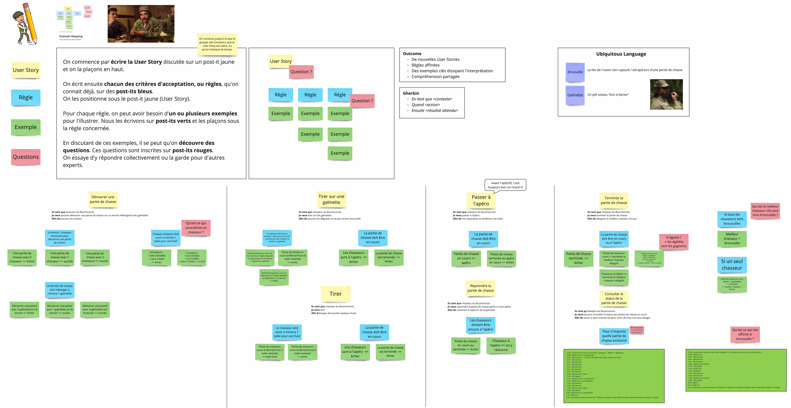

# Refactoring du Bouchonnois

Ce kata a pour objectif de s'exercer au refactoring sur un code existant afin de :

* Identifier certains `smells` dans notre code
* Comprendre quelles pratiques et/ou outils peuvent nous aider pour surpasser ces `smells`
* Pratiquer dans 1 environnement `safe` en dehors de son code de production

<figure><figcaption></figcaption></figure>

Le kata est disponible sur github [ici](https://github.com/ythirion/refactoring-du-bouchonnois/).

## Le contexte

Nos vaillants chasseurs du Bouchonnois ont besoin de pouvoir gérer leurs parties de chasse.\
Ils ont commencé à faire développer 1 système de gestion par l'entreprise `Toshiba` mais ne sont pas satisfaits.

L'entreprise leur parle d'une soit-disante `dette technique` qui les ralentit dans le développement de nouvelles features...

<figure><figcaption></figcaption></figure>

> Les chasseurs comptent sur nous pour améliorer la situation.

## Example Mapping

Ils ont fait quelques ateliers avec `Toshiba` et ont réussi à clarifier ce qui est attendu du système. Pour ce faire, ils ont utilisé le format `Example Mapping` à découvrir [ici](https://xtrem-tdd.netlify.app/Flavours/example-mapping).

Voici l'Example Mapping qui a servi d'alignement pour développer ce système.

<figure><figcaption>
Example Mapping du Bouchonnois
</figcaption></figure>

Version PDF disponible [ici](https://github.com/ythirion/refactoring-du-bouchonnois/blob/main/example-mapping/example-mapping.pdf).

## Facilitation

### Pré-requis

Le code est disponible en `.NET 7`.

Voici la liste des packages utilisés :

* `xUnit`
* `FluentAssertions`
* `Verify.xUnit`
* `FSCheck`
* `TngTech.ArchUnitNET.xUnit`
* `LanguageExt.Core`
* `FluentAssertions.LanguageExt`

### Guide

Chaque étape comprend :

* un "guide" de facilitation
* une proposition de solution "_étape par étape_"

> 1 branche / étape avec le code source associé

<figure><figcaption></figcaption></figure>

## Objectifs pédagogiques

À travers ces différentes étapes j'ai essayé d'introduire les sujets suivants :

* Example Mapping
* Static Code Analysis / Linter
* Treat Warnings as Errors
* Mutation Testing
* Test Data Builders
* Approval Testing
* Automated Refactoring
* Property-Based Testing
* Tests d'Architecture
* Test-Driven Development
* Clean Architecture
* Domain Driven Design
* Tell Don't Ask
* Functional Programming
* Avoid Primitives
* Avoid Exceptions
* Architecture Decision Records
* Event Sourcing
* ...

Bon voyage 🤩

### Proposition de solution

Afin d'améliorer le code on te propose de suivre les étapes ci-dessous :&#x20;


[step-1-se-faire-une-idee-du-code.md](step-1-se-faire-une-idee-du-code.md)



[step-2-treat-warnings-as-errors.md](step-2-treat-warnings-as-errors.md)



[step-3-lets-kill-some-mutants.md](step-3-lets-kill-some-mutants.md)



[step-4-ameliorer-la-lisibilite-des-tests.md](step-4-ameliorer-la-lisibilite-des-tests.md)



[step-5-approve-everything.md](step-5-approve-everything.md)



[step-6-definir-des-proprietes.md](step-6-definir-des-proprietes.md)



[7-tests-darchitecture.md](7-tests-darchitecture.md)



[8-use-cases.md](8-use-cases.md)



[9-tell-dont-ask.md](9-tell-dont-ask.md)



[10-avoid-primitives-commands.md](10-avoid-primitives-commands.md)



[11-avoid-exceptions.md](11-avoid-exceptions.md)



[12-event-sourcing.md](12-event-sourcing.md)

