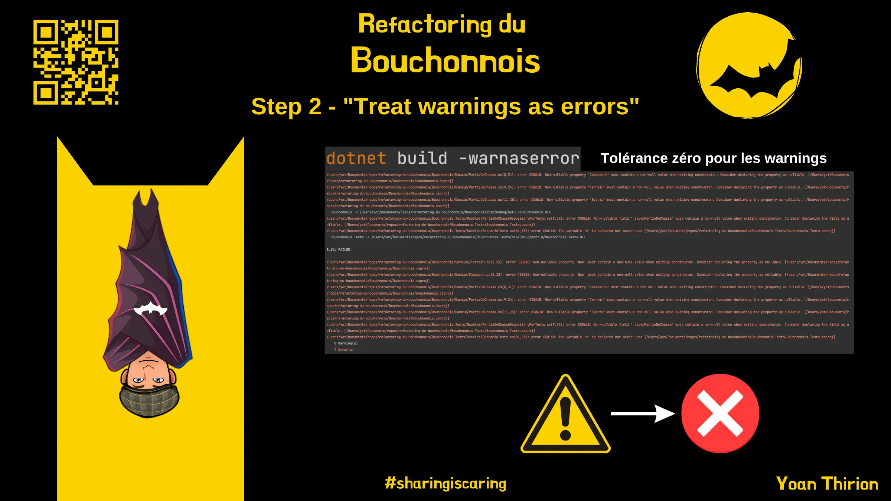
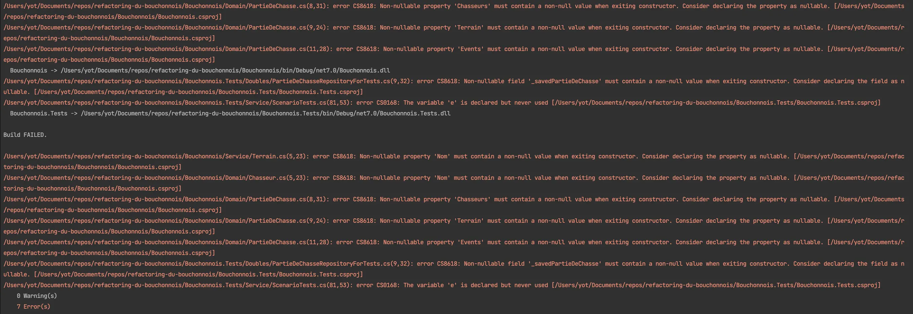
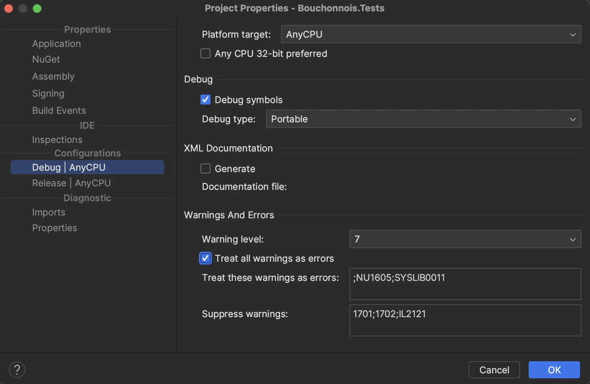
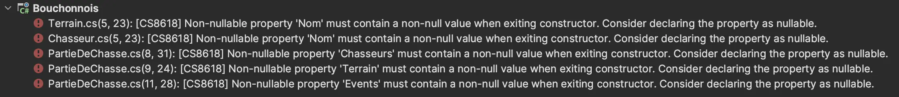
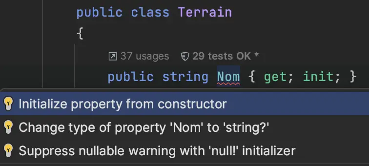
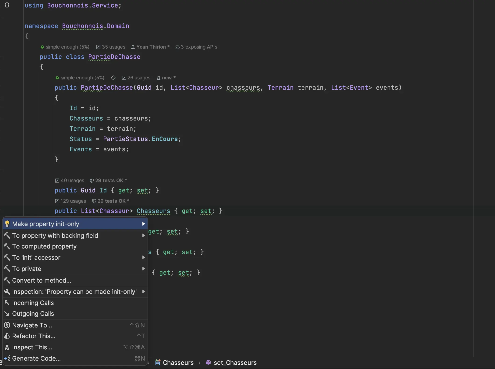

# Step 2 : "Treat warnings as errors"

Prendre quelques instants pour découvrir la page [`Treat warnings as errors`](https://xtrem-tdd.netlify.app/Flavours/treat-warnings-as-errors).

<figure><figcaption><p>Step 2 - "Treat warnings as errors"</p></figcaption></figure>

## Configurer la compilation

Pour ce faire nous avons 2 options.

### Ligne de commande

On peut spécifier à `dotnet` de traiter les warnings comme erreur de compilation via la ligne de commande suivante :

```shell
dotnet build -warnaserror
```

On a dès lors <mark style="color:red;">**7 erreurs**</mark> de compilation :&#x20;

<figure><figcaption><p>Erreurs de compilation</p></figcaption></figure>

Le problème ici, c'est que cette ligne de commande n'est pas partagée entre tous les devs travaillant sur le système :

* IDE Build
* Continuous Integration

Ainsi, la volonté de `traiter tous les warnings comme des erreurs` peut être facilement "oubliée" en compilant via son IDE ou en omettant de spécifier l'argument passer ici.

On va dès lors privilégier l'option ci-dessous qui permet de partager la configuration de compilation quelque soit la manière de faire.

### Configurer nos projets

Pour configurer chaque projet on peut éditer le fichier `csproj` à la main et y ajouter :

```xml
<PropertyGroup Condition=" '$(Configuration)' == 'Debug' ">
    <TreatWarningsAsErrors>true</TreatWarningsAsErrors>
</PropertyGroup>

<PropertyGroup Condition=" '$(Configuration)' == 'Release' ">
    <TreatWarningsAsErrors>true</TreatWarningsAsErrors>
</PropertyGroup>
```

Ou le configurer via notre IDE :&#x20;

<figure><figcaption><p>Configurer la compilation</p></figcaption></figure>

## Jeu des 7 erreurs

On doit maintenant résoudre les 7 erreurs. On commence par le projet du code de production `Bouchonnois`.

### Bouchonnois

<figure><figcaption><p>Erreurs du Bouchonnois</p></figcaption></figure>

Nous avons plusieurs options pour résoudre les erreurs de compilation comme présenté par `Rider` :&#x20;

<figure><figcaption></figcaption></figure>

Ici, nous allons privilégier l'initialisation de la propriété par le constructeur.

Cela permet de :

* Renforcer l'encapsulation
  * Si nous n'avons pas besoin d'exposer le champ `Nom` de manière `public` nous pourrons le rendre `private`
* Forcer / exposer ce qui est requis lors de l'instantiation de nos objets
* Renforcer les règles métiers
  * Initialiser des valeurs par défaut (`Status` par exemple) depuis le constructeur
  * Ne plus "diluer" cette responsabilité dans le système

```csharp
public class Terrain
{
    public Terrain(string nom)
    {
        Nom = nom;
    }

    public string Nom { get; init; }
    public int NbGalinettes { get; set; }
}
```

On va pouvoir se laisser `driver` par notre compilateur à chaque modification.

On va également pouvoir renforcer l'encapsulation et rendre des champs `init-only` :&#x20;

<figure><figcaption><p>Renforcer l'encapsulation</p></figcaption></figure>

On va améliorer la qualité du code en même temps :

```csharp
public PartieDeChasse(Guid id, Terrain terrain)
{
    Id = id;
    // La liste de chasseurs ne sera jamais null
    Chasseurs = new List<Chasseur>();
    Terrain = terrain;
    // Initialiser le Status depuis le constructeur afin qu'à l'instanciation le status soit le bon
    Status = PartieStatus.EnCours;
    // La liste d'events ne sera jamais null
    Events = new List<Event>();
}
```

## Fixer les tests

Après les modifications sur le projet de production, on doit fixer les tests -> l'instantiation des objets du `Domain`.

```csharp
[Fact]
public void QuandLaPartieVientDeDémarrer()
{
    var id = Guid.NewGuid();
    var repository = new PartieDeChasseRepositoryForTests();
    var service = new PartieDeChasseService(repository, () => DateTime.Now);

    // Changer l'instantiation
    repository.Add(new PartieDeChasse
    {
        Id = id,
        Chasseurs = new List<Chasseur>
        {
            new() {Nom = "Dédé", BallesRestantes = 20},
            new() {Nom = "Bernard", BallesRestantes = 8},
            new() {Nom = "Robert", BallesRestantes = 12, NbGalinettes = 2},
        },
        Terrain = new Terrain
        {
            Nom = "Pitibon sur Sauldre",
            NbGalinettes = 3
        },
        Status = PartieStatus.EnCours,
        Events = new List<Event>
        {
            new(new DateTime(2024, 4, 25, 9, 0, 12),
                "La partie de chasse commence à Pitibon sur Sauldre avec Dédé (20 balles), Bernard (8 balles), Robert (12 balles)")
        }
    });

    var status = service.ConsulterStatus(id);

    status.Should()
        .Be(
            "09:00 - La partie de chasse commence à Pitibon sur Sauldre avec Dédé (20 balles), Bernard (8 balles), Robert (12 balles)"
        );
}
```

En essayant de `corriger` les tests on se rend compte qu'on a besoin d'un nouveau constructeur... ou d'une manière simple d'ajouter des chasseurs / events dans la `PartieDeChasse`. Pour le moment et afin de pouvoir compiler, nous allons créer un nouveau constructeur.

```csharp
[Fact]
public void QuandLaPartieVientDeDémarrer()
{
    var id = Guid.NewGuid();
    var repository = new PartieDeChasseRepositoryForTests();
    var service = new PartieDeChasseService(repository, () => DateTime.Now);

    repository.Add(new PartieDeChasse(id, new Terrain("Pitibon sur Sauldre"){ NbGalinettes = 3 }, 
    new List<Chasseur>
    {
        new("Dédé") {BallesRestantes = 20},
        new("Bernard") {BallesRestantes = 8},
        new("Robert") {BallesRestantes = 12, NbGalinettes = 2},
    },
    new List<Event>
    {
        new(new DateTime(2024, 4, 25, 9, 0, 12),
            "La partie de chasse commence à Pitibon sur Sauldre avec Dédé (20 balles), Bernard (8 balles), Robert (12 balles)")
    }));

    var status = service.ConsulterStatus(id);

    status.Should()
        .Be(
            "09:00 - La partie de chasse commence à Pitibon sur Sauldre avec Dédé (20 balles), Bernard (8 balles), Robert (12 balles)"
        );
}
```

A la fin notre classe `PartieDeChasse` ressemble à celà:

```csharp
using Bouchonnois.Service;

namespace Bouchonnois.Domain
{
    public class PartieDeChasse
    {
        public Guid Id { get; }
        public List<Chasseur> Chasseurs { get; }
        public Terrain Terrain { get; }
        // Toujours in problème d'encapsulation ici
        public PartieStatus Status { get; set; }
        public List<Event> Events { get; init; }
        
        public PartieDeChasse(Guid id, Terrain terrain)
        {
            Id = id;
            Chasseurs = new List<Chasseur>();
            Terrain = terrain;
            Status = PartieStatus.EnCours;
            Events = new List<Event>();
        }

        // Nous avons ajouté 3 constructeurs pour les tests...
        public PartieDeChasse(Guid id, Terrain terrain, List<Chasseur> chasseurs)
            : this(id, terrain)
        {
            Chasseurs = chasseurs;
        }


        public PartieDeChasse(Guid id, Terrain terrain, List<Chasseur> chasseurs, List<Event> events)
            : this(id, terrain, chasseurs)
        {
            Events = events;
        }

        public PartieDeChasse(Guid id, Terrain terrain, List<Chasseur> chasseurs, PartieStatus status)
            : this(id, terrain, chasseurs)
        {
            Status = status;
        }
    }
}
```

Nouveau rapport `SonarCloud` disponible [ici](https://sonarcloud.io/summary/overall?id=ythirion\_refactoring-du-bouchonnois\&branch=steps%2F02-treat-warnings-as-errors).

## Reflect

* Comment aurait-on pu faire en sorte que les tests soient moins résistants aux refactorings du code de prod ?
* Quelles autres problèmes avions nous identifier et devrions nous corriger avant d'aller plus loin ?

<figure><figcaption></figcaption></figure>
