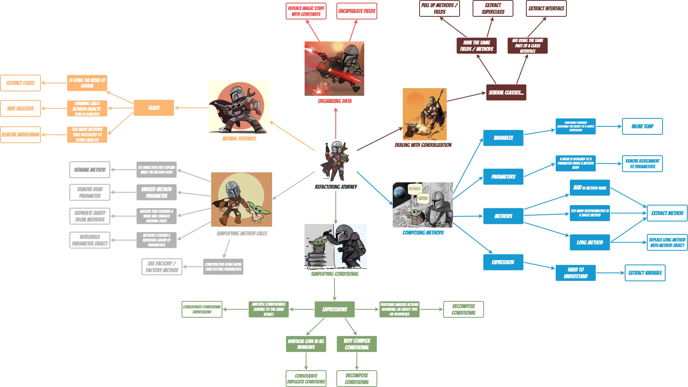

# Refactoring journey

## Objectives

* Practice refactoring tips to improve your day-to-day efficiency
* Use your IDE features

.png>)

### Before we start

* Clone the repository [here](https://github.com/ythirion/refactoring-journey)
* Make sure you can run the tests

## Connection

### Refactoring, you said refactoring ?

.png>)

_**Names of Refactorings :**_

* Write down names of refactorings you already know
* Write up names on a whiteboard or flipchart

Remind them some they use probably : Rename Variable and Extract Interface.

## Concepts

### Several ways to write code

.png>)

### What is refactoring ?

> _Refactoring (noun): a change made to the internal structure of software to make it easier to understand and cheaper to modify without changing its observable behavior._
>
> _Refactoring (verb): to restructure software by applying a series of refactorings without changing its observable behavior_. - [Martin Fowler](https://martinfowler.com/bliki/DefinitionOfRefactoring.html)


Refactoring is a systematic process of **improving code** without creating new functionality that **can transform a mess into clean code and simple design**.


.png>)

> _**The main purpose of refactoring is to fight technical debt**_

### When to refactor ?

.png>)

#### When adding a feature

* If you must deal with someone else’s dirty code, try to refactor it first
  * Clean code is much easier to grasp
* Refactoring makes it easier to add new features
  * Easier to make changes in clean code

#### Rule of Three (duplication)

* You can copy and paste the code once
* BUT when the same code is replicated **3 times**, it should be extracted into a new procedure

#### When fixing a bug

* Clean your code and the errors will practically discover themselves.

#### During a code review

* Code review may be the last chance to tidy up the code before it becomes available to the public
* Best to perform reviews in a pair with an author : _you could fix simple problems quickly_

#### When paying your debt

* Dev teams can create technical debt consciously at one time and book some time later to tackle it
* See [technical debt quadrants](https://martinfowler.com/bliki/TechnicalDebtQuadrant.html)

### How to ?

.png>)

There are two cases when tests can break down after refactoring :&#x20;

* You made an _**error during refactoring**_
  * Go ahead and fix the error
* Your _**tests were too low-level**_ (for example, you were testing private methods of classes)
  * In this case : the tests are to blame
  * Either refactor the tests themselves or write an entirely new set of higher-level tests

## Concrete Practice

.png>)

Follow the journey step by step as explained in [my website](https://ythirion.github.io/refactoring-journey/) :

.png>)

#### Enjoy the Journey

## Conclusion

**Learning feedback**

* Each participant add his/her name on the quadrant
* Please explain _**why you are there**_

.png>)

