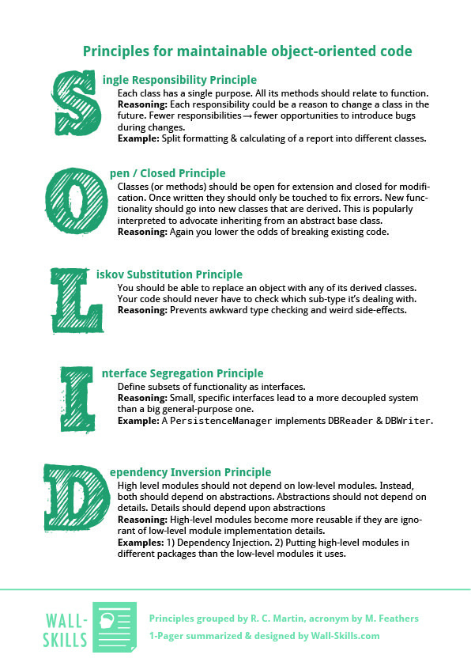

# Write S.O.L.I.D code

## Objectives

* Understand what is “S.O.L.I.D”
* Learn how to use those principles through hands-on

Workshop designed using 4C model \(support provided\) :

* **Connection** : Bad code / Good code
* **Concepts** : Slide deck
* **Concrete** **Practice** : 
  * Bad code / Good code part 2
  * Hands on code katas : [**https://github.com/ythirion/solid-kata**](https://github.com/ythirion/solid-kata)\*\*\*\*
* **Conclusion** : Where do you stand ?



## Resources

* S.O.L.I.D Cheat Sheet :

