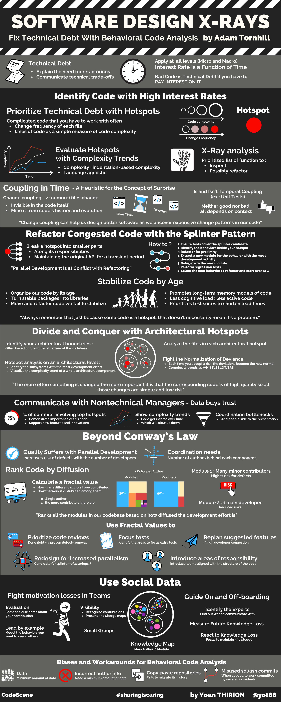

# Software Design X-Rays

## Pitch

Are you working on a codebase where cost overruns, death marches, and heroic fights with legacy code monsters are the norm? Battle these adversaries with novel ways to identify and prioritize technical debt, based on behavioral data from how developers work with code. And that’s just for starters. Because good code involves social design, as well as technical design, you can find surprising dependencies between people and code to resolve coordination bottlenecks among teams. Best of all, the techniques build on behavioral data that you already have: your version-control system. Join the fight for better code!

Use statistics and data science to uncover both problematic code and the behavioral patterns of the developers who build your software. This combination gives you insights you can’t get from the code alone. Use these insights to prioritize refactoring needs, measure their effect, find implicit dependencies between different modules, and automatically create knowledge maps of your system based on actual code contributions.

## Infographic



## Part I — Prioritize and React to Technical Debt

#### Why Technical Debt Isn’t Technical ?


Technical debt is a metaphor that lets developers explain the need for refactorings and communicate technical trade-offs to business people.


* Technical-debt decisions apply both at the 
  * Micro level where we may choose to hack in a new feature with the use of complex conditional logic
  * Macro level when we make architectural trade-offs to get the system through yet another release
* Technical debt is a strategic business decision rather than a technical one


**Keep a decision log :** 

* Human memory is fragile
* Cognitive biases are real
* A project decision log will be a tremendous help in keeping track of your rationale for accepting technical debt
* Jotting down decisions on a wiki or shared document helps you maintain knowledge over time.


* Technical debt is  frequently misused to describe legacy code
  * In fact, the two terms are often used interchangeably to describe code that
    * Lacks quality, and we didn’t write ourselves

#### Interest Rate Is a Function of Time


_**Just because some code is bad doesn’t mean it’s technical debt. It’s not technical debt unless we have to pay interest on it, and interest rate is a function of time.**_


* We would need a time dimension on top of our code to reason about interest rate

#### Your Mental Models of Code

* As programmers we need to serve two audiences :
  * **Machine** that executes our programs :
    * Doesn’t care much about style
    * Is annoyingly pedantic about content and pretty bad at filling in the gaps
  * **Programmers** maintaining our code :
    * Has much more elaborate mental processes
    * Needs our guidance to use those processes efficiently
* As we learn a topic we build mental representations of that domain : schemas
  * A **schema** : theoretical construct used to describe the way we organize knowledge in our memory and how we use that knowledge for a particular event. 
* Understanding code also builds on schemas :
  * General schemas for syntactic and semantic knowledge
  * Like knowing the construction order of a class hierarchy in C++


_Building expertise means evolving better and more efficient mental models._


#### Quality Suffers with Parallel Development

Practices like peer reviews and coding standards help you mitigate the problems with parallel development by catching misunderstandings and enforcing a degree of consistency.

* The structure of the development organization is a stronger predictor of defects than any code metrics.
* _**The risk that a specific commit introduces a defect increases with the number of developers who have previously worked on the modified code**_.

#### Mine Your Organization’s Collective Intelligence

#### How do we uncover the areas in need of improvement?

* Where’s the code with the highest interest rate? 
* Does our architecture support the way our system evolves?
* Are there any productivity bottlenecks for interteam coordination?

### Identify Code with High Interest Rates

#### Measure Interest Rates

> Refactoring complex code is a high-risk and expensive activity, so you want to ensure your time is well invested

Sometimes most development activity is focused on a relatively small part of the codebase

* **Change Frequency = a proxy for Interest Rate**

### Prioritize Technical Debt with Hotspots

* A hotspot is complicated code that you have to work with often. 
* Hotspots are calculated by combining the two metrics we’ve explored:
  * Calculating the change frequency of each file as a proxy for interest rate
  * Using the lines of code as a simple measure of code complexity

#### Use Hotspots to Improve, Not Judge


It’s easy to critique code in retrospect.

* Remember that we don’t know the original context in which the code was developed
* Code is often written under strong pressures of time constraints and changing requirements.


#### Evaluate Hotspots with Complexity Trends

We can find out how severe a potential problem is via a **complexity trend analysis**, which looks at the accumulated complexity of the file over time. 

The trend is calculated by fetching each historic version of a hotspot and calculating the code complexity of each historic revision.

#### What Is Complexity, Anyway?

* Get more insights if the trend is capable of differentiating between 
  * Growth in pure size
  * Versus growth in complexity
* The _**indentation-based complexity**_ metric provides one such approach
  * Simple metric that has the advantage of being **language neutral**

#### Use X-Rays to Get Deep Insights into Code

X-Ray gives you a prioritized list of the methods to inspect and, possibly, refactor :

### Coupling in Time: A Heuristic for the Concept of Surprise


_**Change coupling can helps us design better software as we uncover expensive change patterns in our code**_


#### Uncover Expensive Change Patterns

* How do we know if a software design is any good?
  * Most answers concern facets of programming such as the importance of naming, testability, and cohesion
  * We’ll go beyond that and assert that none of those qualities matter unless our software design supports the kind of changes we need to make to the code
* _**Code under active development is a moving target**_

#### What Is Change Coupling?

* Change coupling is different from how we programmers typically talk about coupling.
  * Change coupling is invisible in the code itself
    * We mine it from our code’s history and evolution
  * Change coupling means that two \(or more\) files change together over time
    * First coupling criterion : when files are changed within the same commit

> _Change Coupling Both Is and Isn’t Temporal Coupling_

Look for surprising patterns when investigating change coupling

* Surprise is one of the most expensive things you can put into a software architecture
  * Suffer the consequences of any surprising change
  * Software bugs thrive on surprises
* _**Change coupling itself is neither good nor bad; it all depends on context**_
  * A unit test that changes together with the code under test is expected
    * Should be worried if not
      * Indicate that our tests aren’t kept up to date
  * On the other hand, if two seemingly independent classes change together over time we might have discovered :
    * An erroneous abstraction
    * Copy-pasted code
    * or—as is often the case—both


**Calculate Change Coupling from the Command Line by using** [**code-maat**](https://github.com/adamtornhill/code-maat)\*\*\*\*


#### Minimize Your Investigative Efforts

Change coupling analysis gives us information on how our code grows, which lets us detect implicit dependencies that point to code that’s hard to maintain.

* Some of the worst hotspots and design issues tend to be in automated tests
  * Often missing abstractions:
    * Test Data: We need to model the domain of our tests and express the concept of test data
    * Assertions: We need a specialized assertion statement that encapsulates our test criteria

#### The Power of Language-Neutral Analyses

The power of language-neutral analyses is that we _**can spot relationships between files implemented in different languages**_

* Today’s systems are often polyglot codebases

### Pay Off Your Technical Debt

Refactoring code that’s under heavy development, perhaps even shared between multiple teams, adds another dimension to the problem.

#### Follow the Principle of Proximity

* Proximity focuses on 
  * How well organized your code is with respect to 
    * Readability and change
* Proximity implies that _**functions that are changed together**_ are _**moved closer together**_. Proximity is both a design principle
* Proximity principle is a refactoring technique that uses feedback from how our code evolves :
  * By ordering our functions and methods according to our change patterns 
  * _**We communicate information that isn’t expressible in programming-language syntax**_

#### Automate Proximity Recommendations

A proximity refactoring serves as a mental note that the two functions belong together.

### Refactor Congested Code with the Splinter Pattern

* Splinter pattern provides a structured way to break up hotspots into 
  * Manageable pieces that can be divided among several developers to work on

#### Parallel Development Is at Conflict with Refactoring

* Our refactoring goal conflicts with the short-term evolution of the overall system
  * Most organizations just cannot afford to pause ongoing work 
    * so that we can refactor in a safe, development-free vacuum
* The splinter pattern resolves this dilemma by recognizing that refactoring a hotspot is an iterative process
  * In a splinter refactoring you 
    * Won’t even improve the code quality as such
    * BUT rather _**transform the code to a structure where multiple people can work together in parallel toward the overall refactoring goal**_.

#### Split a Hotspot File Along Its Responsibilities


_The intent of the splinter pattern is to break a hotspot into smaller parts along its responsibilities while maintaining the original API for a transient period._


Keep the original method signatures and replace the method bodies with a simple delegation to the extracted modules.

Steps behind an iterative splinter refactoring :

1. _Ensure your tests cover the splinter candidate_ : have an adequate test suite
2. _Identify the behaviors inside your hotspot :_  look at the names of the methods inside the hotspot / identify code that forms groups of behaviors
3. _Refactor for proximity :_ form groups of functions with related behavior inside the larger file, based on the behaviors you identified earlier
4. _Extract a new module for the behavior with the most development activity_ : use X-Ray
5. _Delegate to the new module_. Replace the body of the original methods with delegations to your new module
6. _Perform the necessary regression tests to ensure you haven’t altered the behavior of the system_
7. _Select the next behavior to refactor and start over at step 4_

#### Consequences of Splinters

The hotspot now acts as a facade that maintains the original API

#### The Curse of a Successful System

> Much code decay isn’t due to incompetence but rather is owed to the success of an evolving product.

### The Principles of Code Age

Stabilize Code by Age :

1. Organize our code by its age
2. Turn stable packages into libraries
3. Move and refactor code we fail to stabilize

#### Related advantages

* _Promotes long-term memory models of code_ : Stable packages serve as chunks that remain valid over time, which means our expectations of a piece of code won’t be broken
* _Lessens cognitive load since there’s less active code_ : The more code you manage to stabilize, the less knowledge you need to keep in your head
* _Prioritizes test suites to shorten lead times_ : Identify which parts of the software you can safely skip test runs

#### 3 generations of code

Dan North claims that we want our code to be either :

* very recent 
* Or old
* The kind of code that’s hard to understand lies in between these two extremes

#### Ebbinghaus forgetting curve

**To retain** the information we **need to repeat it**, and with each repetition we’re able to improve our performance by remembering more.

> Each time we revisit mid-aged code we need to relearn its inner workings, which comes at a cost of both time and effort.

## Part II - Work with Large Codebases and Organizations

Work at an architectural level to gain insights into the system as a whole.

### Spot Your System’s Tipping Point

* Use social code analysis to make sense of large-scale systems by
  * Breaking them down into subsystems
* Large systems become even more complex once we add the social dimension
  * As a project grows beyond 12 or 15 developers :
    * _**Coordination, motivation and communication issues tend to cause a significant cost overhead.**_
* Know if a specific part of the code is a coordination bottleneck


T_he scale of a codebase has to be reflected in both the organization of people and the architecture of the system._


### Divide and Conquer with Architectural Hotspots

1. _Identify your architectural boundaries:_ 
   * Sometimes those boundaries are documented 
   * If not, you need to reverse-engineer those boundaries, and a good starting point is to _**base them on the folder structure of the codebase**_.
2. _Run a hotspot analysis on an architectural level :_ 
   * Identify the subsystems with the most development effort
   * Visualize the complexity trend of a whole architectural component.
3. _Analyze the files in each architectural hotspot :_ 
   * Focus on individual files
   * Our analysis scope is smaller since we focus on one subsystem at a time


_Always remember that just because some code is a hotspot, that doesn’t necessarily mean it’s a problem._ 


* A hotspot means 
  * We’ve identified a part of the code that requires our attention 
  * Since it attracts many changes
* **The more often something is changed**
  * **The more important it is that the corresponding code is of** 
    * High quality so 
    * all those changes are simple and low risk

#### Analyze subsystems

* **Size alone may be problematic**
  * Large files are likely to contain many different responsibilities and be hard to navigate
* Complexity trends of the code

#### Prioritize Function Hotspots and Code Clones

* Launch X-Ray on
  * Have a prioritized list of refactoring candidates

> There are no hard rules, but with a heuristic you want to inspect the top 10 hotspots in your subsystem.

### Fight the Normalization of Deviance


_Each time you accept a risk, the deviations become the new normal_. \(see Challenger Launch study by sociologist Diane Vaughan\)


* We have plenty of normalization of deviance in software development :
  * Inherit a file with 15,000 lines of code
    * First : shocked by the amount of code and the lack of higher-level organization.
    * But if you work with that code long enough
      * Those 15,000 lines become the new normal
      * **Besides, what difference does a few more lines of code make?** 

#### Get a Whistleblower

_**Complexity trends serve as excellent whistleblowers**_ by giving us an _**unbiased**_ frame of reference that helps us detect when we accept a quality ditch too much

1. _Decide upon a sample interval_—for example, once per month.
2. _Calculate a complexity trend for each file_ in the logical component
3. _Aggregate_ the individual trends into a single trend

#### Communicate with Nontechnical Managers - Data buys trust

* Start by calculating the percentage of commits that involve your top hotspots
  * 10 to 15 percent is common
  * To show your managers how important that code is for your ability to support new features and innovations
* Follow up with the corresponding complexity trends to explain that the code gets worse over time, which will slow you down
* Add the people side to your presentation to highlight that the _**hotspots are coordination bottlenecks**_ too.

> Later you can visualize the effects of a refactoring with a steep downward trend of your prioritized hotspot.

### Beyond Conway’s Law

Interteam communication is an inevitable aspect of building large systems, and thus ease of communication should be a key nonfunctional requirement of any architecture :

* Development productivity increases with better socio-technical congruence
* Excess coordination needs correlate directly to increased lead times

> The number of authors behind each component provides a shallow indication of coordination needs, and is just a starting point.

#### Rank Code by Diffusion

* Ranks all the modules in our codebase based on how diffused the development effort is
  * Then use that as a proxy for coordination needs
  * This is a quantitative metric that we get through a fractal value analysis
* A fractal value is an algorithm that delivers a normalized value between 0.0 and 1.0 based on how many different authors have contributed and how the work is distributed among them.
  * 0 : Single author
  * 1 : the more contributors there are

#### React to Developer Fragmentation


_There is a strong correlation between the fractal value of a module and the number of reported bugs._


Use the fractal values to :

* _Prioritize code reviews :_ Code reviews done right are a proven defect-removal
* _Focus tests :_ Identify the areas of the code where you need to focus extra tests
* _Replan suggested features :_
  * Before you start on a new feature, measure the development fragmentation over the past weeks.
  * If your planned work involves an area of the code with high developer congestion
  * Replan and delay the start on any new feature implementation.
* _Redesign for increased parallelism :_ identify candidates for splinter refactorings allowing people to work more independently.
* _Introduce areas of responsibility :_ reassess the current ways of working, perhaps by introducing teams that are aligned with the structure of the codebase

#### Code Ownership and Diffusion of Responsibility

* Psychological phenomenon called diffusion of responsibility :
  * In larger groups we don’t feel a personal sense of responsibility
  * We assume someone else should react and help.
* Code Ownership Means Responsibility
  * Ownership is a mechanism to counter the diffusion of responsibility
  * It suggests that someone takes personal responsibility for the quality and future of a piece of code

#### Provide Broad Knowledge Boundaries

Several techniques for it :

* Invite people from other teams to code reviews
  * Schedule recurring sessions where you present walkthroughs of a solution or design
* Encourage people to rotate teams

The key to finding the right boundaries is to make it a deliberate rather than an accidental designation.

#### Motivation Losses in Teams

> Social loafing is a type of motivation loss that may occur when we feel that the success of our team depends little on our actual effort.

We pretend to do our part of the work, when in reality we just try to look busy and hope our peers keep up the effort.

Several factors can minimize the risk of **social loafing**:

* _Small groups_
* _Evaluation_ : Code reviews done right have positive motivational effects the _**reviews show that someone else cares about your contribution**_
* _Leadership by example_ : need to model the behaviors you want to see in others
* _Visibility_: Recognize each person’s contributions by presenting knowledge maps that show the main contributors behind each module

### Guide On- and Off-boarding with Social Data

#### Identify the Experts

* One of the challenges of communication is to find out who to communicate with, and this general problem gets harder with geographical distance.
* The knowledge map represents the main developer behind each file with a unique color.

#### Measure Upcoming Knowledge Loss

This analysis uses the same data as the knowledge maps; the only difference is that we form two virtual teams: 

* One for people who actively work on the codebase
* One for people who are about to leave

#### React to Knowledge Loss

When a developer resigns and has a notice period to work out, run this analysis to identify the parts of the system where your organization needs to focus to maintain knowledge.

### Know the Biases and Workarounds for Behavioral Code Analysis

> Need a minimum amount of data before you can start to see clear patterns in a behavioral code analysis

* _Incorrect author info_
* _Copy-paste repositories_: extract a component into a separate Git repository but fails to migrate its history
* _Misused squash commits_: Git lets you squash commits, effectively merging separate commits into one. 
  * Useful on a smaller scale for a single developer
  * Disastrous when applied to work committed by several individuals. 
    * The resulting history erases both 
      * Social information 
      * Change coupling data.

