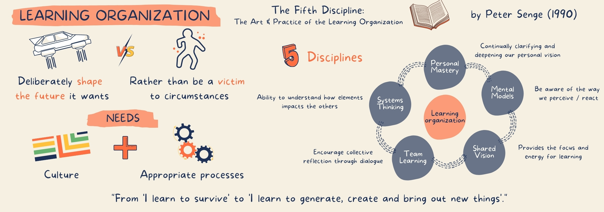
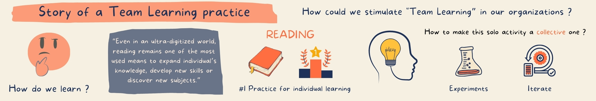

# Cultivate Team Learning with Xtrem Reading

#### I have written this article for infoQ, it has been plublished here : [https://www.infoq.com/articles/learning-xtrem-reading/](https://www.infoq.com/articles/learning-xtrem-reading/)

#### Key Takeaways

* Become a Learning Organization to be able to adapt
* Xtrem Reading: a first step to the Learning Organization
* Learn how to read in an extreme way: 2 books in 1 hour collectively
* Xtrem Reading as a cure to the _Tsundoku_ syndrome
* Xtrem Reading can help you reduce your human debt and improve cohesion

> _With this pandemic, the adaptability of our organizations has been put to the test. To adapt, they have to continually enhance their capabilities to adapt and finally survive._

## How could our organizations achieve that?

The answer has been known for a few decades now \(in 1990\): by becoming a **learning organization;** an organization skilled at:

* Creating, acquiring, and transferring knowledge
* Modifying its behavior to reflect new knowledge and insights

### Disciplines of a Learning Organization

In 1990, Peter Senge published a book called _The Fifth Discipline: The Art & Practice of the Learning Organization_. He summed up his ideas about how organizations can more effectively adapt based on his systems thinking.

He defined a learning organization as one that has both a culture and the appropriate processes to deliberately shape the future it wants, rather than be a victim to circumstances.

He identified 5 disciplines associated:

* **Personal Mastery**: continually clarifying and deepening our personal vision
  * Live in a continual learning mode
  * Clarify what is really important and envision it
* **Mental Models**: learn to let go of our assumptions, be aware of the way we perceive and react
* **Shared Vision**: bring into alignment the vision and the efforts of the employees
  * It provides the focus and energy for learning
  * Where there is a genuine vision—people excel and learn because they want to
* **Team Learning**: encourage collective reflection through dialogue
  * When teams learn together, people will grow more rapidly
  * Learning starts with a dialogue: the capacity to enter into a genuine “thinking together” mode
* **Systems thinking**: the ability to integrate elements of an organization and to understand how each impacts the others
  * Instead of focusing on individual issues, systems thinking reflects the observational process of an entire system
  * People have to understand that every action and consequence is correlated with another

Finally, the message I took away is that learning is the only way for an organization to shape its own future. It is through learning that it can move from “**I learn to survive**” \(learning to survive/adapt\) **to “I learn to generate, create, and bring out new things.”**

In this article, I will introduce a homemade facilitation technique that will help you start your journey to this famous learning organization by focusing on the 4th discipline: Team Learning.

## The story of a Team Learning practice

In 2018, a colleague and I asked ourselves this question—_How could we stimulate team learning in our organization?_

We wanted to find a new way to favor collective reflection and learning, so we started by brainstorming our own ways to learn new stuff.

We are maybe a little bit old school, but we came up with an observation:

_Even in an ultra-digitized world, reading remains one of the most used means to expand an individual’s knowledge, develop new skills, or discover new subjects._

For the record, at the time, I was affected by a syndrome called Tsundoku. \(Maybe you are too at this moment.\) To make a self-diagnostic, you just have to answer two questions:

* Do you have piles of books just waiting for you to read?
* Do you still buy new books, attracted by the tempting windows of your booksellers?

If you answer YES to those 2 simple questions, you are affected. Tsundoku is the act of acquiring books and letting them pile up without reading them. Sorry for this deviation, let’s go back to my original story.

After having identified reading as the number one practice for individual learnings, the problem was the following: _Reading_, as we have been taught, is a solo activity—how could we make it collective?

After a few brainstorming and experimental sessions, we created what we now call Xtrem Reading.

## What is Xtrem Reading?

Xtrem Reading is an easy-to-run workshop format that comes with a promise: Read 2 books in 1 hour and cultivate your collective intelligence. To run a session, it requires:

* A facilitator \(or rather a timekeeper\)
* The facilitation infographic \(provided in this article\)
* A space/room \(virtual or physical\)
* Some books \(more books than the number of participants\)
* Volunteers \(2 people minimum without any maximum\)

When we talk about this format to new people, usually they react like this: “What kind of black magic is this?” or “I’m not Superman, I’m not able to read so fast”…

### How does it work?

#### **1\) Each volunteer brings a book**

Before the beginning of the session, the facilitator invites volunteers to bring a book of their choice that they haven’t read \(often the one lying on their bedside table\).

#### **2\) Share choices**

Invite them to share their choice with the other participants by explaining what they hope to find in the book they brought.

#### **3\) Create groups of interests**

Following the sharing, participants organize themselves into interest groups of 2 to 3 people.

#### **4\) Read 2 books**

During 2 iterations of 15 to 25 minutes, participants read 2 books with a clear objective in mind: **Extract the main points to present to other members of the group.**

At the end of the first iteration inside their group, each participant will change the book with someone else and read the new book.

Here is the black magic—to be good at it, we need to unlearn how we have learned reading at school \(don’t read from page 1 until the end\).  

The first step is to use simple techniques:

* Overview table of contents
* Read the back cover
  * Read the Foreword
* Analyze the structure of the book
  * You can see a book as a gold mine in which you need to identify the gold nugget—aka, the key chapter
  * Often in a book you have 1 central chapter of a few pages and the rest is built upon it
  * If you find it you will be able to quickly understand the whole concepts behind the book
*  Read what you want to read
  * Navigate through it
* Take notes by using Mind mapping for example

Once you master the first stage techniques you can learn and use Speed Reading techniques like:

* Use your finger to track words as you read
* Read in chunks: group words together to get through them faster
* Avoid subvocalization: avoid pronouncing the words in your head otherwise you limit your reading rate to your speech rate

#### **5\) Sharing**

Within each group, 5 to 10 minutes are spent per book to explain what has been discovered. This stage is often very surprising and interesting—in a reading of only 15 to 25 minutes, participants can bring out an incredible amount of information.

I strongly encourage the facilitator to add questions at the end of the sharing, like how could we use this learning in our day-to-day life?

**It will encourage strong collective reflection through dialogue.** Often \(depending on the books\) it leads to awareness or team experimentations.

#### **6\) Appreciate the book \(optional\)**

At the end, each reader can write down his/her feelings about 2 dimensions:

* Book’s readability: \(on a scale from 1 to 5\)
  * 1 - It is almost impossible to find clear information in a quick way
  * 5 - It is easy to find clear information \(abstract at the end of chapters for example\)
* Recommendation: \(on a scale from 1 to 5\)
  * 1 - I don’t recommend it at all
  * 5 - It seems to be a MUST Read on the topic

Those appreciations help to create a community feeling in which participants can help others choose their next readings.

## Lessons learned

So far, I have facilitated dozens of sessions with more than 400 different people in different contexts, \(at client’s location, in specific communities, or at conferences\), and in different countries.

Based on these various experiences, here are my discoveries:

* We are **all Clark Kent**:
  * Reading 2 books in 1 hour, like Clark Kent, is possible.
  * We are all able to do it...but different from what we first think.
* It **improves** book **memorization**:
  * Reading with sharing in mind is incredibly effective in improving retention.
  * The best way to learn is to teach and that’s the spirit behind the exercise.
  * We have learned with Neuroscience that our memory is bound to our emotions. A high emotional charge will promote memorization.
    * By sharing each book we create emotions around it that will help us retain it.
* Creates a **lot of learning**:
  * Each participant in each session learns something new.
  * Without noticing it, we take the participants on the road to Team Learning \(our famous 4th discipline\)
* A very **rich experience**:
  * We all have different systems of thinking and that’s where the real richness lies.
  * When sharing, each reader may have seen and retained different things. Crossing them is incredibly rich!!!
* Discover **unsuspected topics**:
  * It allows participants to discover subjects they wouldn’t have thought they would like. Or on the contrary to realize that a subject doesn’t interest them and this without having invested more than an hour of their time.
  * It will help participants to prioritize their next readings and reduce their Tsundoku syndrome.
* **Break silos** and connect people: “anytime, anywhere, anyone, any topics”
  * Everyone is concerned by this learning experience and wants to participate. The willingness to learn isn’t limited to operational staff.
  * It breaks down horizontal silos \(inside teams and between teams or departments\) but also vertical silos \(hierarchy\).
  * It creates empathy between people who aren’t used to working together.

_You not only learn from the book but also from each other because you will most likely have read different bits, and you will probably have formed very different opinions about the same book._ – [Nancy Beers \(Happy Scrum Master\)](https://www.linkedin.com/in/nancybeers/)

*  **No more waiting frustration**:
  * What’s cool about going to the cinema as a group is the debriefing of the film that takes place right afterward.
    * I like to think that with Xtrem Reading we create this same feeling about books.
  * No more 6 months waiting frustration before being able to talk about a book with someone else

_Xtrem Reading allows me to meet other colleagues whom I don’t usually meet. Finally, even though the length of the session limits the reading to a broad and not a deep exploration, I find that the concepts I get from the books are easier to re-explain afterward._ – [Fabien Hiegel \(Juste un Dev\)](https://www.linkedin.com/in/fabien-hiegel-874416b5/)

### The limits

There are some limitations that you need to be aware of before facilitating a session:

* A comment often made at the end of the session: “You lied to me, I haven’t really read 2 books.” 
  * Some participants think that without any efforts they would be able to fully read 2 books of 200 pages.
  * To answer this question, you can use the best weapon of the coach: ask open questions.
    * “Which value did you see in today’s exercise?”
    * “What have you learned from this session?”
    * Participants should be able to find a lot of value from it.
  * You can as well explain that the promise was to “read 2 books” but the fact that some participants thought it was a full reading was a cognitive bias.
    * Xtrem reading is another approach to reading.
* It doesn’t work for fiction books.
  * If you Xtrem Read fiction books, of course, it will ruin the pleasure of discovering the characters and their evolution.
* Be aware of confirmation bias:
  * This bias is the tendency of people to favor information that confirms their beliefs or values.
  * If you organize sessions with only people with the same point of view, same fields of expertise, this bias will be strengthened.
    * I highly recommend you mix people during those kinds of sessions to manage this bias.
* Beware the Dunning-Kruger effect:
  * This effect is a type of cognitive bias in which people believe that they are smarter and more capable than they really are. Essentially, low-ability people don’t possess the skills needed to recognize their incompetence.
  *  I like to remind participants that just because people have spent some time on a book explaining a given concept, doesn’t make them experts on this given concept.
    * It can help to fight this effect.

### And with the Pandemic?

Xtrem reading can be used remotely as well by using different tools. Here are the ones I have tested for the different parts:

* Discord: to communicate and create groups of interests
* Trello: to list books, select them and appreciate them
*  OneDrive: to share books

Honestly, the first sessions are really chaotic: book file format nightmares, tool usage, access rights on the different tools…

Once participants are used to it, it is a different experience but as rich as physical.  

## Conclusion

The journey to Team Learning is not so complicated once the organization understands that its employees are its privileged partners.

To get them to understand this, you can start by setup and spreading practices that allow Team Learning, such as Xtrem Reading, Lean coffees, brown bag lunches, hackathons, feedback sessions, etc.

As a conclusion, I propose to you some reflections:

* Imagine you have just facilitated your first Xtrem Reading session. People are excited and talking to each other. What are you seeing and hearing?
* What did you find in this article that could help you? Why? How?
* Once you consider your organization a learning organization, what will be different?

## Infographic



_This article is based on the Xtrem Reading concept I have created with_ [_Cédric Tamavond_ ](https://www.linkedin.com/in/cedric-tamavond-b30ab917/)_when I was an employee at AP. This work has been licensed under a_ [_Creative Commons Attribution-ShareAlike 4.0 International License_](https://creativecommons.org/licenses/by-sa/4.0)_._

