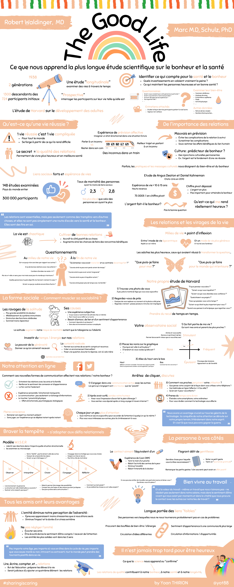
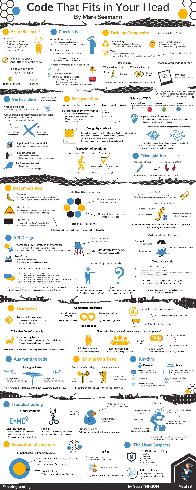
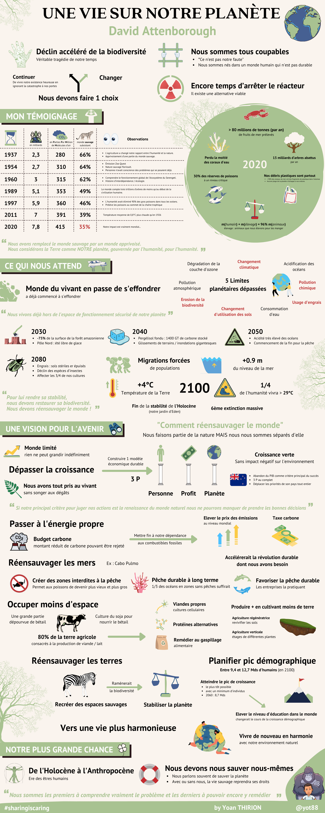
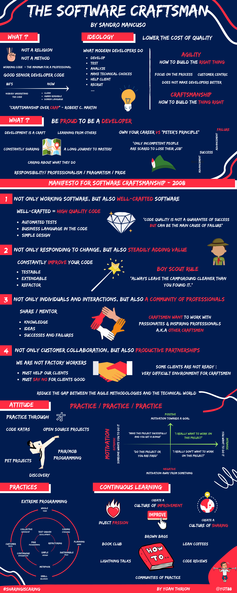
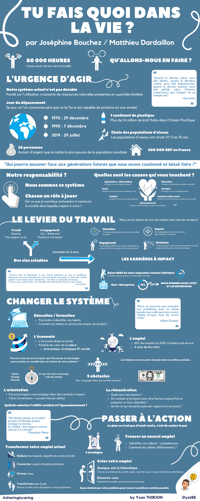

# My Book Infographics


Download Yoan Thirion's book infographics


* [_**Dynamic Reteaming - The Art and Wisdom of Changing Teams**_](https://www.oreilly.com/library/view/dynamic-reteaming-2nd/9781492061281/) _by_ [_Heidi Helfand_](https://www.heidihelfand.com)

<figure><figcaption></figcaption></figure>

* [_**The Good Life**_ _**- Ce que nous apprend la plus longue étude scientifique sur le bonheur et la santé**_](resources/book-notes/the-good-life.md) _par_ [_Robert Waldinger_](https://www.linkedin.com/in/robert-waldinger-90012169/)_,_ [_Marc M.D. Schulz_](https://www.linkedin.com/in/marc-schulz-20663222a/)

<figure><figcaption>
Infographie du live "The Good Life" par Yoan Thirion
</figcaption></figure>

* [_**Software craft, TDD, Clean Code et autres pratiques essentielles**_](https://www.dunod.com/sciences-techniques/software-craft-tdd-clean-code-et-autres-pratiques-essentielles) _par_ [_Cyrille Martraire_](https://www.dunod.com/livres-cyrille-martraire)_,_ [_Arnaud Thiéfaine_](https://www.dunod.com/livres-arnaud-thiefaine)_,_ [_Dorra Bartaguiz_](https://www.dunod.com/livres-dorra-bartaguiz)_,_ [_Fabien Hiegel_](https://www.dunod.com/livres-fabien-hiegel)_,_ [_Houssam Fakih_](https://www.dunod.com/livres-houssam-fakih) _- May 2022_


High resolution Software Craft book infographic by Yoan Thirion


* [_**Code that Fits in Your Head**_](https://www.oreilly.com/library/view/code-that-fits/9780137464302/) _by Mark Seemann - April 2022_

* [**Une vie sur notre planète**](https://editions.flammarion.com/une-vie-sur-notre-planete/9782080249616) by _David Attenborough - February 2022_


Une vie sur notre planète - High Resolution Book infographic


* [_**The Software Craftsman**_](https://www.goodreads.com/book/show/23215733-the-software-craftsman) _by Sandro Mancuso_ _-_ _January 2022 (update)_

* [_Tu fais quoi dans la vie_](https://livre.fnac.com/a16126259/Matthieu-Dardaillon-Tu-fais-quoi-dans-la-vie) _by Joséphine Bouchez et Mathieu Dardaillon - November 2021_

* [_How to avoid a climate disaster_](https://www.goodreads.com/book/show/52275335-how-to-avoid-a-climate-disaster) _by Bill Gates - October 2021_

* [_Unit Testing Principles, Practices, and Patterns_](https://www.manning.com/books/unit-testing) _by Vladimir Khorikov - October 2021_



* [_**The programmer's brain**_](https://yoan-thirion.gitbook.io/knowledge-base/xtrem-reading/resources/book-notes/the-programmers-brain) _by Felienne Hermans - August 2021_

.png>)

* [_**La Liberté du Commandement**_ ](https://livre.fnac.com/a14046398/Loic-Finaz-La-liberte-du-commandement)_par Loïc Finaz - June 2021_

.png>)

* [_**Refactoring at Scale: Regaining Control of Your Codebase**_](https://www.goodreads.com/book/show/53483751-refactoring-at-scale) _by Maude Lemaire - May 2021_

.jpg>)

* [_**Team Topologies**_](https://www.goodreads.com/book/show/44135420-team-topologies) _by Matthew Skelton, Manuel Pais - April 2021_

.png>)

* [_**Succeeding with OKRs in Agile**_](https://www.goodreads.com/book/show/57019672-succeeding-with-okrs-in-agile?ac=1\&from\_search=true\&qid=HgSf8HvSoN\&rank=1) _by Allan Kelly - March 2021_

.png>)

* [_**Software-Design X-Rays**_](https://www.goodreads.com/book/show/36517037-software-design-x-rays?ac=1\&from\_search=true\&qid=X1QZx8XCCs\&rank=1) _by Adam Tornhill - February 2021_

.png>)

* [_**Leadership Strategy and Tactics: Field Manual**_](https://www.goodreads.com/book/show/51136198-leadership-strategy-and-tactics?ac=1\&from\_search=true\&qid=ExRdMvfk8X\&rank=1) _by Jocko Willink - February 2021_

* [_**Samman Technical Coaching**_](https://www.goodreads.com/book/show/56659570-technical-agile-coaching-with-the-samman-method?ac=1\&from\_search=true\&qid=Vsc4qfo3k7\&rank=1) _by Emily Bache - January 2021_

* [_**Culture is Everything**_](https://www.goodreads.com/book/show/35080568-culture-is-everything?ac=1\&from\_search=true\&qid=G7bsQEDUsD\&rank=1) _by Tristan White - December 2020_

.jpg>)

* [_**Leadership is language**_](https://www.goodreads.com/book/show/42774083-leadership-is-language) _by David Marquet - November 2020_

* [_**The Software Craftsman**_](https://www.goodreads.com/book/show/23215733-the-software-craftsman) _by Sandro Mancuso_ _-_ _April 2017_

