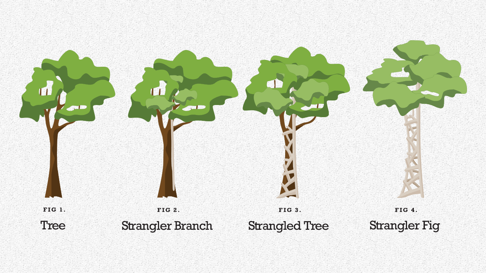

# Code that fits in your head

## Pitch

**How to Reduce Code Complexity and Develop Software More Sustainably**

> “Mark Seemann is well known for explaining complex concepts clearly and thoroughly. In this book he condenses his wide-ranging software development experience into a set of practical, pragmatic techniques for writing sustainable and human-friendly code. This book will be a must-read for every programmer.”
>
> –_Scott Wlaschin, author of_ Domain Modeling Made Functional
>
>
>
> _**Code That Fits in Your Head**_ offers indispensable, practical advice for writing code at a sustainable pace and controlling the complexity that causes projects to spin out of control. Reflecting decades of experience helping software teams succeed, Mark Seemann guides you from zero (no code) to deployed features and shows how to maintain a good cruising speed as you add functionality, address cross-cutting concerns, troubleshoot, and optimize. You’ll find valuable ideas, practices, and processes for key issues ranging from checklists to teamwork, encapsulation to decomposition, API design to unit testing. Seemann illuminates his insights with code examples drawn from a complete sample project. Written in C#, they’re designed to be clear and useful to anyone who uses any object-oriented language including Java , C++, and Python. To facilitate deeper exploration, all code and extensive commit messages are available for download.

* Choose mindsets and processes that work, and escape bad metaphors that don’t
* Use checklists to liberate yourself, improving outcomes with the skills you already have
* Get past analysis paralysis by creating and deploying a vertical slice of your application
* Counteract forces that lead to code rot and unnecessary complexity
* Master better techniques for changing code behavior
* Discover ways to solve code problems more quickly and effectively
* Think more productively about performance and security

If you’ve ever suffered through bad projects or had to cope with unmaintainable legacy code, this guide will help you make things better next time and every time.

.png>)

## Book Notes

I. Acceleration

### 1. Art or Science

* Are you :
  * a scientist or an artist ?
  * an engineer or a craftsman ?
  * a gardener or a chef ?
  * a poet or an architect
  * Mark's answer
    * None of the above
    * Little of all of the above
* Software as a craft
  * A skilled work
  * Should have apprentices who work alongsiode masters
* Programming as an art :
  * Doesn't fit reality
  * Follow heuristics
    * Rules of thumb
    * Guidelines that can be taught
      * The kley to turning programming into an engineering discipline
* When we type code, corresponds to engineer drwaing plans
  * Rather than workers construction things

### 2. Checklists

This book can help transition from programmer to software engineer

* An aid to memory
  * Help focus on the hard parts by taking your mind off the trivial things
  * Should enable / support / liberate practicioners (not a constrain)
* Example : checklist for starting a new code base :

```
✅ Use Git
✅ Automate the build
✅ Turn on all error messages
```

* Turn on all error messages = Treat warnings as errors
  * Have 0 tolerance for warnings
  * Hard to see new compiler warnings when you have already a lot
  * Nullable Reference types -> on when the code base is new
  * Treat linter and static code analysis warnings as errors

### 3. Tackling Complexity

* Sustainability
  * Much software lives for years / decades
  * During its lifetime, it undergoes changes :
    * Gets new features
    * Bugs are fixed
    * ...
    * Requires regular work on the codebase
  * A continual effort that must be **sustainable**

`Software engeineering should make the software development process more regular. It should sustain the organisation.`

* Value
  * Code should produce value leads to the logical fallacy that code not producing value is prohibited
  * Some code produces no _immediately measurable_ value

#### Why Programming is Difficult

* Human short-term memory
  * Can hold from 4 to 7 pieces of information
  * If too many things are going on
  * Our brain can't keep track of it all

`Optimise code for readability`

* Readability
  * When writing code : aware of all the context that gives rise to the code
  * When reading code : all the contextual info is gone
* How to ?
  * Organise code so that the relevant info is activated
    * WYSIATI : what you see is all there is (Kahneman)
    * Place related code together :
      * All the dependencies
      * Variables
      * Decisions

`The core problem that software engineering should solve is that it's so complex that it doesn't fit the human brain`

### 4. Vertical Slice

`Don't trust yourself to write correct code`

* Get to working software as soon as possible
* **Walking skeleton**
  * Find a motivation for making changes to the code
  * Use X-Driven development methodologies : TDD, BDD, DDD, Type-Driven Development, Property-Driven Development
* Characterization Test
  * Charcaterizes the behaviour of existing softwares
  * Protects against regression
* Arrange Act Assert
* Outside-In TDD
  * Write the tests before the implementation : a driver to it
  * High-level tests should go easy on the assertions
    * As you add more test code, you ll be describing the exepcted behaviour of the system in increasing detail
    * The goal is not to write as many lines of code as fast as you can
      * `Sustainable software`
* DTO and Domain Model :
  * Different roles at play
  * Structural equality make elegant assertions possible
* Commit database schema to your git repository
* Always keep your Domain Model unpolluted by implementation details
* [Humble Object](https://martinfowler.com/bliki/HumbleObject.html)
  * Consider objects like `Repository` as Humble Object
  * Implementation is hard to unit test because depends on a subsystem that you can't easily automate
* Perform smoke test
  * Favour automated tests but don't forget manual testing
  * Use cURL for that
* Vertical slide is an effective way to demonstrate that the software may work

`Abstraction is the elimination of the irrelevant and the amplification of the essential - Robert C. Martin`

### 5. Encapsulation

* A contract introduces / formalises a level of trust
  * That's what encapsulation is about
  * Making objects engage in contracts
* [Transformation Priority Premise](https://blog.cleancoder.com/uncle-bob/2013/05/27/TheTransformationPriorityPremise.html)
  * Don't forget to use `driver` if you can
  *   When you edit code : transforn from one working state to another

      * Move in small incrment.

      
* Parameterised Test
  * Once you have identified which transformation to aim for
  * Write a test driving that change
* Validation
  * ArgumentNullException is better than NPE
  * Carries info about the argument whcih was null

#### The science of TDD

* Red Green Refactor
* One of the most scientific methodologies of Software Engineering
  * Form a hypothesis in a form of a prediction of a falsifiable outcome
  * Perform an experiment / Measure the result
  * Compare the actual to the predicated one
* Refactor phase
  * Can you improve the code ?

#### Design by contract

* Encapsulation is more than just checking for null
* It is the idea that you should be able to interact with an object without intimate knowledge of its implementation details
  * Enables you to change the implementation (refactor)
  * Allows you to think of an object in an abstract way
* It enables you to replace the many details of an object's implementation with a simpler contract

#### Guard clause and Postel's Law

`Be conservative in what you send, be liberal in what you accept`

* In API design :
  * We can interpret Postals as such :
  * Allow inpu as long as you can meaningfully work with it, but no longer

#### Protection of invariants

* Always valid
* Encapsulation should guarantee that an object should never be in an invalid state
  * Not the caller's responsibility

### 6. Triangulation

#### Legacy code and memory

* If it takes 3 months before a new emplyee can be productive
  * Programmers become irreplaceable
* A degree of job security in being a legacy code programmer
* What happens when you change the structure of code ?
  * Information in Long Term Memory becomes outdated
  * Gets harder to work with the code base
    * because your painstakingly acquired knowledge no longer applies&#x20;


* Triangulation : `as the tests get more specific, the code gets more generic`
* Add more test cases until you've defeated the Devil
  * `min <= r.At <= max`

### 7. Decomposition

* Code rot
  * Code gradually becomes more complicated because each change seems small
    * And no one pays attention top the overall quality
* Thresholds
  * Agreeing on a threshold can help curb code
  * Cyclomatic complexity for example
  * If it exceeds seven : reject the change
* The 80 / 24 rule
  * In languages like C#, java C++ consider staying within a 80x24 character box
  * Can help keep method smalls
    * The purpose : nudge yourself towards writing readable code
    * Code that fits in your head at the end

#### Code that fits in your head

* Hex Flower
  * No more than seven things should be going on a single piece of code
  * Conceptually, you should be able to describe what's going on by filling the 7 hexagons
  * In each slot, you can plot outcome related to a branch in the code&#x20;


* Cohesion
  * `Things that change at the same rate belong together. Things that change at different rates belong apart - Kent Beck`
* [Parse don't validate](https://lexi-lambda.github.io/blog/2019/11/05/parse-don-t-validate/)
  * Instead of `IsValid` translate DTOs to domain objects if the preconditions hold
  * Return a Maybe / Option / Either
    * Callers will be "forced" to handle both cases
  * `If you can measure the essence of a method in the signature, then that's a good abstraction`
  * What is a parser at the end ?
    * Just a function that consumes less structured input and produces more-structured output
* You must actively prevent code from rotting
  * When you combine metrics with agressive thresholds
    * Establish a culture that actively pays attention to code quality

### 8. API Design

* Principles of API Design
  * Affordance : An interface is an affordance
    * A set of methods, values, functions and objects you have at your disposal
    * An API enables you to interact with an encapsulatedf package of code
      * Like a door handle enables you to interact with a door
    * When you encounter a chair for the 1st time
      * Clear from the shape how to use it
    * On API : degree of discoverablity `dot-driven development`
  * Poka-Yoke : which means `mistake-proofing`
    * Mistake-proof -> artefacts and processes
  * Write for Readers :
    * Write code for future readers. It may be you.
  * Favor well-named code over comments
    * Use types to keep you honest
    * Try to x `out the method names` and see if you can still figure out what they do
    * This exercises helps you empathise with future readers

```csharp
public interface IReservationsRepository
{
	Task Xxxx(Reservation reservation);
	Task<IReadOnlyCollection<Reservation>> Xxx(DateTime dateTime);
	Task<Reservation?> Xxx(Guid id);
}
```

* Command Query Separation
  * Methods with side-effects should return no data (void)
    * Its `raison d'être` : carry out side effects
    * a.k.a `Commands`
  * Methods that do return data should have no side effects
    * a.k.a `Queries`
  * We can distinguish them without knowing implementation details
* Hierarchy of communication `Don't say anything with a comment that you can say with a method name. Don't say anything with a method name you can say with a type`

```
1. Guide the reader by giving APIs distinct types
2. Guide the reader by giving methods helpful names
3. Guide the reader by writing good comments
4. Guide the reader by providing illustrative examples as automated tests
5. Guide the reader by writing helpful commit messages
6. Guide the reader by writing good documentation
```

### 9. Teamwork

* Git : use git tactically
  * Commit messages
    * Focus on communication over writing
    * Standard for git commit messages : `50/72 rule`
      * Write a summary -> no wider than 50 characters
      * If you add more text, leave the second line blank
      * You can add as much extra text as you'd like : no wider than 72 characters
    * The best place to explain `why`
* Continuous Integration
  * It is a practice
  * `Integration mean merging`
  * Decrease integration risks
    * Make small changes
    * Merge as often as you can
  * `Integrate at least every 4 hours`
    * If you can't complete a feature in 4 hours
    * Hide it behind a feature flag
  * Make micro-commits
    * Ex : Rename a symbol, Extract a method, Inline a method, Add a Guard Clause, Fyx a typo, ...

#### Collective Code Ownership

* Is there a part of your code only X works on ? What happens when X is sick ?
* If a single person 'owns'a part of the code base
  * You're vulnerable to team changes
* **Bus factor**
  * How many team members can be hit by a bus before development halts ?
  * Less morbid metaphor : **lottery factor**
* Code ownership does not prohibit specialisation
  * It favors overlap of responsibilities
  * `Any code changes should involve more than one person`
* Practices :
  * Pair Programming : prevent knowledge silos
  * Mob programming : great for knowlegde transfer
  * Code Review Latency
    * Can introduce latency
    * Consider setting aside time for them
      * Ex : half an hour each morning + half an hour after lunch
  * Rejecting a changeset : reject it if too big
  * Code Reviews : `Will I be okay maintaining this ?`
    * Rejection is an option :
      * Not to hurt the author
      * Or prove your superiority
      * But reach an agreement to move forward
    * Check wether the code fits in your head :

```
✅ Does the code work as intended?
✅ Is the intent clear?
✅ Is there needless duplication?
✅ Could existing code have solved this?
✅ Could this be simpler?
✅ Are the tests comprehensive and clear?
```

* Pull requests :

```
✅ Make each PR as small as possible
✅ Do only one thing in PR
✅ Avoid reformatting, unless that's the only thing the PR does
✅ Make sure the code builds
✅ Make sure all tests pass
✅ Add tests of new behaviour
✅ Write proper commit messages
```

II. Sustainability

### 10. Augmenting code

* Strangler Pattern
  * `For any significant change; don't make it in place; make it side-by-side.`
  * Can be applied at both method and class level
  * At method level :
    * Add a new method
    * Gradually move callers over
    * Finally delete the old method
  * At class level :
    * Add a new class
    * Gradually move callers over
    * Finally delete the old class&#x20;



### 11. Editing Unit Tests

* Refactoring Unit Tests
  * `to refactor, the essential precondition [...] is solid tests`
* Separate refactoring of test and production code
* See tests fail
  * `Don't trust a test that you haven't seen fail`
* Be careful editing unit test code; there's no safety net

### 12. Troubleshooting

* Understanding : try to understand what's going on
  * Scientific method :
    * Make a prediction / hypothesis
    * Perform the experiment
    * Compar outcome to prediction
  * Simplify : consider if removing some code can make the problem go away
  * Rubber ducking : talk to a rubber duck it will solve your problems
    * Explaining a problem tends to produce new insight
    * Instead of rubber duck :
      * Begin writing a question on the Stack Overflow Q\&A site
* Defects
  * Reproduce defects as tests
  * Slow tests : maximum time for a test suite should be 10 seconds
    * Create different "containers" to isolate slow tests
  * Non deterministic defects
    * ex : multi-threaded access with optimistic locking
    * Can write non deterministic tests over no test coverage at all
* Bisection :
  * Feature in git to identify the exact `commit` that caused the problem

### 13. Separation of concerns

* Composition : composition and decomposition are intricately connected
  * Keep non deterministic Queries and Behaviour with side effects close to the edge of the system
  * Write complex logic as pure functions
  * `Functional Core, imperative shell`
* Logging
  * The more your code is composed from pure functions
  * The less you need to log

`Log all impure functions, but no more`

### 14. Rhythm

* Personal rhythm
  * Time-boxing : use Pomodoro Technique
    * Work in time-boxed intervals (like 25 minutes)
  * Take breaks
  * Use time deliberately : "I start my day with two 25-minute time-boxes where I try to educate myself"
* Team rhythm
  * `Regularly update dependencies` : dangerous to fall too far behind
    * With 2 weeks sprint : schedule package update activity to be the first thing you do in a new sprint
