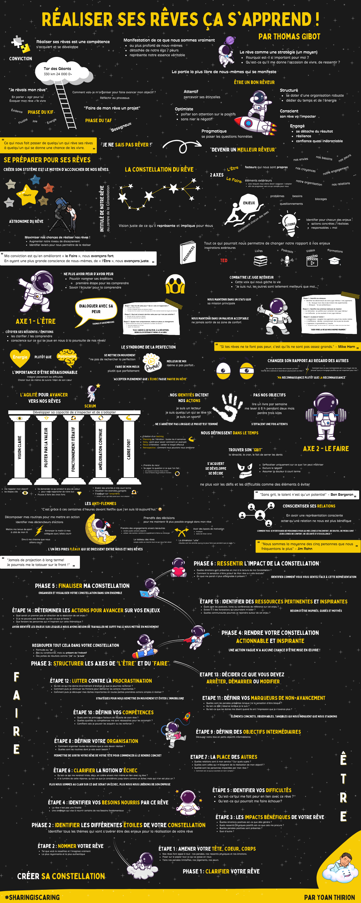
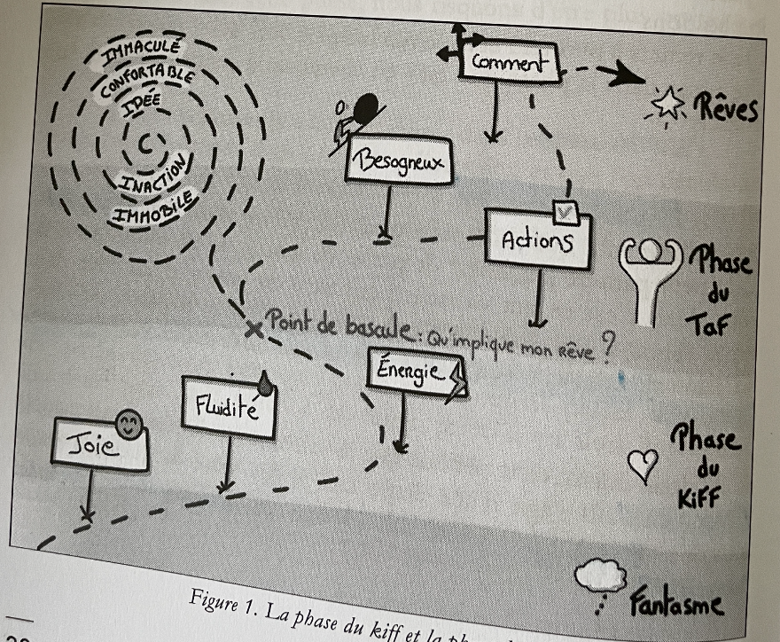
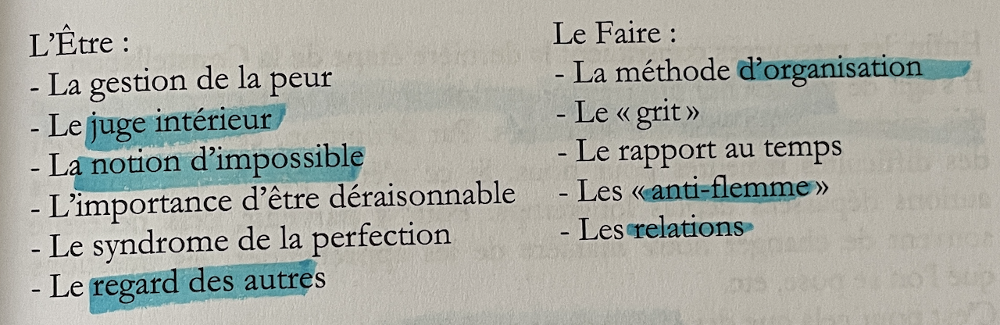

# Réaliser ses rêves, ça s'apprend

## Pitch

<figure><figcaption>
Couverture "Réaliser ses rêves ça s'apprend" de Thomas Gibot
</figcaption></figure>

💭 A quoi ressembleraient nos vies et le Monde si chacun de nous devenait meilleur à réaliser ses rêves?

🌟 Ce livre a pour ambition de considérer le rêve comme une compétence, qui s'apprend et se développe. Pour l'illustrer, je vous fais part du système que j'ai créé et utilisé durant plusieurs années pour accomplir mes rêves : la Constellation.&#x20;

Il m'a permis de courir l'un des ultra-trails les plus durs au monde, le Tor des Géants: une course de 330km et 24.000m de dénivelé positif. 🏔

Avec ce livre, je vous emmène dans cette folle aventure en vous partageant comment j'ai construit ma Constellation pour prendre le départ du Tor des Géants et, surtout, vous apprendre comment vous pourrez l'utiliser pour réaliser VOS rêves! 🚀

## Infographie

<figure><figcaption>
Infographie du livre "Réaliser ses rêves, ,ca s'apprend" par Yoan Thirion
</figcaption></figure>


Infographie du livre "Réaliser ses rêves, ,ca s'apprend" en PDF par Yoan Thirion


## Mes notes

### Intro

#### Ce que ce livre va vous apporter

Ce livre est né d'une conviction : réaliser ses rêves est une compétence qui s'acquiert et se développe.

Au même titre qu'apprendre à lire, écrire, parler anglais ou devenir boulanger.

#### Le rêve

* Rêve = manifestation de ce que nous sommes vraiment
  * au plus profond de nous-mêmes. Il décrit la part de nous détachée de notre égo, de nos peurs et représente notre essence véritable.
* la partie la plus libre de nous-mêmes qui se manifeste.
* une manifestation de notre véritable élan de vie

#### Le rêve comme une stratégie

* Je considère le rêve non plus comme une finalité, mais un moven.
* « Pourquoi est-il si important pour moi ?»
* « Qu'est-ce qu'il me donne l'occasion de vivre, de ressentir? ».

#### Ressentir la joie

Comme le dit très justement Thomas D'Ansembourg; «Tout ce qui fait joie fait sens ».

Voilà la mission de nos rêves : nous rappeler notre désir d'y goûter le plus souvent possible!

### Partie 1 - Partir à la découverte de son rêve

> "Life begins at the end of your confort zone" - Walsh

* Pourquoi tous les rêves se fracassent-ils dès le premier pas ?

#### Je rêvais mon rêve

* Tout d'abord, je parlais beaucoup plus de mon rêve que je n'agissais concrètement pour lui!
* Comme si partager mon enthousiasme pour l'ultra et évoquer mon rêve revenait à le vivre;


Sortir de la « phase du kiff» pour tenter dans la « phase du taf »


#### La phase du "kiff"

* C'est un moment juste incroyable.
* Nous ressentons alors de l'évidence, de la fluidité, de la foie, de l'énergie.

#### Quitter la phase du «kiff» et entrer dans la phase du « taf »

* Développer cette capacité de s'observer dans le cycle de notre rêve est pour moi un élément clé pour nous donner une chance de le réaliser.


**Questions à se poser** : Pour passer de l'un à l'autre, je me demande donc :

* Quel est le prix à payer pour que mon fantasme devienne une réalité?
* Une fois réalisé, quels seront tous les inconvénients avec lesquels je vais devoir vivre?&#x20;
* Enfin, suis-je vraiment prêt à accepter tout cela ?


#### La phase du «taf»

* Le meilleur mot que j'ai trouvé pour décrire ce stade est : **besogneux**.
  * En somme, la phase du «taf » va faire de mon rêve un projet que je vais devoir structurer pour le réaliser.
* « comment vais-je m'organiser pour faire avancer mon objectif ?»
  * Avec la phase du «taf», nous réfléchissons au processus plus qu'au résultat.

> C'est ce qui nous fait passer de quelqu'un qui rêve ses rêves à quelqu'un qui se donne une chance de les vivre.

<figure><figcaption></figcaption></figure>

#### Et si rêver était une compétence?

* "Je ne SAIS pas rêver !"
* Plutôt que de chercher à devenir un meilleur coureur, je vais tenter d'être un meilleur... rêveur !

#### Être un bon rêveur

* **Attentif : d**évelopper la capacité de percevoir ses étincelles en nous est une compétence fondamentale du bon rêveur.
* **Optimiste :** Être optimiste, ce n'est pas être naif.
  * C'est choisir consciemment de porter son attention sur les éléments positifs d'une situation, sans nier le fait qu'il y en a des négatifs.
* **Pragmatique :** capacité de se poser les questions honnêtes sur ce que sa quête implique et sur sa faculté à y répondre.
* **Structuré :** capable de se doter d'une organisation robuste et cohérente avec ce qu'il a besoin d'accomplir. Pour cela, il est prêt à dédier du temps et de l'énergie
* **Conscient :** prend en compte la manière dont son rêve va l'impacter.
* **Engagé** se détache du résultat pour se concentrer exclusivement sur la qualité de son engagement
  * Résilience et d'une confiance quasi inébranlable.

### Partie 2 - Se préparer pour ses rêves

#### La Constellation

* un concept qui m'est cher et dont on reparlera plus tard : **l'empirisme**, qui consiste à toujours privilégier l'expérience à la théorie.

#### Pourquoi un système est-il nécessaire pour faire avancer ses rêves

* Rêves : remplis d'ambition, de légèreté, d'insouciance
  * Complètement déconnectés de toute forme de lien avec la réalité, bien au chaud dans nos têtes
  * Ils sont purs
* Le système : concret et pragmatique

Les plus grosses avancées vers nos objectifs ont lieu lorsque nous avons le courage de nous poser très concrètement la question du **«Comment?»**

> Créer son système est alors le moyen d'accoucher de nos rêves.

#### La Constellation du rêve

* Constellation: groupe d'étoiles qui forme un tour cohérent
  * C'est ainsi que je vois mon système
  * Comme si le rêve était le centre d'une Constellation et que chaque étoile en représentait l'une composantes
* j'ai fait le choix de ne regarder mon objectif de TOR que sous l'angle de la course à pied
  * sans chercher à voir toutes les autres dimensions qui y étaient rattachées
  * Je n'observais qu'une étoile de ma Constellation
* Des **dizaines d'autres étoiles** :
  * le sommeil
  * le matériel
  * l'alimentation
  * les besoins d'aide
  * ma manière de me préparer
  * ...


Plus nous sommes capables de mettre des étoiles dans la Constellation de notre rêve, plus nous avons une vision juste de ce qu'il représente et implique pour nous.


#### Astronome du rêve

* Certaines étoiles sont très faciles à découvrir, car elles brillent très fort (a course à pied).
* D'autres, en revanche, sont plus petites, ternes et peuvent être masquées (la peur de l'échec).
  * Notre travail « d'astronome du rêve»

#### Intention de la Constellation

* **Maximiser nos chances de réaliser nos rêves !**
  * Augmenter notre niveau de discernement de notre rêve
  * Identifier autant de leviers que possible pour nous permettre de le réaliser
* **À quoi ressemble une Constellation ?**
  * De **l'intitulé** de notre rêve au centre de la Constellation
  * De **deux axes majeurs** : «l'Être» et le «Faire» de part et d'autre du rêve
  * Des **enjeux** qui composent chacun de ces axes
  * Des **actions** à mettre en œuvre pour adresser ces enjeux
  * Des **ressources** pour élargir notre compréhension et notre regard sur ces enjeux

<figure><figcaption>
Constellation - Tor des géants de Thomas Gibot
</figcaption></figure>

#### Les deux axes : « Être » et « Faire »

* « **Être** » : facteurs qui nous sont propres
  * nos envies
  * nos besoins
  * nos peurs
  * nos croyances
  * nos automatismes
  * notre engagement
  * etc
* « **Faire** » : éléments extérieurs avec lesquels nous allons devoir composer, nous adapter au mieux, afin de progresser vers ce qui compte pour nous
  * Notre organisation
  * Nos relations
  * etc

#### **Exemple de Kobe Bryant**

* À 7 ans : il écrit une lettre à ses parents
  * expliquant qu'il souhaite devenir l'un des meilleurs basketteurs de l'histoire
* Dès lors, tous ses choix, ses décisions, ses actions seront pris à la lumière de ce prisme: _**"est-ce que cela le rapproche de son but?"**_
* Ambition claire :
  * Travailler le "faire" :&#x20;
    * réveil à trois heures du matin tous les jours
    * sport à quatre heures
    * sommeil entre les entraînements
    * etc
  * Travailler son "être" :&#x20;
    * le fait de clarifier et une raison d'être
    * l'obsession pour atteindre son niveau de performance
    * le détachement du regard des autres sur ses choix d'organisation et d'entraînement hors normes
    * l'importance d'avancer sans peur
    * etc

#### Les enjeux

Dans chacun des deux axes, nous allons rencontrer des problèmes, des besoins, des questionnements ou des blocages que nous allons devoir adresser pour réaliser nos rêves.

> C'est ce que j'appelle les enjeux.

<figure><figcaption></figcaption></figure>

#### Les actions

* L'idée est d'identifier, pour chacun des enjeux :
  * des actions concrètes
  * réalistes
  * et dont nous sommes responsables pour avancer


La force de la Constellation, c'est de nous **faire réfléchir à des actions** sur une échelle beaucoup **plus fine**.


#### Les ressources

Tout ce qui pourrait nous aider à nous améliorer sur chacun des enjeux que nous avons identifiés - inspirations extérieures :

* livres
* podcasts
* vidéos
* conférences
* TED
* formations

Tout ce qui pourraient nous permettre de changer notre rapport à nos enjeux.

> Ma conviction est qu'en améliorant le « **faire** », **nous avançons fort**.&#x20;
>
> En ayant une plus grande conscience de nous-mêmes, de «**l'être** », **nous avançons juste**.

### Axe 1 - L'être

* Côtoyer ses ressentis, ses émotions afin de les clarifier et les comprendre est un vecteur de réussite incroyable
* Conscience sur ce qui se joue en nous lorsque nous nous lançons à la poursuite de nos rêves!

#### Ne plus avoir peur d'avoir peur

> "Si tes rêves ne te font pas peur, c'est qu'ils ne sont pas assez grands." - **Mike Horn**

* Se connecter à ses émotions et pouvoir les nommer avec discernement est la première étape pour les comprendre
* Savoir l'écouter (sa peur) pour la comprendre

#### Comment faire ? (par Thomas D'Ansembourg)

* Personnifier ma peur et lui demander de venir s'installer en face de moi, sur une chaise

Processus de dialogue avec ses peurs en 3 étapes:

* **Étape 1** : **Que me dit cette peur** ? Qu'a-t-elle à m'apprendre ?
  * "J'ai peur d'être ridicule."
  * "J'ai peur d'exploser après une distance indigne."
  * "J'ai peur de m'en vouloir si je ne finis pas sans m'être vraiment donné les moyens de terminer."
* **Étape 2** : Quel est le **besoin** derrière cette peur qui n'est pas satisfait?
  * redoute de finir comme un déchet
  * un besoin de sécurité qui s'exprime
* **Étape 3** : **Ajuster mon comportement**, mettre en place un changement
  * Quelles seraient les actions qui m'aideraient à combler ces besoins de sécurité, de cohérence et d'humilité?
  * veux pas préparer le Tor seul
  * expert me rassurerait


Plus j'arrive à lire ma peur, a la déchiffrer, moins elle m'effraie et moins je la subis.


#### Combattre le juge intérieur

* La plupart du temps, nous ne sommes même pas conscients de cette voix en nous, qui nous gâche la vie.
  * "Je suis nul, les autres sont tellement meilleurs que moi,..."
* Nous pouvons passer toute une existence à le subir, à le laisser nous rabaisser, nous juger et nous dénigrer sans parvenir à nous en défaire.

#### D'ou vient le **juge interieur** ?

* Exprime les règles et les normes héritées de notre enfance et que nous avons inconsciemment engrammées
* La **mission principale** de notre juge intérieur est de nous maintenir dans un statu quo
  * il préfère ne pas nous voir échouer plutôt que nous voir réussir
* Le second méfait du juge intérieur, plus vicieux :&#x20;
  * nous maintenir dans un malheur acceptable
  * éviter que nous sortions de notre zone de confort et d'habitude


**Oser vivre la vie qui nous inspire vraiment.**


Les 3 étapes pour ne plus subir son juge intérieur

* **Étape 1** : **J'identifie les attaques**
  * Identifier les déclencheurs de votre juge intérieur et ses jugements
    * Mes déclencheurs : Evoquer mon rêve à des traileurs très expérimentés
    * Les attaques de mon juge intérieur : "Je suis prétentieux.»
* **Étape 2** : J'identifie mes **schémas habituels de réaction**
  * Je rationalise : justifier pour tenter de contenter mon juge intérieur
  * Je m'effondre : je me soumets complètement à mon juge intérieur.
* **Étape 3** : Je **passe à l'action** !&#x20;
  * comment nous défendre des attaques de notre juge intérieur
  * L'exagération : exagérer les jugements jusqu'à les rendre risibles,
  * L'indifférence : décider, consciemment, de ne pas les écouter.
    * «Merci... mais non merci, ca ne m'intéresse pas du tout d'entrer dans ce débat. T'écouter serait une perte de temps et d'energie. »
  * L'agression, la grossièreté ou l'insulte
    * «Ta gueule le juge ! Je n'en ai rien à f\*\*\* de ton avis ! Ne me casse pas les c\*\*\* et laisse-moi vivre mes rêves !»

#### L'importance d'être déraisonnable

* l'énergie du cour plutôt qu'à la rationalité du cerveau.
* intégrer pleinement ces difficultés et choisir tout de même de suivre l'élan de mon cœur.

Rester acteur de son rêve « Jusqu'où suis-je prêt à aller pour courir le Tor ?»

#### Le syndrome de la perfection

* Pour maximiser nos chances de réaliser nos rêves, le but n'est pas de rechercher la perfection, mais bien de se mettre en mouvement!
* Ce n'est pas parce que ce n'est pas parfait que je n'ai pas mis le meilleur de moi.
* Faire de mon mieux plutôt que parfaitement.

> "Mieux vaut échouer vite et se poser les bonnes questions que réussir sans comprendre pourquoi." - Charles Pépin

* Accepter pleinement que l'échec fasse partie du rêve

#### Changer son rapport au regard des autres

* "MA reconnaissance plutôt que LA reconnaissance"
* "Est-ce que les autres vont trouver ça bien? Vais-je être valorisé et reconnu en poursuivant ce rêve ?" vs "Comment tout ce que j'entreprends est-il un moyen de me prouver que je m'engage pour ce qui est important pour moi ?"

### Axe 2 - Le faire

* La phase du « taf»
* Faire de ce rêve un véritable projet avec tout ce que cela implique

#### L'importance d'une méthode pour faire avancer ses rêves

Ce sont nos identités qui dictent nos actions, pas nos objectifs

* Exemples d'identité :
  * je suis un lecteur
  * je suis quelqu'un qui se lève tôt
  * je suis un sportif
  * ...
* Exemples d'objectifs :
  * lire un livre par semaine
  * me lever à 6 h pendant deux mois
  * perdre trois kilos
  * ...
* Identités ont ceci de puissant qu'elles ne s'arrêtent pas lorsque le projet est terminé
* Elles nous définissent dans le temps
* Les objectifs s'effacent une fois atteints

#### L'idée de l'Agilité qui va tout changer

L'incertitude, la complexité, les besoins d'adaptation constants, sont les enjeux que j'essaye d'adresser au quotidien.

#### L'Agilité pour avancer vers nos rêves

* Développer la capacité de s'inspecter et de s'adapter
* Ma méthode pour réaliser mon rêve : **Scrum**
* **Pilier 1** : Avoir une **vision** claire
  * pour me rappeler mon objectif et les étapes clés
* **Pilier 2** : Piloter par la **valeur**
  * se demander, en permanence, ce qui pourrait produire le plus de valeur pour nous rapprocher de notre but
  * Cela pousse à faire des choix forts pour eliminer tout le superflu
* **Pilier 3** : Le fonctionnement **itératif**
  * Nous poser très régulièrement la question de ce qui amène le plus de valeur pour notre rêve
  * Etablir des priorités à très court terme
  * Visualiser régulièrement nos avancées et nos progrès
  * S'appuyer sur **l'empirisme**, c'est-à-dire utiliser ce qui s'est déjà passé pour mieux nous adapter pour la suite
* **Pilier 4** : **L'amélioration continue**
  * Se forcer à prendre du recul, à arrêter de faire, pour se poser la question si ce que l'on fait est toujours la bonne chose à faire ou si nous le faisons de la meilleure manière
* **Pilier 5** : Un **cadre** fort
  * Création d'un backlog
  * Planning de l'itération : toutes les 4 semaines avec Fabrice (coach)
  * Daily : point pour savoir comment avançait l'itération
  * Revue d'itération : valider le travail effectué durant l'itération.
  * Retrospective : comment nous pouvions nous améliorer, à tout point de vue.

#### Trouver son "grit"

* Regroupe :
  * toutes mes habitudes
  * mes routines
  * mes sources de motivation
  * mes notions de performance
* Le «**grit**»
  * Ben Bergeron : la ténacité, le cran, le fait de serrer les dents

> "Sans grit, le talent n'est qu'un potentiel" - Ben Bergeron (Chasing Excellence)

* Si le talent est un don inné, sur lequel nous avons peu de leviers, le grit, lui, s'acquiert, se développe et se décide.
* Appris à ne plus voir les défis et les difficultés comme des éléments à éviter

**3 principes clés**

* Se focaliser uniquement sur ce que l'on peut maîtriser
* Exclure le négatif
* Assumer la douleur à court terme

#### Le rapport au temps

* «je n'ai pas le temps. »


L'illusion du manque de temps nous plonge dans une posture où nous subissons entièrement ce qui se passe dans notre vie plutôt qu'une posture de choix clairement établis et assumés!


#### Les « anti-flemmes »

* L'un des pires fléaux qui se dressent entre nous et nos rêves : [La flemme](https://youtu.be/h7IZgMEd6J0?feature=shared)
* «C'est grâce à ces centaines d'heures devant Netflix que j'en suis là aujourd'hui.» 🤪

**3 axes :**

* Décomposer mes routines pour me mettre en action
* Prendre des décisions pour me maintenir le plus possible engagé pour mon rêve
* Développer la visualisation

**Identifier mes déclencheurs d'actions**

* Ma tenue de sport : Mettre ma tenue de sport juste à côté de mon lit
* Mes collègues : j'annonçais le matin à mes collegues que lais courir le midi.
* Ma chienne : dire à ma chienne que nous allions courir

**Prendre des décisions pour me maintenir le plus possible engagé dans mon rêve**

* Prendre des engagements envers les autres
  * rendais publics certains objectifs
  * trouver le juste milieu qui me permettait d'utiliser «les autres» comme le supplément d'âme ou d'énergie qui pouvait parfois me faire défaut
* Avoir des boosts de motivation
  * musique
  * texte de Kilian Jornet
* Ma sonnerie au réveil
* Le tableau des rêves
  * simple cadre sur lequel nous venions inscrire tout ce qui nous faisait vibrer
* La dimension « utile»
  * «Quelles sont les activités que je ne peux faire que pendant que je cours ? »

#### Conscientiser ses relations

* acter qu'une relation ne nous est plus bénéfique

> Nous sommes la moyenne des cinq personnes que nous fréquentons le plus - Jim Rohn

* en avoir une représentation consciente
* comment puis-je m'entourer de personnes pour qui mes zones d'inconfort, de doutes, de peurs sont leurs zones de confort, de sécurité et d'excellence ?
* Mon rapport aux rêves des autres
  * Ne pas ramener à mon expérience sauf s'il y a une demande explicite m'invitant à partager ce que j'ai vécu sur une thématique.
  * Me mettre à la disposition du besoin de mon interlocuteur (soutien, motivation, écoute, etc.)
  * Tenter de comprendre ce qui serait utile plutôt que de parler de ce dont j'ai envie.


Jamais de projection à long terme! Je pourrais me le tatouer sur le front !


### Les apprentissages

La Constellation au service de nos rêves

<figure><figcaption></figcaption></figure>

#### Phase 1 : Clarifier votre rêve

* **Étape 1** : **Amener votre tête, coeur, corps**
  * Nos rêves font appel à tout : nos pensées, nos ressentis physiques et nos émotions.
  * Poser sur le papier tout ce qui se passe en nous
    * De taire nos pensées limitantes, nos jugements, nos peurs pour fluidifier l'expression de nos rêves telle qu'elle est présente en nous.
* **Étape 2** : **Nommer** votre rêve
  * nommer votre rêve tel que vous le ressentez et l'imaginez vraiment
  * la plus rayonnante et la plus authentique

#### Phase 2 : Identifier les différentes étoiles de votre Constellation

Identification de tous les thèmes qui vont s'avérer être des enjeux pour la réalisation de votre rêve.

**Axe de l'être**

*   **Étape 3** : Les **impacts bénéfiques** de votre rêve

    Goûter avec discernement aux impacts bénéfiques d'un rêve constitue un pilier solide sur lequel nous appuyer pour le réaliser.

    * Quelles émotions positives est-ce que cela génère? (joie, confiance, sérénité, euphorie)
    * Quels ressentis physiques positifs est-ce que cela me procure? (légèreté, grande énergie)
    * Quelles pensées positives sont présentes?
    * Quoi d'autre ?
* **Étape 4 :** Identifier vos **besoins nourris** par ce rêve
  * le rêve n'est pas une finalité, mais une stratégie qui vise à nourrir certains de nos besoins fondamentaux
*   **Étape 5** : **Identifier** vos **difficultés**

    Identifier tout ce qui nous freine, consciemment ou non.

    * Qu'est-ce qui me fait peur en lien avec ce rêve ?
    * Qu'est-ce qui pourrait me faire échouer?
*   **Étape 6 : Clarifier** la notion d'**échec**

    Plus nous sommes au clair sur ce que serait un échec, plus nous nous libérons de son emprise.

    * Qu'est-ce qui me rendrait triste, déçu, en colère envers moi-même en lien avec ce rêve ?
    * A la lumière de cette réponse, qu'est-ce que je considérais jusqu'alors comme un échec mais qui n'en est plus un?
*   **Etape 7** : La place des **autres**

    Rôle que les autres peuvent jouer en lien avec votre rêve.

    * Quelles relations sont à mon service ? Sur quels sujets ?
    * Quelles sont celles qui m'éloignent de la réalisation de mon objectif? Dans quels domaines?
    * Quelles sont les personnes impactées par mon rêve ? Comment est-ce que je souhaite en tenir compte ?

**Axe du faire**

*   **Étape 8** : Définir votre **organisation**

    Permettre de sortir votre rêve de votre tête pour commencer à le rendre concret.

    * Comment organiser toutes les actions que je vais devoir réaliser?
    * Quelles sont les routines dont je vais avoir besoin?
* **Étape 9 :** Définir des **objectifs intermédiaires**
  * Découper notre rêve en petits objectifs intermédiaires est un vecteur de réussite incroyable.
*   **Étape 10 :** Définir vos **compétences**

    Plus nous en identifions, plus nous nous dotons de leviers pour nous rapprocher de notre objectif.

    * Quels sont les principaux facteurs de réussite de mon rêve ?
    * Quelles qualités ou compétences me sont nécessaires pour les accomplir ?
    * Comment vais-je pouvoir les acquérir ou les renforcer ?
*   **Etape 11 :** Définir vos **marqueurs de non-avancement**

    Lister des éléments concrets, observables, tangibles qui nous indiquent que nous stagnons.

    * Quelles sont les pensées présentes lorsque j'ai la sensation d'être bloqué ?
    * Qu'est-ce que j'observe lorsque je le suis ?
    * Qu'est-ce que les autres me disent quand ils ont l'impression que je n'avance plus ?
*   **Étape 12** : **Lutter** contre la **procrastination**

    Stratégies pour nous remettre en mouvement et éviter l'immobilisme.

    * Qu'est-ce qui me donne énormément d'énergie et que je pourrai renforcer?
    * Comment puis-je diminuer les frictions pour démarrer les actions importantes?
    * Comment puis-je découper mes tâches importantes en toutes petites premières actions simples à réaliser ?
*   **Etape 13 :** Décider ce que vous devez **arrêter, démarrer ou modifier**

    Si vous n'avez pas encore réalisé votre rêve, c'est probablement que votre manière de fonctionner aujourd'hui ne vous permet pas de l'atteindre et que certains de vos comportements, habitudes, pratiques ne sont pas adaptés.

#### Phase 3: Structurer les axes de «l'être » et du « faire»


Regrouper tout cela dans votre Constellation, organisée autour des deux axes : «l'Être» et le « Faire».

* Formulés au «Je»
* Pas au conditionnel, mais au présent de l'indicatif
* Des verbes de résultats comme « j'ai» ou « je suis »


#### Phase 4: Rendre votre Constellation actionnable et inspirante

*   **Étape 14 :** Déterminer les **actions pour avancer** sur vos enjeux

    Avoir identifié les enjeux sur lesquels nous avons besoin de travailler ne suffit pas à nous mettre en mouvement.

    * Quel serait un premier pas en direction de la résolution de cet enjeu?
    * Si je ne pouvais pas échouer, qu'est-ce que je ferais ?
    * Que feraient les personnes qui m'inspirent sur cette thématique?

> Une action vague n'a aucune chance d'être mise en œuvre !

*   **Étape 15 :** Identifier des **ressources pertinentes** et **inspirantes**

    Besoin d'être inspirés, guidés et motivés.

    * Quels sont les podcasts, livres ou conférences de référence sur cet enjeu ?
    * Existe-t-il des formations qui pourraient m'aider ?
    * Quelles communautés pourrais-je rejoindre autour de cet enjeu ?
    * Quelles sont les newsletters, ou chaînes YouTube auxquelles je pourrais m'abonner?

#### Phase 5 : Finaliser ma Constellation

* Organiser et visualiser votre Constellation dans son ensemble.

#### Phase 6 : Ressentir l'impact de la Constellation

Identifier comment vous vous sentez face à cette nouvelle représentation.

* Quelles émotions sont présentes en moi à la lecture de ma Constellation ?
* Comment la sensation d'être acteur de mon rêve a-t-elle évoluée?
* En quoi me paraît-il plus atteignable à présent ?

Plus d'infos et de ressources sur le site de Thomas [ici](https://thomasgibot.fr/livre/).

