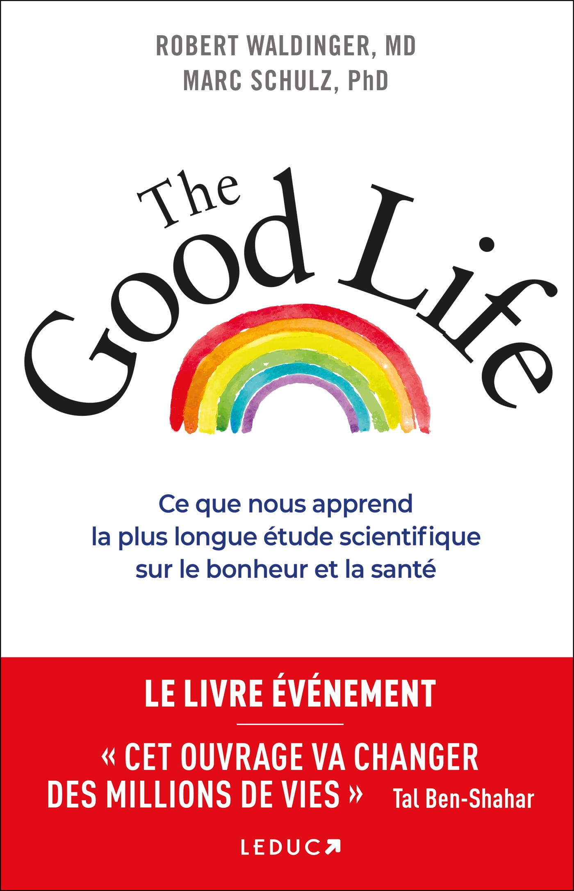
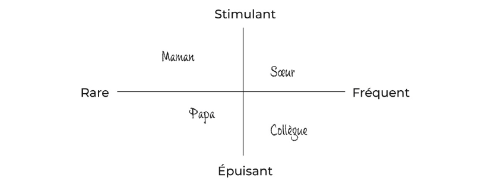
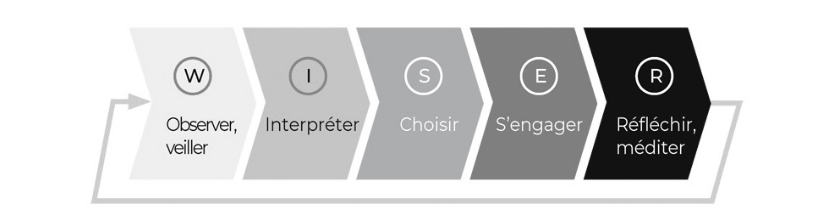
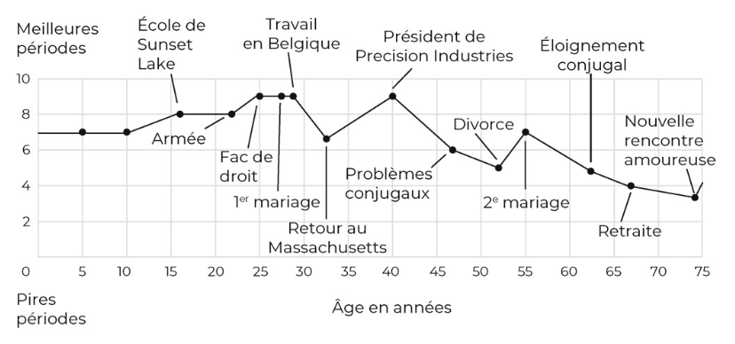

# The Good Life

## Pitch

> Les réponses de la science à la plus grande question humaine de tous les temps : qu’est-ce qui nous rend vraiment heureux ?&#x20;

L’Étude de Harvard sur le développement des adultes est la plus longue et rigoureuse jamais réalisée : 724 individus et leurs 1 300 descendants sont suivis depuis plus de quatre-vingts ans par les chercheurs et les médecins les plus éminents au monde pour comprendre sur quoi reposent le bien-être et la santé de l’être humain.&#x20;

En cette période de grande incertitude, les Dr Robert Waldinger et Marc Schulz, actuels directeurs de l’Étude, font pour la première fois la synthèse de ces décennies de recherches. Associant résultats médicaux, trajectoires personnelles, sagesses ancestrales et outils concrets, ils nous prouvent scientifiquement qu’une vie véritablement heureuse n’est pas synonyme de réussite et de succès financiers, et que nous avons en nous les clés de notre épanouissement et de notre résilience.

<figure><figcaption></figcaption></figure>

## Notes

### Note des auteurs

* L’étude de Harvard sur le développement des adultes (Harvard Study of Adult Development)
  * étude scientifique qui a suivi pendant plus de 80 ans la vie de 2 générations d’individus issus des mêmes familles
  * lancé en 1938

### 1) Qu'est-ce qu'une vie réussie ?

* _Nous comparons constamment ce que nous vivons intérieurement avec ce que les autres veulent bien nous montrer_.
  * Avec le temps, nous développons le sentiment subtil mais tenace que notre vie est ici et maintenant, alors que les choses qui nous rendraient heureux sont ailleurs ou plus tard.
* **Spoiler alert** : une vie réussie, c’est une vie compliquée. Pour tout le monde.
* Parce qu’une vie riche, une vie vraiment réussie, se forge précisément à partir de ce qui la rend difficile.


_Ce livre s’appuie sur un socle de recherche scientifique, au centre duquel figure l’étude de Harvard sur le développement des adultes, un extraordinaire projet scientifique lancé en 1938 et qui, contre toute attente, se poursuit encore aujourd’hui._


* Ses méthodes ont évolué au fil des décennies et elle s’est élargie pour inclure aujourd’hui trois générations et plus de 1 300 descendants des 724 participants initiaux.

#### Méthode de travail

* Questionnaires
  * Qu’est-ce qui comptait pour cette personne en particulier ?
  * Qu’est-ce qui donnait un sens à ses journées ?
  * Qu’avait-elle appris de ses expériences ?
  * Que regrettait-elle ?
* Entretiens attachés (séparément)
  * Cassettes vidéo / transcriptions des entretiens
  * Etudiés la façon dont les participants parlaient l’un de l’autre
    * leurs signaux non verbaux et bien d’autres informations puissent être codés en données sur la nature de leur relation
* Examiner leur bien-être sous différents angles
  * Scanners cérébraux
  * Analyses de sang
  * Enregistrements vidéo
  * Echantillons capillaires sont prélevés pour mesurer les hormones du stress

Beaucoup de questions:

* Sur la santé, nous recueillons régulièrement des informations sur :
  * leur poids
  * leur activité physique
  * leurs habitudes de consommation de tabac et d’alcool
  * leur taux de cholestérol
  * les interventions chirurgicales subies
  * les complications
* Autres données :
  * nature de leur emploi
  * leur nombre d’amis proches
  * leurs passions et loisirs
* Nous concevons aussi des questions de fond pour explorer leur expérience subjective et les aspects moins quantifiables de leur vie
* les participants **décrivent**
  * leurs plus grandes inquiétudes
  * leurs objectifs essentiels dans la vie

#### Le but

* Observer des vies entières à mesure qu’elles se déroulent
  * Depuis l’adolescence jusqu’à la vieillesse
  * Identifier ce qui compte vraiment pour la santé et le bonheur de chaque personne
    * Quels investissements en valaient vraiment la peine ?
* Découvrir ce qui maintient les personnes vraiment heureuses et en bonne santé

#### Le secret: la qualité des relations

Résumer l’étude à un seul principe de vie:&#x20;

> `Des relations de qualité nous permettent de vivre plus heureux et en meilleure santé. Un point c’est tout.`

#### Une lentille pour voir à travers le temps

* Une étude « longitudinale »
  * Examiner des vies à travers le temps
* 2 façons de faire
  * rétrospective : demander aux gens de se souvenir du passé
  * prospective : interroger les participants sur leur vie telle qu’elle est, et non telle qu’elle était
* Taux de participation de 84 % pendant quatre-vingt-quatre ans, et elle se porte bien

#### La recette d'une vie réussie

* Mais que signifie le bonheur ? À quoi ressemblerait-il dans votre vie ?
* la dure réalité
  * les gens n’ont aucune idée de ce qui est bon pour eux
* Les personnes qui entretiennent des _relations plus étroites_ avec leur famille, leurs amis et leur voisinage sont _plus heureuses et en meilleure santé physique_.
* Les personnes qui sont plus _isolées_ qu’elles ne le souhaitent voient leur _santé décliner plus tôt que celles qui se sentent connectées aux autres. Elles vivent également moins longtemps._
* Les personnes ayant les relations les plus satisfaisantes à l’âge de 50 ans étaient celles en meilleure santé (mentale et physique) à 80 ans

### 2) De l'importance des relations

* Interactions
  * Positives
    * indique à notre corps que nous sommes en sécurité
    * réduit notre excitation physique / augmente notre sentiment de bien-être
  * Négative
    * nous donnent le sentiment d’être en danger
    * incitent l’organisme à produire des hormones de stress comme l’adrénaline et le cortisol
* Des êtres sociaux
  * leur corps et leur cerveau ont évolué pour encourager la coopération
  * survécu grâce à cela

> Les relations positives sont essentielles au bien-être de l’être humain.

* Les moins favorisés moins heureux? Mythe…
  * Nous partons du principe que la vie des personnes moins favorisées est moins heureuse, et que celle des personnes plus fortunées l’est davantage.
  * La science raconte une histoire plus complexe

#### Des inconnus dans un train

* Expérience de prévision affective ([source](https://www.researchgate.net/publication/263899201\_Mistakenly\_Seeking\_Solitude))
  * Prédiction, qui consiste à imaginer un état émotionnel dans une situation future
  * Nous faisons constamment des prédictions sur la façon dont toutes sortes de choses, grandes et petites, nous affecteront
* L'expérience
  * Des chercheurs de l’université de Chicago
  * Ont transformé leur train de banlieue local en une expérience
  * Ont demandé aux usagers de prédire lequel de deux scénarios (parler à un inconnu ou rester dans son coin) leur ferait **vivre une expérience plus positive**
  * Ont ensuite demandé aux membres d’un groupe d’entrer intentionnellement en contact avec un inconnu à proximité, et à ceux d’un autre groupe de rester seuls.
  * À la fin du trajet, ils ont demandé aux voyageurs ce qu’ils avaient pensé de leur voyage en train.
  * Avant le trajet, les participants ont prédit à une écrasante majorité que parler à un inconnu serait une plus mauvaise expérience que garder son quant-à-soi.
    * Ils anticipaient ce qui les rendrait heureux et ce qui les rendrait malheureux.
    * Pourtant, la situation réelle s’est avérée à l’opposé de leurs prévisions : expérience positive, passé un meilleur trajet que d'habitude

> De nombreuses recherches de ce type suggèrent que les êtres humains sont assez mauvais en matière de prévision affective... Nous semblons particulièrement mauvais pour ce qui est de prévoir les bienfaits des relations.

* Ce n’est pas que nous recherchions la solitude
  * mais nous préférons éviter les éventuelles complications de la relation à autrui
  * nous surestimons ces complications, tout comme nous sous-estimons les effets bénéfiques du lien humain
* C’est une caractéristique de notre processus décisionnel en général
  * nous accordons beaucoup d’attention aux coûts potentiels
  * nous minimisons ou rejetons les avantages éventuels

#### L'impact de la culture

* nous ne sommes pas les seuls à prévoir ce qui nous rendra heureux :
  * la **culture dans laquelle nous vivons le fait aussi pour nous**.

> Parfois, les pratiques et les messages culturels nous éloignent du bien-être et du bonheur.

* Tendance
  * se concentrer sur ce qui est le plus visible et le plus immédiat
  * la valeur des relations est éphémère / difficile à quantifier
  * l’argent, cela se compte
* Postulat ancien et persistant: `L’argent est le fondement d’une vie réussie.`
  * la force de cette croyance ruisselle partout autour de nous

> "la richesse n’est évidemment pas le bien que nous cherchons : c’est seulement une chose utile, un moyen en vue d’une autre chose." - Aristote

* les personnes à hauts revenus peuvent espérer vivre 10 à 15 ans de plus que les personnes à faibles revenus
  * Dans quelle mesure l’argent affecte le bonheur et le bien-être ?

#### L'argent fait-il le bonheur?

* [Etude de Angus Deaton et Daniel Kahneman](https://www.researchgate.net/publication/46169956\_High\_Income\_Improves\_Evaluation\_of\_Life\_But\_Not\_Emotional\_Well-Being)
* Ont montré qu'aux Etats-Unis en 2010: 75 000$ chiffre pivot
  * Plus de relations claire entre les montants gagnés et la somme de plaisir / rire
* Sert à
  * satisfaire les besoins fondamentaux
  * procurer un sentiment de sécurité
* Une fois ce seuil dépassé, l’argent semble peu, voire pas important pour atteindre le bonheur

> « plus d’argent n’achète pas nécessairement plus de bonheur, mais moins d’argent est associé à une douleur émotionnelle ». - Deaton et Kahneman

* `Plus nous nous comparons aux autres, moins nous sommes heureux`
  * Même lorsque la comparaison est en notre faveur
* Nous nous posons la mauvaiise question: L'argent fait-il le bonheur
  * La bonne question est peut-être : `Qu’est-ce qui me rend réellement heureux ?`

#### Liens sociaux forts et espérance de vies

* Examin de 148 études menées dans des pays du monde entier (Canada, Danemark, Allemagne, Chine, Japon, Israël, etc.)
  * regroupant un total de plus de 300 000 participants
* Dans l’ensemble de ces études
  * Taux de mortalité des personnes ayant le moins de liens sociaux était entre 2,3 (hommes) et 2,8 (femmes) fois plus élevé que celui des personnes en ayant le plus

> Les relations sont essentielles, mais pas seulement comme des tremplins vers d’autres choses, et elles ne sont pas simplement une route d’accès vers la santé et le bonheur. Elles sont des fins en soi.

> Le moteur d’une vie heureuse n’est pas le moi, .., mais plutôt notre lien avec les autres.

### 3) Les relations et les virages de la vie

* Questions
  * Pouvez-vous nous parler des problèmes auxquels vous avez été confronté après 50 ans et qui ne vous semblaient pas importants lorsque vous étiez plus jeune ?
  * Comment avez-vous essayé de surmonter ces problèmes ?
* Le plus précieux dans leur participation ?
  * cela leur donne l’occasion de faire un point régulier sur leur vie
  * **pas besoin de participer à une étude pour faire de même** -> introspection

#### Votre propre étude de Harvard

* Trouver une photo de vous
  * à peu près la moitié de l’âge que vous avez aujourd’hui
* Regardez-vous de près sur cette photo
  * Après avoir cessé de vous demander pourquoi vous portiez des vêtements marron, ou de vous émerveiller de votre taille fine ou de vos cheveux autrefois luxuriants
  * Essayez de vous **replacer au moment où la photo a été prise**
  * Regardez vraiment : passez plusieurs minutes (oui, c’est long !) à vous en imprégner et à vous souvenir de cette époque de votre vie.
* Questionnements :
  * À quoi pensiez-vous alors ?
  * Qu’est-ce qui vous inquiétait ?
  * Qu’est-ce que vous abordiez avec confiance ?
  * Quels étaient vos projets ?
  * Avec qui passiez-vous votre temps ?
  * Qu’est-ce qui était le plus important pour vous ?
  * Et peut-être la question la plus difficile à affronter : Quand vous pensez à ce que vous étiez à cette époque, que regrettez-vous ?

#### L'importance du calendrier

* Notre éducation et nos influences (amis, informations, réseaux sociaux, films) créent une « **horloge sociale** » informelle, un calendrier d’événements qui sont censés se produire à des moments précis de notre vie
  * Pointe l’importance de la société et de la culture qui façonnent notre développement
* Autrice : Bernice Neugarten
* Les horloges sociales diffèrent d’une culture à l’autre et d’une génération à l’autre
* Des événements clés tels que
  * le départ de la maison
  * l’engagement dans une relation à long terme
  * la naissance des enfants
* Les événements ont chacun leur propre valeur culturelle et leur propre place dans la chronologie

#### Nos questionnements

* Au **milieu de notre vie** :
  * Est-ce que je m’en sors bien par rapport aux autres ?
  * Suis-je dans une ornière ?
  * Suis-je un bon conjoint et un bon parent ?
  * Ai-je de bonnes relations avec mes enfants ?
  * Combien d’années me reste-t-il ?
  * La vie que je mène a-t-elle un sens, pour moi mais aussi pour le monde qui m’entoure ?
  * Quelles personnes et quels objectifs me tiennent vraiment à coeur ?
  * Qu'est-ce que je voudrais encore faire d'autre ?

> Le milieu de la vie est un point d’inflexion, non seulement entre la jeunesse et la vieillesse, mais aussi entre le mode de vie égocentrique et replié sur soi-même que beaucoup d’entre nous ont développé au début de l’âge adulte et un mode de vie plus généreux et tourné vers l’extérieur.

* Milieu de vie : élargir notre champ d’action au monde qui nous entoure, au-delà de notre personne
* les adultes les plus heureux et les plus satisfaits étaient ceux qui avaient réussi à transformer la question **« Que puis-je faire pour moi ? »** en **« Que puis-je faire pour le monde qui m’entoure ? »**
* A **la fin de leur vie** : « Qu’aimeriez-vous avoir moins fait et au contraire davantage fait ? »
  * « J’aurais aimé ne pas avoir perdu autant de temps. »
  * « J’aurais aimé ne pas avoir autant tergiversé. »
  * « J’aurais aimé ne pas m’inquiéter autant. »
  * « J’aurais aimé passer plus de temps avec ma famille. »

#### Changement : tournant positif?

* Un changement intense, même de nature traumatique, offre aussi des possibilités de croissance positive.
* La vie est chaotique
  * En cultivant de bonnes relations:
    * accroît le côté positif de ce chaos
    * augmente ainsi les chances de faire des rencontres bénéfiques

> Prendre du recul de temps en temps pour avoir une vision plus large, pour nous placer, nous et nos proches, dans le contexte d’une vie plus longue, est un excellent moyen d’injecter de l’empathie et de la compréhension dans nos relations.

### 4) La forme sociale - comment muscler sa sociabilité

* Prendre soin de nos relations n’est pas chose aisée
  * Une relation que l’on néglige s’atrophie
  * Notre vie sociale est un système vivant
  * Elle a besoin d’exercice.

#### Les ravages de la solitude

* Quand on se sent seul, ça fait mal
  * Pas une métaphore
* La solitude a un effet physique sur notre corps
  * Plus grande sensibilité à la douleur
  * affaiblissement du système immunitaire
  * diminution des fonctions cérébrales
  * sommeil moins réparateur

> Des recherches récentes ont montré que, chez les personnes âgées, la solitude est deux fois plus néfaste pour la santé que l’obésité, et que la solitude chronique augmente de 26 % les risques de décès d’une personne au cours d’une année donnée.

* Au Royaume-Uni, le coût économique de la solitude
  * parce que les personnes seules sont moins productives et plus susceptibles de perdre leur emploi
  * estimé à plus de 2,5 milliards de livres par an (2,85 milliards d’euros)
* En 2020, on estime que 162 000 décès pourraient être attribués à des causes découlant de l’isolement social (Covid)

#### Les causes de la solitude

* ce qui cause un sentiment de solitude chez un individu peut n’avoir aucun effet sur un autre
* la solitude est une expérience subjective
* On peut entretenir
  * une relation amoureuse stable
  * avoir trop d’amis pour les compter
  * et pourtant se sentir seul&#x20;
* Nous avons besoin d’amour, de lien et d’un sentiment d’appartenance.
  * Mais nous vivons aujourd’hui dans des environnements sociaux compliqués, et le défi, c’est de savoir comment répondre à ces besoins.

> la fréquence et la qualité de nos contacts avec autrui sont deux prédicteurs majeurs de bonheur.

#### Votre observatoire social

* Représenter notre univers social ?
  * Qui fait partie de ma vie ?
  * Qui sont mes amis et parents les plus proches ?
* Une fois votre liste établie, posez-vous la question suivante : `Quelle est la nature de ces relations ?`
  * reconnaître ce que vous ressentez lorsque vous êtes avec ces personnes
  * Stimulante:
    * elle vous anime et vous exalte
    * vous donne un sentiment de lien et d’appartenance qui demeure après que vous vous êtes quittés
    * vous permet de vous sentir mieux que si vous étiez seul
  * Epuisante
    * provoque des tensions
    * de l’agacement ou de l’anxiété
    * au point que vous vous sentez plus inquiet, voire démoralisé

<figure><figcaption></figcaption></figure>

* Placez les noms sur le graphique en pensant à chaque personne.
  * Pourquoi est-elle à cette place particulière ?
  * Qu’est-ce qui, dans votre relation, vous a poussé à la placer à cet endroit ?
  * Est-elle à l’endroit où vous voulez qu’elle soit ?
  * Si une relation est particulièrement difficile et vous a procuré un sentiment d’épuisement, des raisons vous viennent-elles à l’esprit ?

> Faire ainsi le point sur chaque relation peut nous aider à apprécier à leur juste valeur les personnes qui enrichissent notre vie et à leur être reconnaissants, mais cela nous permet aussi de mettre le doigt sur celles que nous aimerions améliorer.

* Si vous avez une idée de la direction que vous aimeriez donner à cette relation, dessinez une flèche de l’endroit où elle se trouve vers l’endroit où vous aimeriez qu’elle aille.

<figure><figcaption></figcaption></figure>

> reconnaître la différence entre notre situation actuelle et celle dans laquelle nous aimerions nous trouver est un élément clé pour motiver le changement.

* Définir ces deux états crée une sorte d’énergie potentielle qui nous aide à faire ce premier pas difficile.

#### Aller du haut vers le bas

* Examinez vos relations les plus stimulantes
  * réfléchissez à la manière dont vous pourriez consolider ou favoriser leurs aspects positifs
  * Dites (et montrez !) à ces personnes combien vous les appréciez, et pourquoi
  * Renforcer les sources d’énergie et de vitalité dans notre vie ne peut pas nuire.
* Ensuite jetez un coup d’œil aux relations qui dépassent tout juste la frontière entre stimulant et épuisant, ou qui se révèlent peut-être un peu fatigantes dans l’ensemble.
  * Y a-t-il un moyen de les tirer vers le haut et de les rendre plus stimulantes ?
  * Des changements mineurs suffisent parfois à éliminer de petits fardeaux qui se sont accumulés.

#### Principes

**Principe n°1 : le pouvoir de la générosité**

* L’idée de donner ce qu’on aimerait recevoir en retour est une bonne réponse à l’impuissance et au désespoir que nous ressentons parfois lorsque nous pensons à nos relations
* La générosité est un moyen de faire surgir dans notre cerveau des sentiments positifs
  * ces sentiments nous rendent plus susceptibles d’aider les autres à l’avenir
  * La générosité est une spirale ascendante.

**Principe n°2 : apprendre de nouveaux pas de danses**

* s'ouvrir à de nouvelles expériences

**Principe n°3 : la curiosité radicale**

> La curiosité – une curiosité réelle et profonde à l’égard de ce que vivent les autres – joue un rôle majeur dans les relations importantes.

* Ouvre la voie vers des conversations et des connaissances dont nous ne soupçonnions pas l’existence.
* Elle permet aux autres de se sentir compris et reconnus.
* Mais elle compte aussi beaucoup dans des relations moins significatives, car elle permet de créer un environnement bienveillant et de renforcer des liens encore fragiles.
* La curiosité nous aide à nous connecter
  * prendre le temps de se demander qui est réellement cette personne et ce qui compte pour elle.
  * poser une question, d’écouter la réponse et de voir où cela nous mène.

> Comme la générosité, la curiosité est une spirale ascendante.

#### Investir du temps sur nos relations

> les relations comptent parmi nos outils les plus précieux pour rester heureux et en bonne santé, alors il est vital d’y investir du temps et de l’énergie.

Un investissement dans notre forme sociale n’est pas seulement un investissement dans nos vies telles qu’elles sont maintenant. Il aura une incidence sur tout ce que nous vivrons à l’avenir.

### 5) L'attention portée aux relations - votre meilleur investissement

* À quoi occuper notre temps ?
* Leurs réponses tournaient souvent autour d’une idée centrale : la valeur du temps.
* Comme l’amour, l’attention est un don qui va dans les deux sens.
  * Lorsque nous accordons notre attention, nous donnons un peu de notre vie, mais ce processus nous fait aussi nous sentir plus vivants.
  * Le temps et l’attention sont les matériaux essentiels du bonheur.
  * un réservoir de vie

#### La famille, une vie d'attention

* Ce sentiment d’un travail qui a du sens est important pour notre bonheur et notre bien-être
  * pas rare que cela entre en conflit avec d’autres priorités, comme le temps passé en famille
* `les solutions efficaces pour nourrir les relations`
  * consacrer du temps et de l’attention dans le moment présent
  * étaient les mêmes qu’aujourd’hui.

> L’attention est l’essence même de la vie, et elle a la même valeur, quelle que soit l’époque à laquelle on vit.

#### Notre attention en ligne

* Comment ces nouvelles formes de communication affectent nos relations ?
  * Notre bonheur ?
  * Renforcent-elles ou inhibent-elles notre capacité à nous connecter sincèrement les uns aux autres ?

#### Les plus et les moins des réseaux sociaux

* Aspect positif aux réseaux sociaux
  * permettent d’entretenir les relations avec les amis et la famille
    * renforçant ainsi les sentiments de connexion et d’appartenance
  * Pour quiconque se trouve isolé et dans une situation inhabituelle, Internet est une véritable bénédiction.

> Comment ces espaces en ligne affectent le développement des enfants et des adolescents ?

* Nos capacités non verbales s’atrophient-elles dans les contextes virtuels
* le virtuel affecte-t-il les interactions dans le monde réel ?
* Les outils virtuels ont vite montré leurs limites
  * réunions en ligne quelque chose de l’ordre de l’expérience sensorielle et du contenu émotionnel est manquant
  * La communication n’est pas seulement un échange d’informations
  * Le toucher et la proximité physique ont des effets émotionnels, psychologiques et même biologiques

#### Arrêtez de cliquer, discutez

* Communication active sur les réseaux = + heureux

1. Engagez-vous dans une communication active avec les autres
   * les utilisateurs passifs de Facebook, qui se contentent de lire et de faire défiler les pages, se sentent moins bien
   * que les utilisateurs actifs qui contactent d’autres personnes et commentent les publications
2. Après avoir surfé sur les réseaux sociaux, sondez votre humeur.
   * Après avoir passé une demi-heure sur Facebook
   * Avez-vous l’impression d’avoir fait le plein d’énergie ?
   * Vous sentez-vous épuisé après un long voyage à travers Internet ?
   * Comment vous sentez-vous ?
3. Demandez à vos proches comment ils perçoivent votre utilisation des réseaux sociaux.
   * Que pense votre conjoint de la façon dont vous utilisez votre téléphone ?
   * Vos habitudes en ligne l’affecte-t-il (ou elle) ?
   * Y a-t-il certains moments ou certaines activités – au petit déjeuner, après le dîner, en voiture – pendant lesquels votre attention et votre présence lui manquent ?
   * Qu’en est-il pour vos enfants ?
4. Prenez du temps sans écran
   * éteindre votre smartphone et votre ordinateur pendant de courtes périodes peut vous révéler comment la technologie vous affecte

> nous avons un avantage crucial sur tous les géants de la technologie : la conquête de notre attention se déroule sur notre propre terrain, littéralement dans notre esprit. Et c’est là que nous pouvons gagner la guerre.

#### Être vigilant et le rester

* Pleine conscience
  * Pour se connecter au présent
  * un état de conscience qui résulte du fait de porter son attention, intentionnellement, au moment présent, sans juger, sur l’expérience qui se déploie instant après instant
  * Fournir un effort conscient pour prêter attention à
    * sensations de notre corps
    * ce qui se passe autour de nous
  * A faire sans l’abstraction et le filtre du jugement
  * notre pensée et notre expérience sont mises en phase avec l’endroit où nous nous trouvons en ce moment.

> L’esprit humain a tendance à s’évader ; l’objectif de la pleine conscience est de le ramener à la maison, c’est-à-dire au moment présent.

#### Ne pas passer sa vie en pilote automatique

* Être attentif, c’est avoir le sentiment de vivre réellement
  * L’accumulation de moments de pilotage automatique (par exemple, un trajet quotidien auquel nous ne prêtons plus attention, des heures de navigation sur Internet et les routines du réveil et du coucher) contribue au sentiment que la vie passe à toute allure et qu’elle se déroule, en quelque sorte, sans nous.
* Essayez de vous poser 1 belle question
  * `Qu’y a-t-il ici que je n’ai jamais remarqué auparavant ?`
* A l'inverse - `qu’y a-t-il ici que je ne remarque pas ?`
  * peut être extraordinairement puissante lorsque nous l’appliquons aux gens :
  * Qu’est-ce que je n’ai pas remarqué chez cette personne auparavant ?
  * Qu’est-ce que cette personne ressent que je n’ai pas remarqué ?
  * Comment cette personne se sent-elle ?
  * À quoi pense-t-elle ?
  * Est-ce que quelque chose m’échappe ?
  * Comment est-ce que je me sentirais si j’étais à sa place ?
  * Et lorsque vous le pouvez, faites-lui savoir que vous êtes curieux et que vous essayez de la comprendre.
    * Un petit effort qui peut avoir un effet considérable.

#### Chaque jour un peu plus d'attention

* Parmi les personnes auxquelles vous consacrez du temps, lesquelles reçoivent vraiment toute votre attention ?

1. Que pourrais-je mettre en œuvre aujourd’hui pour accorder de l’attention et de la reconnaissance à quelqu’un qui le mérite ?
2. Consacrer du temps à cette personne
   * envisager de modifier certaines de vos habitudes
   * Est-il possible de créer des moments ou des activités sans distraction, en particulier lorsque vous êtes avec les personnes qui vous sont chères ?

> Plus vous vous intéressez aux autres, plus ils s’intéresseront à vous

### 6) Braver la tempête - s'adapter aux défis relationnels

* 2 piliers du bonheur
  * l’amour
  * trouver une façon de surmonter les épreuves de la vie sans repousser l’amour
* Questions :
  * Au cours du dernier mois, combien de fois avez-vous été bouleversé(e) à cause d'un événement inattendu ?
  * Combien de fois vous êtes-vous senti(e) nerveux(se) et stressé(e) ?
  * Combien de fois avez-vous eu l'impression que les difficultés s'accumulaient au point que vous ne pouviez pas les surmonter ?

#### Réflexe vs réflexion

* « tendance à l’action »
  * les réactions émotionnelles sont complexes
  * nous amène de façon irrépressible à nous comporter d’une certaine manière
  * Exemple : la peur engendre l’envie de fuir
* Au fil de la longue histoire de l’être humain, les émotions ont évolué pour permettre des réactions rapides, notamment lorsque nous nous sentons menacés.

#### Stratégie d’adaptation

> Les schémas de pensée et de comportement qui surviennent en réponse à des événements stressants révèlent ce que les psychologues appellent notre stratégie d’adaptation.

#### Braver la tempête ou faire l’autruche ?

* l’incapacité ou le refus d’affronter directement les difficultés et de faire appel à son réseau de soutien peut avoir des conséquences fatales
* Lorsque nous évitons d’affronter les difficultés dans une relation, non seulement le problème ne disparaît pas, mais il peut s’aggraver. - [Source](https://pubmed.ncbi.nlm.nih.gov/16451230/)

> Être capable de s’adapter à des circonstances changeantes est une compétence très puissante, et elle peut s’apprendre.

#### Modèle W.I.S.E.R

* Objectifs:
  * ralentir vos réactions dans n’importe quelle situation émotionnelle.
  * les examiner au microscope&#x20;

<figure><figcaption></figcaption></figure>

* **Étape 1** : observer (la curiosité est bonne conseillère)
  * vieil adage en psychiatrie : Avant de réagir, réfléchis.
  * concerne l’ensemble de la situation :
    * l’environnement
    * la personne avec laquelle vous interagissez et vous-même
    * Questions:
      * la situation est-elle inhabituelle ou courante ?
      * Que se passe-t-il généralement ensuite ?
      * Qu’est-ce que vous n’avez pas envisagé et qui pourrait être un élément important de la situation ?
    * étoffer le contexte de ce qui s’est passé
      * quel est votre ressenti, et pourquoi
* **Étape 2** : interpréter (nommer les enjeux)
  * Chacun d’entre nous perçoit et interprète une situation à sa manière
  * ce que nous considérons comme la « réalité » n’est pas forcément celle des autres
  * Essayer de comprendre les enjeux
  * se demander quels sont vos présupposés sur la situation pour ne pas en faire toute une montagne
  * Questions:
    * Qu’est-ce qui m’échappe, ici ?
* **Étape 3** : sélectionner (choisir parmi les options)
  * Que dois-je faire ?
  * Ralentir nous permet d’envisager des possibilités et de réfléchir à leur probabilité de succès :
  * Compte tenu de l’enjeu et des ressources dont je dispose
    * que puis-je faire dans cette situation ?
    * Quelle serait la meilleure issue ?
    * Et quelle est la probabilité que les choses se passent bien si je réagis de cette façon-ci plutôt que de celle-là ?

> Le secret, c’est d’essayer de ralentir quand vous le pouvez, de zoomer, et de passer d’une réponse entièrement automatique à une réponse plus réfléchie et plus ciblée, en accord avec ce que vous êtes et ce que vous cherchez à accomplir.

* **Étape 4** : s’engager (à mettre en œuvre avec précaution)
  * s'engager dans la stratégie que vous avez choisie
  * Même la stratégie la plus logique peut échouer si nous ne soignons pas sa mise en œuvre
  * Peut être utile de s'entraîner, que ce soit dans votre tête ou auprès d’une personne de confiance
    * Les chances de réussite augmentent également si vous réfléchissez d’abord à vos atouts et à vos faiblesses.
* **Étape 5** : réfléchir (ou l’art de refaire le match)
  * Comment ça s’est passé ?
  * Ai-je amélioré les choses ou ont-elles empiré ?
  * Ai-je appris quelque chose de nouveau sur la difficulté à laquelle je suis confronté et sur la meilleure réponse à apporter ?

### 7) La personnes à vos côtés - Comment les relations intimes façonnent nos vies

> « L’empathie est la seule forme de persuasion qui fonctionne » - un participant de l'étude de Harvard

#### Le contact aimant : l’équivalent d’un médicament

* Expérience - tenir la main IRM
* Tenir la main d’une personne dont ils se sentaient proches a :
  * réduit l’activité des centres de la peur dans le cerveau
  * diminuant leur anxiété
  * a aussi réduit l’intensité de la douleur qu’ils disaient ressentir en recevant un choc.
* Tenir la main d’un inconnu présentait également un avantage
  * mais l’effet était si prononcé pour les partenaires intimes...

> Coan en a conclu que tenir la main d’un être cher pendant une procédure médicale avait le même effet qu’un anesthésique léger.

* Les relations des participants de l’étude affectaient leur corps en temps réel - [Source](https://youtu.be/1UMHUPPQ96c)

#### L'intimité tout au long de la vie

<figure><figcaption></figcaption></figure>

* Le graphique a été réalisé par un participant de la première génération.
  * `Idée pour 1 rétro -> niveau d'énergie ?`

#### Prendre son conjoint en flagrant délit de gentillesse

* Quelle est la dernière chose pour laquelle vous lui êtes reconnaissant : un dîner qu’il a préparé ?
  * Une caresse dans le dos ?
  * Cette fois où vous vous êtes montré impatient et où il ne vous en a pas voulu ?
* Notez ce petit geste.
  * Tenir un « journal de gratitude »
  * écrire noir sur blanc ce pour quoi nous estimons avoir de la chance, mais le simple fait de remarquer les petits gestes et de s’en souvenir peut avoir un effet positif

### 8) Affaires de famille

* Le caractère des relations familiales peut avoir un effet spectaculaire sur notre bien-être

> C’est à partir des relations entretenues dans notre enfance – notamment avec notre famille – que nous apprenons ce que nous pouvons attendre des autres.

#### Les expériences correctives (dès maintenant)

* Que faire si nous avons vécu dans notre enfance des expériences très dures ?
* Une expérience forte et positive peut avoir un effet correctif sur une expérience négative antérieure
* Développer notre capacité à voir ce qui se passe réellement:
  1. `soyez à l’écoute des sentiments difficiles`
     * considérer ses réactions émotionnelles comme des informations utiles
     * et non des éléments à repousser
  2. `apprenez à voir quand une expérience se révèle plus positive que prévu`
  3. `essayez de prendre les autres en flagrant délit de bon comportement`
     * souvent très doués pour remarquer que les gens se comportent mal
     * beaucoup moins pour voir qu’ils se comportent bien. Sur la route, les bons
     * essayez de remarquer les bons conducteurs, les gens bien

#### S'attaquer à nos préjugés familiaux

> Qu’y a-t-il chez cette personne que je n’ai jamais remarqué auparavant ?

#### 9) Bien vivre au travail - Investir dans les relations

> Si vous pouviez arrêter de travailler sans perte de revenus, le feriez-vous ? Que feriez-vous à la place ?

* Pour la plupart des gens
  * avoir un emploi -> subvenir à leurs besoins et à ceux de leur famille
* Et si la valeur du travail – même un travail que nous n’aimons pas – ne résidait pas seulement dans notre salaire, mais dans le **sentiment d’être vivant qui nous saisit par moments et dans la vitalité que nous procure le contact avec les autres sur notre lieu de travail** ?

> Les réalisations ont plus de sens lorsqu’elles engagent des relations. Quand ce que nous faisons compte pour les autres, cela compte encore plus pour nous.

* nos émotions au travail déteignent sur notre vie privée
  * Lorsque les sentiments du travail débordent sur notre vie de couple,
  * affronter ces émotions.

> la solitude augmente notre risque de mortalité autant que le tabagisme ou l’obésité - [Source](https://pubmed.ncbi.nlm.nih.gov/20668659/)

* essentiel de regarder autour de nous et d’apprécier les collègues qui apportent de la valeur à nos vies.

#### Une source majeure de socialisation et connexion

* le travail est une source majeure de socialisation et de connexion
* changez la nature du travail, et vous changez la nature de la vie
  * l’une des leçons les plus éclatantes de la pandémie de Covid-19
  * Des millions de personnes enfermées chez elles, mises à pied, licenciées ou obligées de travailler à distance, se sont rapidement retrouvées privées des liens dont elles avaient l’habitude au quotidien.

### 10) Tous les amis ont leurs avantages

* Question: Considérez vois 10 meilleurs amis. Combien d'entre eux classeriez-vous dans chacune des catégories suivantes ?
  * Ami intime : nous partageons la plupart de nos joies et de nos peines.
  * Camaraderie : nous avons des interactions fréquentes découlant d’intérêts communs.
  * Ami occasionnel : nous ne cherchons pas à nous rencontrer.
* Les amitiés ne réclament pas notre attention
  * mais ne s’entretiennent pas toutes seules.

#### Les bienfaits de l'amitié

* Diminue notre perception de l’adversité :
  * les épreuves nous apparaissent moins stressantes que si nous étions seuls
  * les amis peuvent en diminuer l’impact et la durée d'un stress extrême

#### La longue portée des liens « faibles »

* Liens faibles : relations avec des personnes vers lesquelles nous ne nous tournerons probablement pas en cas de problème
  * mais qui nous procurent au quotidien des bouffées de bien-être ou d’énergie
  * ainsi qu’un sentiment d’appartenance à une communauté plus large
* Bénéfices:
  * permettent la circulation d’idées différentes et souvent surprenantes
  * circulation d’informations autrement non disponibles et d’opportunités
  * les liens occasionnels ou anodins peuvent également nous conduire à approfondir notre compréhension de la communauté dans laquelle nous vivons
  * Plus nous parlons à des personnes en dehors de nos bulles, plus nous lions de liens et plus nous humanisons ces expériences, mieux nous les comprendrons si des conflits surviennent.

#### Le chemin à parcourir

* Les amitiés sont parmi les relations qu’on a le plus tendance à négliger
* Apprenez à écouter vos amis
* Être écouté nous donne le sentiment d’être compris, de recevoir de l’attention et de la considération.
* Les amitiés les plus solides vont dans les 2 sens

### Conclusion - Il n'est jamais trop tard pour être heureux

> peu importe votre âge, peu importe où vous en êtes dans le cycle de vie, peu importe que vous soyez marié ou non, introverti ou extraverti, tout le monde peut prendre des tournants positifs dans sa vie.

[Site de l'étude](https://www.lifespanresearch.org/)

* Ce que la science nous apprend
  * Les relations de qualité contribuent à notre bonheur, à notre santé et à notre longévité.

#### Lire, écrire, compter, et ...

* L’éducation élémentaire est parfois résumée par les trois fondamentaux : « lire, écrire, compter »
  * But de l'éducation : préparer les élèves à la vie
  * il serait judicieux d’y ajouter un quatrième élément : les relations
