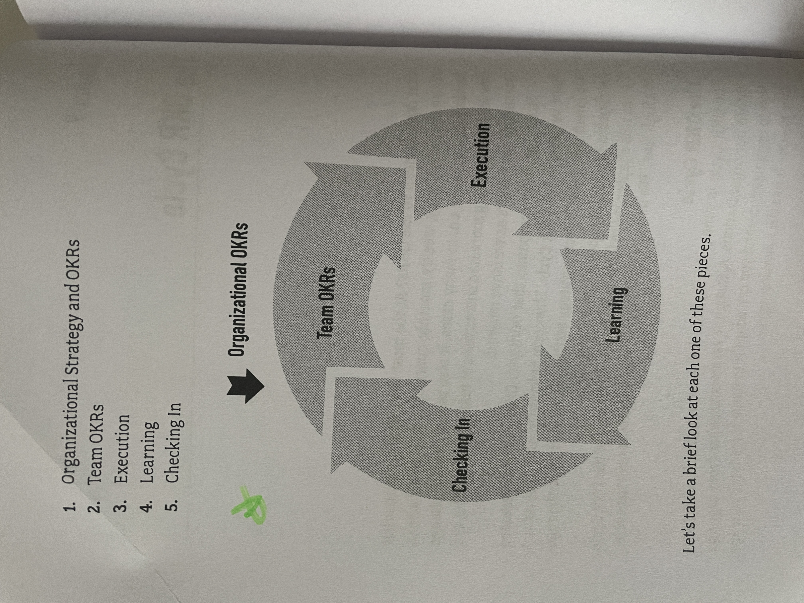

# Who Does What By How Much?

## Pitch

OKRs are a simple but powerful goal-setting framework used by leading companies in every industry imaginable. This book will help you learn how to succeed with OKRs by using them to put your customers at the center of everything you do.

Every team and organization wants to improve. OKRs help you get better, because they help your teams focus on the right work. Too many companies waste time, money, and energy working on the wrong things. Why? We lose track of what our customers want and need.

Everyone has a customer. (Yes, everyone—that includes you.) We all make something in our work, and we make it for other people. Those other people are our customers—though you may call them patients, students, constituents, or even coworkers. Our success depends on how those customers respond to what we make—and they’ll only respond positively if we deliver something that’s valuable to them. So, to succeed, we must figure out who our customers are, what customer responses drive value, and how (and how much) to change our customers’ behavior to achieve better results.

Objectives and Key Results help organizations do all of this by focusing teams’ goals on the question, “Who does what by how much?”

However, using OKRs isn’t just about writing goals in a new way. It requires changing the way you work, the way you think about your work, and the way you plan the work you’ll do in the future.

In Who Does What by How Much?coauthors and OKR experts Jeff Gothelf and Josh Seiden provide a clear, how-to guide for employees in all industries to learn how to put customers front and center, so you can get to work on the right things, navigate uncertainty and achieve greater success.

<figure><figcaption></figcaption></figure>

## Notes

### Introduction

#### What's the Problem?

> Why do people work on the wrong stuff? they lose track of what their customers want.

* We're all generally in the business of serving other people's needs
* Too often organizations don't have a clear understanding of
  * &#x20;who these people are&#x20;
  * or what they need


Everyone-yes, everyone has a customer: people who consume the things that you make at work.


* Customer Behavior = Results
  * Do end customers buy more of your products?
  * Do they subscribe to your newsletter?
  * Do they refer your services to their friends and colleagues?
  * Do your coworkers use the presentation you create?
  * Do they adopt the plans you propose?

#### Who Does What by How Much?

* It is, in a nutshell, your value equation. It has three parts
  * "_**Who?**_" is your customer
  * "_**Does what?**_" is their behavior
  * "_**By how much?**_" is the measure of change in their behavior

#### OKRs and the Value Equation

* Objectives are your high-level goal statement.
* Key results are your measures of success, which we write using our simple value equation: who does what by how much?

#### What This Book Is

It's a manual for understanding:

* Who your customers are
* How your work affects what your customers do
* And how all of that will create results that matter-to you, your team, and your organization

### Chapter 1: What Are OKRs?

OKRs have the ability to focus your work on delivering value to customers.

* OKRs Are a **Goal-Setting Framework**
  * **Objectives**: The job of an objective is to inspire the team and provide a clear why.
    * Example: "Redefine local and regional air travel in North America to make it simpler, safer, and more accessible by the end of this decade."
  * **Key Results**: Key results are the way you measure progress toward your goal.
    * Example: "At least 35% of local and regional travelers, both air- and land-based, are now regularly using our flying vehicles."


Good key results measure value, and the best way to understand value is by measuring what people are doing, or doing differently, as a result of our work.


#### What do OKRs leave out?

* OKRs **don't contain: solutions**
  * They don't explicitly tell you how to achieve your goals
* Define a problem-We want to win
  * _**Here's what winning looks like**_

#### Focus on Customer Behavior

* What our customers are doing, and doing differently
* Identify Customers:
  * Who are your colleagues?
  * What do they need from you?
  * What do you need from them?&#x20;
  * How might you change the way you work to make everyone more effective?
    * "My work influences my colleagues' behaviors. They're my customers."

> Your goal is to influence that behavior in a positive way: a way that benefits them by helping them be more successful and in a way that benefits you at the same time by creating value for your organization.

Example:

* Objective: Make it easier for all necessary departments to provide design feedback by the end of the quarter.
  * Key Result 1: Brand managers (who) provide feedback (does what) 50% faster on each shoe design (by how much).
  * Key Result 2: The manufacturer (who) produces physical prototypes of each shoe design (does what) 100% faster (by how much).
* These key results are what we call "**outcomes**."&#x20;
  * An outcome is a change in behavior that creates value.

OKRs Are

* A Process
* A Culture: OKRs are a flexible and customizable framework
  * Successful OKRs are deeply embedded in the organizations' culture
  * Leadership champions them
  * A powerful tool for creating culture
    * They are all about changing what people do.


"Rule #1 of OKRs is that there is no Rule #1"


* They are the qualitative expression of an organization's or team's strategy in the form of specific and time-bound goals.

### Chapter 2: Why Use OKRs

> _Why are we trying to change the way we work? What's the benefit?_

#### The Benefits of Using OKRs

* Help us to be customer-centric
* Allow us to change course in response to learning
* Create transparency
* Grant people the autonomy to figure things out
* Provide the alignment and focus that organizations need to manage complexity.

#### OKRs emphasize learning and autonomy


OKRs don't tell people what to do.


#### OKRs use measurement and data to create transparency

The benefits of measurement are numerous, and they should be clear and obvious. Here are just a few, it allows us to:

* **have better conversations** about our work
* **assess whether or not our work is on track**
* **share** our success
* **talk objectively** about our progress and the challenges we face

#### Other benefits

* OKRs anchor teams' goals to a larger why
* OKRs create alignment and focus
* OKRs work for every organization and every role

#### Principles for Using OKRs

* No single right way to use OKRs
* If you're having trouble, ask your-self
  * _**"Are we using OKRs in a way that helps us focus?"**_
  * If the answer is "no," then consider changing the way you're using OKRs to help you and your organization create more focus

#### The Key Principles of OKRs

1. **Focus**

* **Anti-pattern:** People try to express all of their work as an OKR, which results in too many OKRs and unclear prioritization.&#x20;
  * Real focus means fewer OKRs.
* **Solution**: Use OKRs only for the current strategic priorities.

2. **Autonomy**

Individual teams are the closest to the work and, thus, are in the best position to judge _**how to create value in their area of responsibility**_.

* **Anti-pattern**: Leaders define OKRs for the whole organization without the input of the teams themselves.&#x20;
  * This is top-down governance that allows for no collaboration and grants no actual autonomy.
* **Solution**: Teams set their own goals, linking each goal to a higher-level goal.

3. **Alignment**

Alignment and autonomy are two halves of the sam then. Teams using OKRs need to coordinate to ensure everyone - both the people on their individual team and everyone on adjacent teams-is rowing in the same direction.

* **Anti-pattern:** Teams working on similar projects silo themselves, focusing only on their individual team's goals and limiting coordination with adjacent teams.
* **Solution**: Teams working on similar projects share an OKR, uniting and focusing their efforts while driving intra-team transparency.&#x20;

> All teams can link their OKRs to "parent OKRs" at a higher level in the organization.

4. **Accountability**

Let teams declare their goals and then monitor and measure their progress.

* **Anti-pattern**: Teams operate without concern for business results, focusing (sometimes in well-intentioned ways) on tasks that don't create value for the organization.
* **Solution**: Teams use OKRs to set their goals transparently, working with peers and leadership to ensure these goals align with organizational goals.

5. **Transparency**

To maintain alignment, teams need to constantly share progress with one another and their leaders.

* **Anti-pattern**: When teams don't share their progress consistently, or aren't used to doing so, they can default to limited communication, which causes **duplicate efforts**, conflicting or competing work, and an overall lack of alignment across teams.
* **Solution**: OKR work and progress are shared publicly and broadly in a central system anyone in the company can see.

6. **Agility**

Work in short cycles to solve the problem at hand, track your progress, and pivot as needed

* **Anti-pattern**: Teams use OKRs in a set-it-and-forget-it fashion. They don't check in often enough, and/or they don't have permission to make changes based on what they learn from customer feedback.
* **Solution**: Teams check in on a weekly, monthly, quarterly, and annual basis to ensure goals and work are aligned with strategic and market priorities.

7. **Customer-centricity**

OKRs provide a way to focus on work that makes a real difference by creating outcomes - customers doing something differently in a way that's valuable.

* **Anti-pattern**: Teams write OKRs that focus on making stuff. Stuff isn't valuable unless it creates a positive outcome.
* **Solution**: Teams write OKRs where both the objective and the key results are **based on a better state for the customer** as **visible through** their **behavior**.

### Chapter 3: OKRs and Outcomes

> Success means that you've created a valuable outcome.

<figure><figcaption></figcaption></figure>

#### Logic Model

<figure><figcaption></figcaption></figure>

* The core idea of this model is that we make outputs, which hopefully create outcomes.
* Ultimately, we hope that the outcomes contribute to our long-term goals. We call those long-term goals " impact."


Just because you make something doesn't mean that you've created value.


* **Output**: the people involved made something
  * **Example**:
    * Option 1: An output-based key result:
      * Manufacture 100,000 Google Glass units for public release by 03 2013.
    * Option 2: An outcome-based key result:
      * 10,000 people purchase and become active users of Google Glass by Q4 2013.
* **Outcome**: An outcome is the measurable change in human behavior that we see when people receive our output.
  * These are your key results.
  * Example: "25% of Google Glass customers use the product every day."
* **Impact**: Impact is the high-level, long-term measure of success.

Example in practice:&#x20;

* **Objective**: Be the best place to work in our industry within one year
* **Key Result 1**: Increase the number of employees who would recommend us as a place to work by 10% compared to last year.
  * Who? Employees
  * Does What? Recommend the organization as a place to work
  * By How Much? At a 10% higher rate than last year
*   **Key Result 2**:

    Reduce regrettable turnover by 10%.

### Chapter 4: Strategy and OKRs

* OKRs work when they reflect and express your strategy
* Strategy: an **opinionated** and coherent approach to addressing an important challenge.&#x20;
  * It identifes a challenge and defines how to deal with it

> Important challenges are ones that don't have obvious or easy solutions

* When you select a challenge to work on, you're making the first important decision of strategy:
  * Where should we focus?&#x20;
  * Why should we work on this one instead of that one?
* Strategy is opinionated
  * Strategy involves choices
  * It's about what you're choosing to do and how you're choosing to do it.
* Strategy is coherent
  * The various parts of your strategy must play well together and must reinforce one another.
  * Example: your strategy is to create a luxury brand that sells watches.
    * You want to create a brand that stands the test of time
    * To do that, you'd probably set your prices quite high,&#x20;
      * but you also need your quality to be high

#### How to Create a Strategy: A Lightweight Process

* At the Organization-wide Level
  * What's your goal?
  * What are the obstacles in the market that your organization must overcome to achieve that goal?
  * What challenges do you face?
* At the Team Level
  * How your team can contribute to the organization's goals
  * "What is the organization trying to achieve, and what work can this team do to advance or support those goals?"

### Chapter 5: Who Does What?

* Consider three questions:
  * What does your team have control over?
    * Your team's work doesn't (and can't) touch every part of the business
    * _**Your OKRs should focus only on what you can control and change.**_
  * Which customers will you target first?
  * What behaviors from this target audience drive business results?
    * Are there parts of the customer journey keeping your customers from exhibiting those behaviors?

#### Who: Which Customer Will You Target First?

* External Customers
* Internal Customers
  * Is there something you work on that can help make the people who DO work with customers more effective?

#### Exercise: Create a list of potential "whos" to focus on.

* Make a list of the different people and roles in your market.
  * You can do this work by yourself or brainstorm the list with your team.
* Aim for somewhere between three and six plausible roles in your market.
  * Don't have to decide which group of people are going to be the focus yet.
  * At this point, it's more important to just create a small set of candidates.

#### Telling a Story

* Start to break things down by telling a story about our customer and their journey with our product or service
* Example:
  * Pull out the behaviors
    * Our customer takes the subway to work.
      * Our customer buys a donut and coffee after getting off the train.
      * Our customer carries the donut and coffee to their office.
      * Our customer eats the donut and drinks the coffee at work.
  * To be successful, then, we'd be looking for...
    * A high number of people who take the subway to work:\
      Foot traffic is a potentially important measure for us.
    * People exiting the subway and walking to work: This is the specific kind of foot traffic that will help
  * Here are the measurements that we can nominate for potential key result targets:
    * Foot traffic to our location (the number of potential donut buyers who pass our location each day)
    * The number of people who buy both a donut and a coffee
    * The number of people who order to-go versus those who eat their donut on-site
    * ...

#### Exercise: Understand your Customer's Journey

1. Tell your story about the person or people who are the focus of your work. If you want, write your story out as you work, as in the diagram below.
2. Pay particular attention to what people are doing in the story.
3. Pull out somewhere between three to six important behaviors: things people do that are important, that create value, either for them, for you, or ideally, both.
4. Write down those important behaviors, using the who / does what format

<figure><figcaption></figcaption></figure>

#### Helpful Tips

* Make sure every box is written in the (who) (does what) format.
* Make sure your story focuses on steps within your scope of control.
* Look for obstacles.

### Chapter 6: Writing OKRs

#### Review: What Is an Objective?

* **Inspirational**: It connects the team's work to a broader purpose.
* **Qualitative**: It describes a strategic aspiration without quantifying it.
* **Timeboxed**: It includes a deadline by which you believe you will achieve it (or by when you'd like to)
* **Specific**: It focuses on a key element of your strategy instead of making a generalization.

#### Focus on the Most Important Work

How many OKRs should we create?

* At the **organizational level**, you want to have a small set of OKRs-probably two or three that represent different dimensions of your business.
  * If you're a big organization, you might want to have one OKR per business unit or other major division.
  * Less is more: Start with one and build from there
* At the **team level**, we recommend having only one OKR.
  * In both cases, we recommend setting two or three key results per objective.

#### Creating Your Objective

1. **Gather what you need.**

* Your organization's strategy and your team's strategy
* Your team's most important obstacle
* Your organization's high-level OKRs
* Your scope of control
* A list of potential customers to focus on
* A list of potential outcomes that you might pursue

2. **Identify your biggest obstacle.**

* At the organizational level: Think about how to make the whole company successful.
* At the team level: Think about how your team can contribute to the organization's goals.

3. **Turn your obstacle into a positive statement.**

* To write your objective, take the big obstacle you identified and turn it into a positive statement.&#x20;
  * If you solve the problem, what does that look like?

4. **Self-Check your objective.**

Make sure that it meets the following criteria:

* It's a positive statement.
* It's inspirational.
* It's qualitative.
* It's timeboxed.
* It's specific.
* It doesn't contain a solution.

<figure><figcaption></figcaption></figure>

5. **Find your parent.**

* Create alignment in the organization
* Every OKR has a parent OKR

<figure><figcaption></figcaption></figure>

#### Creating Your Key Results


Key results are the way you measure progress toward your goal.


To create your key results:

* Gather the important behaviors that you wrote down when you were telling your customer story.
* Turn this into two to four statements that use the format of our titular question: \[who] + \[does what] + \[by how much]

<figure><figcaption></figcaption></figure>

#### Self-Check Your Key Results

* Make sure your key results are outcomes
* Make sure that your key results aren't solutions
* Make sure you can answer "yes" to the following question:&#x20;
  * If we achieve all of these key results, will we have achieved our objective?

#### What's the Score?

* Many teams (and consultants) advocate for "scoring" your OKRs
  * We're not particularly enthusiastic about scoring OKRs
  * Scoring is the process of giving a grade to your performance
  * At the end of the quarter, you've grown foot traffic but only by 50%
    * Is that good?
    * Is that bad?
    * Should you continue to work on that OKR? Should you revise it? Should you abandon it?
* Our favorite system of scoring is the simplest. It has four levels:
  * We **exceeded expectations**: you not only hit your target numbers, but you also far outperformed the target you set.
  * We **delivered:** This means you hit the target that you set.
  * We **fell short**: This means that you made progress, you created some value, and you can claim success.
  * We **failed to deliver:** you didn't create the value that you set out to create.

### Chapter 7: Setting OKRs Through Collaboration

#### Collaborating Top-Down and Bottom-Up to Set OKRs

Top-down and bottom-up collaboration leverages the knowledge and points-of-view of both leadership and teams, allowing organizations to set goals with deeper understanding.

#### A Process for Top-Down and Bottom-Up Collaboration

* **Top-down**
  * Leadership determines the strategy and high-level OKRs for the organization
  * Communicates them clearly to every team and every individual
* **Bottom-up**
  * Each team creates its own OKRs that fall within its sphere of influence
  * Have a clear relationship to a parent OKR, and function to advance for the organization's high-level OKRs
* **Collaboration**
  * All teams bring their OKRs to their leaders and peer teams and explain why they chose their goals&#x20;
  * And how they believe achieving those goals will help the organization reach its high-level OKRs
* **Revise and publish**
  * Following the collaborative conversations, teams revise their OKRs as needed, then publish their final OKRs for the period

### Chapter 8: Common Questions About Writing OKRs

#### General Questions About OKRs

* _Should everything get an OKR?_
  * Make a distinction between important business as usual work and OKRs
  *   Most organizations distinguish between OKRs and Business as Usual

      (BAU) metrics
* _Where do the numbers come from?_
  * Choose numbers that are realistic but also ambitious enough to make a difference to the organization
* _Does every key result have to be an outcome? Every time? Really?_
  * Yes, every one, every time.

#### Questions About Teams

* _Should we have individual OKRs?_
  * No. Keep OKRs at the team level
  * The moment your key result becomes an output : your team stops working on the problem of creating
* _Does every team need its own OKRs?_
  * No, in some cases, teams can share OKRs
  * Dependent teams can share an OKR and work together to achieve it
* _Should OKRs be cross-functional, or should each discipline have its own?_
  * OKRs should not be discipline-centric
  * They should be cross-functional

The **most common pitfalls** teams encounter when writing OKRs are as follows:&#x20;

* Writing key results as task lists
* Reverse engineering key results to fit your team's to-do lists
* Choosing key results that are measures of system behavior instead of customer behavior
* Sandbagging key results metrics

### Chapter 9: The OKR Cycle

<figure><figcaption></figcaption></figure>

#### 1: Organizational Strategy and OKRs

The process begins with setting organizational strategy and goals : this happens annually each year.

#### 2: Setting Team-Level OKRs

Teams will set their OKRs annually and revisit them during their quarterly check-ins.

#### 3: Execution

* Once our goals are set, we get to work
* One of the most magical properties of OKRs is that the only thing that matters is results
* Execution is **timeboxed :** work on something until your next check-in meeting

#### 4: Learning

* Sometimes, you know exactly what you need to do to create results
  * Get started and monitor your results
* Sometimes, you're not sure about the best way to generate results
  * Might have a list of promising ideas


Sometimes called research or discovery, this refers to the learning tactics that you can use to test your ideas and learn why they're working or not working.


#### 5: Checking In

Most organizations use two different kinds of check-ins:

* **Monthly**: smaller and less formal
  * Gather your team, immediate stakeholders, and key collaborators to look at the results you've generated so far
  * Share what you've learned along the way
  * Evaluate your progress
  * Then decide on any adjustments you might need to make to your tactics
* **Quarterly**: more structured, with a greater emphasis on strategic course correction
  * The opportunity to either recommit to their OKRs, adjust them if necessary, or in some cases, even discard them and write new ones

#### Communication Is Key

The crucial element underlying every stage of the OKR Cycle is communication:&#x20;

* Consistent
* Continuous
* Transparent among all stakeholders

### Chapter 10: Working with OKRs


What OKRs are not:

* They don't contain solutions to your problems
* They aren't task lists
* They aren't project plans
* They aren't specifications or requirements
* They aren't to-do lists


#### The Process of Working with OKRs

Leaning = at the heart of successful OKR implementation.

* **Review the problem** that you are trying to solve.
  * Key result is an outcome and should be written in this form:&#x20;
    * `who + does what + by how much`
    * The problem lives inside this statement
    * You're trying to get your "who" to do more or less of something
* **Brainstorm solutions** for ways to achieve your key results.
  * Ways that you might get your "who" to "do what."
* **Decide** what you are going to work on first and how you are going to approach it.
* **Execute**: Do the work using an experimental, learning-centric, and customer-centric approach.
* **Measure your results**.
  * OKRs are all about creating results.&#x20;
  * Whether you're executing or learning, you're trying to make progress and generate results.
  * When you complete a piece of work, you want to measure your results.
* **Evaluate and learn**.&#x20;
  * Consider what you ve learned from that work.
  * Prepare to start another cycle of learning and execution.
* Repeat the process -executing, measuring, evaluating, and learning — as you work toward your key result.

<figure><figcaption></figcaption></figure>

#### Hypotheses

It can be helpful to express your ideas as testable **hypotheses**.


We believe that \[making or doing this thing]

Will achieve \[this outcome].


Example:&#x20;

> We believe that running ads in the local newspaper Will increase foot traffic in our stores by 50%.

Or


**We believe that doing this:**

_Running ads in the local newspaper_

**Will achieve our outcome, which is:**

**Who**: _breakfast buyers_

**Does what**: enter our store

**By how much**: _increase of 50%._


#### Collecting Data

2 kinds of data:

* **Quantitative data = numbers**
  * Measurements of customer behavior
  * Often gathered through analytics tools
  * Tell you what is happening and how well you're progressing
* **Qualitative data = words** (and things you can't count)
  * What you get from your interactions with your customers
  * It helps explain the numbers&#x20;
    * Can also help you figure out what adjustments you might want to make to your work
